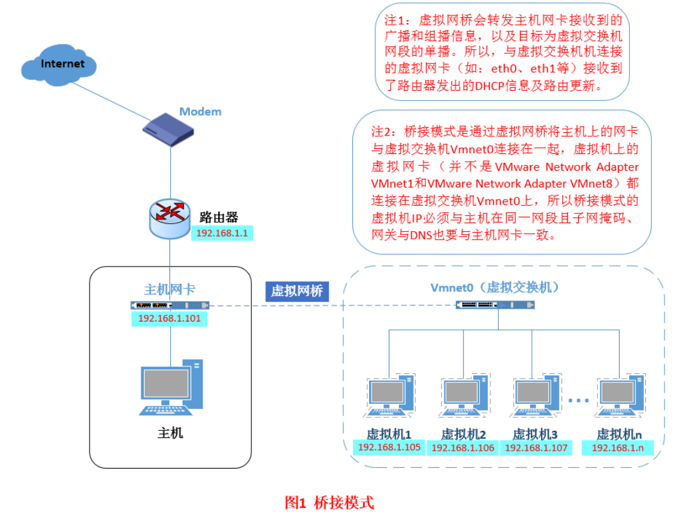
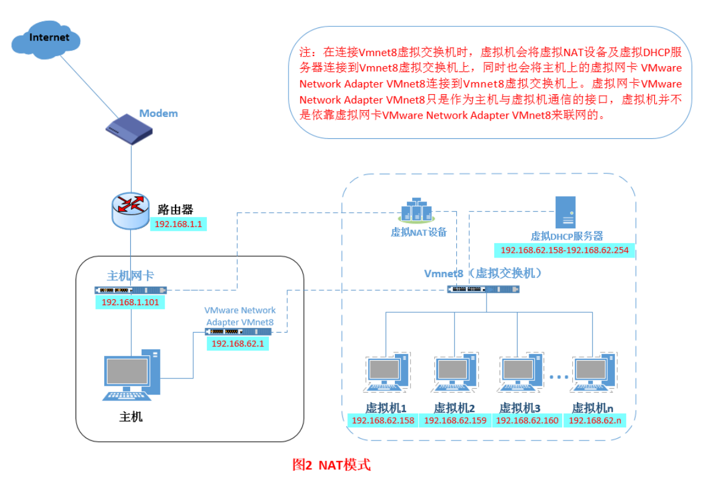
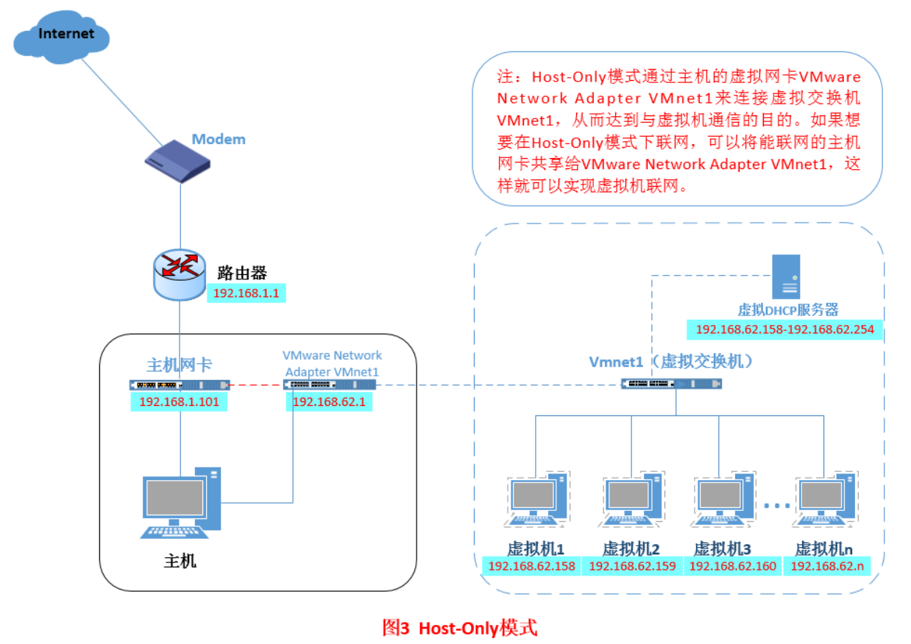

<div align="center">

<h1>嵌入式系统基础</h1>

</div>

# 目录

- [目录](#目录)
- [概述](#概述)
- [VMWare提供的三种网络工作模式](#vmware提供的三种网络工作模式)
- [Linux](#linux)
  - [1. 分区类型](#1-分区类型)
  - [2. Linux版本](#2-linux版本)
  - [3. 硬盘分区](#3-硬盘分区)
  - [4. 挂载](#4-挂载)
  - [5. 文件类型](#5-文件类型)
  - [6. 文件属性](#6-文件属性)
  - [7. 新建文件的权限](#7-新建文件的权限)
  - [8. 目录结构](#8-目录结构)
  - [9. Linux常用命令](#9-linux常用命令)
  - [10. 目录文件的权限](#10-目录文件的权限)
  - [11. 安装源代码发布软件包](#11-安装源代码发布软件包)
  - [12. 变量](#12-变量)
  - [13. 引号与反斜线](#13-引号与反斜线)
  - [14. read和echo](#14-read和echo)
    - [read 命令](#read-命令)
    - [echo 命令](#echo-命令)
  - [14. 算术运算扩展](#14-算术运算扩展)
    - [使用 $\[expression\]](#使用-expression)
    - [使用 $((expression))](#使用-expression-1)
    - [区分](#区分)
    - [let](#let)
  - [15. 测试](#15-测试)
    - [文件测试](#文件测试)
    - [字符串测试](#字符串测试)
    - [整数测试](#整数测试)
  - [16. 分支结构](#16-分支结构)
    - [if结构](#if结构)
    - [case结构](#case结构)
  - [17. 循环结构](#17-循环结构)
    - [1. `for` 循环（foreach型）](#1-for-循环foreach型)
    - [2. `for` 循环（C语言型）](#2-for-循环c语言型)
    - [3. `select` 循环](#3-select-循环)
    - [4. `while` 循环](#4-while-循环)
    - [5. `until` 循环](#5-until-循环)
  - [18. 函数](#18-函数)
    - [函数的定义格式](#函数的定义格式)
    - [函数的调用形式](#函数的调用形式)
    - [函数参数（Arguments）](#函数参数arguments)
    - [函数变量（Variables）](#函数变量variables)
    - [函数的结束与返回值](#函数的结束与返回值)
  - [19. 使用标准输出实现函数的返回值](#19-使用标准输出实现函数的返回值)
- [习题](#习题)
  - [（1）解释程序并说明功能](#1解释程序并说明功能)
    - [（2）用shell编程](#2用shell编程)

# 概述

**1. 嵌入式系统概念**
   - 以应用为中心：嵌入式系统专注于满足特定应用领域的需求。
   - 以计算机技术为基础：利用计算机技术实现特定功能。
   - 软件硬件可裁剪：系统的软硬件可根据需求进行定制和优化。
   - 满足严格要求：嵌入式系统在功能、可靠性、成本、体积、功耗等方面有严格的要求。

**2. 嵌入式系统组成**
   - 嵌入式硬件系统：包括微处理器、存储器、输入设备、输出设备等。
   - 嵌入式软件系统：包括启动代码、驱动程序、操作系统、应用程序等。

**3. 嵌入式系统硬件核心**
   - 嵌入式处理器：系统的核心计算单元，常分为嵌入式微处理器、嵌入式微控制器、嵌入式DSP处理器、嵌入式片上系统。

**4. 嵌入式系统操作系统**
   - 实时操作系统（RTOS）：如VxWorks、μC/OS-II，用于处理实时任务和严格的时间要求。
   - 通用操作系统：包括WinCE、Embedded Linux、iOS、Android，适用于更通用的嵌入式应用。

# VMWare提供的三种网络工作模式

VMWare提供的三种网络工作模式分别是`Bridged`（桥接模式）、`Host-Only`（仅主机模式）和`NAT`（网络地址转换模式）。

**1. Bridged（桥接模式）**
   - 特点：虚拟机的IP可设置与主机在同一网段，虚拟机相当于网络内的一台独立机器。
   - 互联性：同一网络内的虚拟机之间以及虚拟机与主机之间可以互相访问，形成一个类似局域网的环境。



**2. NAT（网络地址转换模式）**
   - 特点：实现主机与虚拟机间的双向访问，但虚拟机为主机独享，其他局域网主机（或虚拟主机）不能直接访问该虚拟机。
   - 访问网络：虚拟机可以通过主机使用NAT协议访问网络内的其他机器。



**3. Host-Only（仅主机模式）**
   - 特点：虚拟机与主机共享网络连接，与外部网络隔离。
   - 互联性：主机与虚拟机可以互相访问，但无法直接访问外部网络，实现了一种局域网络的隔离模式。



这些网络工作模式提供了不同的网络配置选项，使用户可以根据需求选择适合其场景的配置：Bridged模式提供了与外部网络直接通信的方式，NAT模式提供了一种保护虚拟机的方式，而Host-Only模式则提供了一种与主机共享连接但与外部网络隔离的选项。

# Linux

## 1. 分区类型

- **根分区：** 这是Linux系统的主要安装目录，包含操作系统的核心文件。通常，根分区是文件系统的根目录 ("/")。
- **交换分区：** 用于虚拟内存，当物理内存不足时，系统可以将一些数据存储到交换分区中。交换分区对于系统的性能和稳定性很重要。

## 2. Linux版本

- **核心版：** 通常指Linux内核，它是操作系统的核心部分，管理硬件资源、文件系统等。用户可以选择并添加其他软件组件，以构建完整的Linux系统。
- **发行版：** 发行版是包含了Linux内核及相关软件、工具和包管理系统的完整操作系统。常见的发行版有`Ubuntu`、`Fedora`、`Debian`等，它们提供了更易用的界面和软件包管理。

## 3. 硬盘分区

- **主分区：** 最多可以有四个，用于安装操作系统及其引导程序。
- **扩展分区：** 用于划分逻辑分区，一个硬盘上只能有一个扩展分区。
- **逻辑分区：** 位于扩展分区中，用于存储用户数据和其他文件。

## 4. 挂载

- **挂载点：** 在Linux中，挂载是将一个分区与文件系统中的目录关联的过程。挂载点是这个目录，通过挂载，分区的内容就可以在这个目录下访问。

## 5. 文件类型

在Linux系统中，遵循着“一切皆文件”的理念，所有信息都被当作文件来识别。

以下是Linux系统中常见的文件类型：

**1. 普通文件：**
   - 描述：是用户日常使用最多的文件类型，包括文本文件、shell脚本、二进制可执行文件以及各种类型的数据文件等。
   - 例子：`text.txt`, `script.sh`, `executable`, `data.dat`等。

**2. 目录文件：**
   - 描述：包含文件名、子目录名以及指向文件和子目录的指针，用于组织文件系统中的层次结构。
   - 例子：`/home/user/documents/`, `/etc/config/`等。

**3. 链接文件：**
   - 描述：类似于Windows快捷方式，但更为强大。可以链接到不同目录文件系统甚至是不同机器上的文件，而不需要重新占用磁盘空间。
   - 例子：硬链接、符号链接。

**4. 设备文件：**
   - 描述：Linux将设备也看作文件来进行操作，分为字符设备文件、块设备文件和网络设备文件。
     - **字符设备文件：** 处理数据时以字符为单位，例如串口、LCD等。
     - **块设备文件：** 处理数据时以块为单位，例如硬盘、U盘等。
     - **网络设备文件：** 代表联网设备，如网卡。

通过将所有这些不同类型的信息都抽象为文件，Linux系统提供了一种一致的接口和方法来处理各种数据和设备。这种思想使得用户和开发人员可以使用相似的命令和工具来管理和操作系统的各个方面。

## 6. 文件属性

在Linux系统中，文件的属性信息包括文件类型、文件归属（所有权）以及文件访问权限。

以下是对十位标志的解释：

**1. 第1位 - 文件类型：**
   - `-`：普通文件
   - `d`：目录
   - `l`：软链接文件
   - `p`：FIFO管道文件
   - `c`：字符设备文件
   - `b`：块设备文件

**2. 第2-4位 - 属主权限（User）：**
   - `r`：读取权限
   - `w`：写入权限
   - `x`：可执行权限

**3. 第5-7位 - 属组权限（Group）：**
   - `r`：读取权限
   - `w`：写入权限
   - `x`：可执行权限

**4. 第8-10位 - 其他用户权限（Other）：**
   - `r`：读取权限
   - `w`：写入权限
   - `x`：可执行权限

**示例：**

```
[root@localhost ~]# ls -l install.log
-rw-r--r-- 1 root root 34298 04-02 00:23 install.log
```

在上述示例中，对应的文件属性解释如下：
- 文件类型：`-` 表示这是一个普通文件。
- 属主权限：`rw-` 表示属主（root）具有读写权限。
- 属组权限：`r--` 表示属组（root）具有只读权限。
- 其他用户权限：`r--` 表示其他用户具有只读权限。


另外，这里补充一个知识点。

在Linux文件权限中，常用的权限组合是由三个数字组成：

- `4` 表示读权限（Read）
- `2` 表示写权限（Write）
- `1` 表示执行权限（Execute）

因此每个权限组合都可以是这三个数字的和，例如：

- `7` 表示读、写、执行权限（4 + 2 + 1）
- `6` 表示读、写权限（4 + 2）
- `5` 表示读、执行权限（4 + 1）
- `4` 表示只读权限（4）

## 7. 新建文件的权限

在Linux系统中，新建文件或目录时的默认权限由文件创建掩码（umask）决定。默认情况下，文件创建掩码通常设置为022。

**默认权限计算规则：**
1. 对于可执行文件，默认权限是777减去掩码的值。如果掩码为022，则新建可执行文件的权限为755。
2. 对于非可执行文件（如文本文件、数据文件等），在创建时默认是没有执行权限（x）的，因此新建文件的权限为(777减去掩码)并去除执行权限位。如果掩码为022，则新建文件的权限为644。
3. 对于新建目录，默认权限是777减去掩码的值。如果掩码为022，则新目录的权限为755。

**示例：**
如果掩码为022，新建文件或目录的默认权限计算如下：
- 新建可执行文件权限：`777 - 022 = 755`
- 新建非可执行文件权限：`(777 - 022) & 666 = 644`
- 新建目录权限：`777 - 022 = 755`

## 8. 目录结构

Linux的目录结构是一个树形结构，说明如下：

1. **`/`（根目录）：**
   - 包含整个文件系统的根目录。

2. **`/boot`：**
   - 存放系统启动所需要的文件，包括内核文件和引导加载程序（GRUB等）。

3. **`/bin`：**
   - 存放常用的基本系统命令的可执行文件，这些命令对系统的正常运行非常重要，通常包含一些基本的 `Shell` 命令。

4. **`/sbin`：**
   - 存放系统管理员的系统管理程序，这些程序通常需要超级用户权限才能运行。

5. **`/usr`：**
   - 存放用户安装的应用程序和文件。通常包括用户的主目录、系统的二进制文件、库、文档等。

6. **`/dev`：**
   - 存放所有设备文件，包括硬盘、分区、键盘、鼠标、USB等。Linux中一切皆文件，设备也被视为文件。

7. **`/var`：**
   - 存放系统可变信息的文件，例如日志文件、邮件、打印队列等。这些文件的内容可能随着系统的运行而变化。

8. **`/etc`：**
   - 存放系统管理所需要的配置文件。包含系统的各种配置信息，例如网络配置、用户配置等。

9. **`/lib`：**
   - 存放系统动态链接共享库文件，这些库文件被可执行文件引用，提供了程序运行所需的函数和资源。

## 9. Linux常用命令

以下是一些常用的Linux系统命令及其简要说明：


1. **显示目录内容命令 `ls`：**
   - 显示目录中的文件和子目录。选项 `-a` 显示所有文件，`-l` 以详细列表方式显示，`-h` 以易读格式显示文件大小。
     - 示例：`ls -a` 显示所有文件，包括隐藏文件。
     - 示例：`ls -l` 以详细列表方式显示文件信息。
     - 示例：`ls -h` 以易读格式显示文件大小。

2. **改变工作目录命令 `cd`：**
   - 切换当前工作目录到指定目录。
     - 示例：`cd Documents` 进入 "Documents" 目录。

3. **删除空目录命令 `rmdir`：**
   - 删除空目录。
     - 示例：`rmdir directory_name` 删除名为 "directory_name" 的空目录。

4. **复制文件或目录命令 `cp`：**
   - 复制文件或目录。选项 `-f` 强制复制，`-r` 递归复制。
     - 示例：`cp file1 file2` 复制文件 "file1" 到 "file2"。
     - 示例：`cp -r dir1 dir2` 递归复制目录 "dir1" 到 "dir2"。

5. **查找文件或目录命令 `find`：**
   - 在文件系统中查找文件或目录。
     - 示例：`find / -name filename` 在根目录下查找文件名为 "filename" 的文件。

6. **改变文件访问权限命令 `chmod`：**
   - 修改文件或目录的权限。例如，`chmod +x filename` 赋予执行权限。
     - 示例：`chmod 755 file` 赋予文件 "file" 执行权限。

7. **配置网络参数命令 `ifconfig`：**
   - 显示或配置网络接口的参数。
     - 示例：`ifconfig` 显示所有网络接口信息。

8. **查看进程信息命令 `ps`：**
   - 显示当前运行的进程信息。选项 `-e` 显示所有进程，`-f` 显示详细信息，`-u` 显示用户相关信息。
     - 示例：`ps -ef` 显示所有进程的详细信息。

9. **创建设备节点命令 `mknod`：**
   - 创建字符设备或块设备的节点。
     - 示例：`mknod /dev/mydevice c 10 1` 创建字符设备节点 "mydevice"。

10. **装载内核驱动模块命令 `insmod`：**
    - 装载指定的内核模块。
      - 示例：`insmod mymodule.ko` 装载名为 "mymodule.ko" 的内核模块。

11. **显示文件内容命令 `cat`：**
    - 查看文件内容。
      - 示例：`cat file.txt` 显示文件 "file.txt" 的内容。

12. **建立子目录命令 `mkdir`：**
    - 创建新的目录。选项 `-p` 创建多级目录。
      - 示例：`mkdir new_directory` 创建名为 "new_directory" 的新目录。

13. **删除文件或目录命令 `rm`：**
    - 删除文件或目录。选项 `-f` 强制删除，`-r` 递归删除。
      - 示例：`rm file.txt` 删除文件 "file.txt"。
      - 示例：`rm -r directory` 递归删除目录 "directory"。

14. **移动、重命名文件或目录命令 `mv`：**
    - 移动文件或目录，或者重命名文件或目录。
      - 示例：`mv file1 file2` 将 "file1" 移动或重命名为 "file2"。

15. **链接文件或目录命令 `ln`：**
    - 创建硬链接或符号链接。
      - 示例：`ln file link` 创建硬链接 "link" 指向 "file"。

16. **挂载文件系统命令 `mount`：**
    - 挂载文件系统到指定目录。
      - 示例：`mount /dev/sda1 /mnt` 将设备 "/dev/sda1" 挂载到目录 "/mnt"。

17. **压缩与解压缩命令 `tar`：**
    - 打包和解压文件。选项 `-c` 创建打包文件，`-x` 解压文件，`-z` 使用 gzip 压缩。
      - 示例：`tar -cvf archive.tar file1 file2` 创建打包文件 "archive.tar" 包含 "file1" 和 "file2"。

18. **显示系统信息命令 `uname`：**
    - 显示系统信息。例如，`uname -a` 显示所有信息。
      - 示例：`uname -r` 显示内核版本。

19. **查看内核加载模块命令 `lsmod`：**
    - 显示当前加载的内核模块。
      - 示例：`lsmod` 显示所有加载的内核模块。

20. **卸载内核驱动模块命令 `rmmod`：**
    - 卸载指定的内核模块。
      - 示例：`rmmod mymodule` 卸载名为 "mymodule" 的内核模块。

每个命令都有不同的选项和用法，可以通过命令后加上 `--help` 获取更详细的帮助信息。

## 10. 目录文件的权限

在Linux中，目录文件也是有权限的，这些权限决定了对目录的不同操作。

1. **读权限（r）：**
   - 具有读权限的用户可以**查看目录中的文件列表**。使用 `ls` 命令查看目录内容就是一种读操作。

2. **写权限（w）：**
   - 具有写权限的用户可以**改变目录下的文件列表**，包括**新建、删除、改名**等操作。如果没有写权限，用户不能对目录进行修改。

3. **执行权限（x）：**
   - 具有执行权限的用户可以进入目录或其下级子目录。进入目录是一种执行操作。如果没有执行权限，用户不能使用 `cd` 命令进入目录。

这些权限规定了用户对目录的不同操作权限，与文件权限类似。例如，一个目录的权限为 `rwxr-xr--`，表示：

- 属主（Owner）具有读、写、执行权限，可以查看、修改目录内容，并进入目录。
- 属组（Group）具有读、执行权限，可以查看目录内容和进入目录。
- 其他用户（Others）具有只读权限，可以查看目录内容但不能进入目录也不能修改目录下的文件。

## 11. 安装源代码发布软件包

安装源代码发布软件包的一般步骤如下：

1. **解包：**
   - 使用 `tar` 命令解包源代码压缩文件。通常，源代码发布软件包的文件扩展名为 `.tar.gz` 或 `.tar.bz2`。
   ```bash
   tar -zxvf package.tar.gz   # 解压 .tar.gz 文件
   # 或
   tar -jxvf package.tar.bz2  # 解压 .tar.bz2 文件
   ```

2. **配置：**
   - 进入解压后的目录，运行 `./configure` 命令进行配置。这一步检查系统环境、设置参数等。
   ```bash
   cd package
   ./configure
   ```

3. **编译：**
   - 运行 `make` 命令进行编译，将源代码文件编译成可执行程序。
   ```bash
   make
   ```

4. **安装：**
   - 运行 `make install` 命令，将编译好的程序文件复制到系统中的指定目录。
   ```bash
   make install
   ```

请注意，执行以上步骤需要在具有编译环境和相关依赖项的系统上进行。在某些情况下，可能需要使用 `sudo` 或以超级用户身份执行这些命令，以确保对系统目录的写入权限。

这是一个通用的步骤序列，实际使用时可能会有一些特定的配置选项和依赖项需要处理。在解压后的源代码目录中通常会包含一个 `README` 或 `INSTALL` 文件，其中提供了更详细的安装说明。

## 12. 变量

下面记录一下Shell脚本中变量的基本规则和一些特殊变量：

1. **用户变量命名规则：**
   - 变量名以字母或下划线开头，后面可以包含字母、数字和下划线，形成一个有效的变量名。

2. **变量赋值：**
   - 变量的赋值使用等号 `=`，例如：`variable_name=value`。这既是赋值过程也是声明过程。

3. **访问变量值：**
   - 使用 `$` 符号加上变量名来访问变量的值。例如：`echo $variable_name`。
   - 比如：
   ```bash
    #!/bin/bash
   
    # 变量名以字母或下划线开头，后面可以包含字母、数字和下划线
    user_name="John_Doe"
   
    # 访问变量值
    echo "User name: $user_name"
    User name: John_Doe
   ```

4. **位置参数变量：**
   - 在脚本中，使用 `$1`、`$2` 等来表示脚本或函数的位置参数。例如，`$1` 表示第一个参数，`$2` 表示第二个参数，以此类推。
   - 比如：
   ```bash
    #!/bin/bash
   
    # 脚本名称: example.sh
    # 运行方式: ./example.sh 参数1 参数2
   
    # $1 表示第一个位置参数
    echo "第一个参数为: $1"
   
    # $2 表示第二个位置参数
    echo "第二个参数为: $2"
   
    # $0 表示脚本名称
    echo "脚本名称为: $0"
   ```

5. **内部变量：**
   - `$#` 表示命令行上位置参数的个数。
   - `$?` 表示上一条命令执行后的返回值。
   - `$0` 表示命令行上输入的`Shell`程序名。
   - `$*` 表示所有位置参数看成一个字符串（以空格间隔）。
   - `$@` 将每个位置参量看成单独的字符串（以空格间隔）
   - `$$` 表示当前进程的进程号。

6. **位置参数传递：**
   - 当调用Shell函数时，可以通过 `$1`、`$2` 等传递参数给函数。这些参数是在调用函数时由脚本的命令行传递的。
   - 比如：
   ```bash
    #!/bin/bash
   
    # 位置参数传递给函数
    function greet_user {
        echo "Hello, $1!"
    }
   
    # 调用函数并传递参数
    greet_user "Alice"
    Hello, Alice!
   ```

## 13. 引号与反斜线

在Shell脚本中使用引号和反斜线的规则如下：

1. **双引号 (`""`)：**
   - 由双引号括起的字符中，除了 `$`、反斜线 `\`、和反引号 \` 仍保留其特殊功能外，其余字符均作为普通字符对待。
   - 双引号内的变量会被展开，但不会进行命令替换。例如：`"$variable"`。

2. **单引号 (`''`)：**
   - 由单引号括起来的字符都作为普通字符出现，所有字符都照原样显示，特殊字符也失去原来的意义。
   - 单引号内的内容不会被展开，即使其中包含变量名也不会被替换。例如：`'$variable'`。

3. **倒引号 (\`)：**
   - 倒引号括起来的字符串会被Shell解释为命令行，Shell会先执行该命令行，并以它的标准输出结果取代整个倒引号部分。
   - 例如：\`command\`。

4. **反斜线 (`\`)：**
   - 反斜线是转义字符，用于将特殊字符转换为普通字符。在某个字符前面利用反斜线能够阻止Shell把后面的字符解释为特殊字符。
   - 例如：`\$` 表示普通的美元符号，而不是变量展开。

示例：

```bash
#!/bin/bash

# 双引号示例
variable="world"
echo "Hello, $variable!"
Hello, world!

# 单引号示例
echo 'This is a single-quoted string. $variable'
This is a single-quoted string. $variable

# 倒引号示例
current_date=`date`
echo "Current date: $current_date"
Current date: Thu Dec 28 13:11:22 UTC 2023

# 反斜线示例
echo "This is a dollar sign: \$"
This is a dollar sign: $
```

## 14. read和echo

`read` 和 `echo` 是在Shell脚本中经常使用的两个命令，用于与用户交互和输出信息。

### read 命令

`read` 命令用于从标准输入（通常是键盘）中读取用户输入，并将输入的值赋给指定的变量。以下是一个简单的例子：

```bash
#!/bin/bash

echo "请输入您的名字："
read name

echo "您输入的名字是：$name"
```

在这个例子中，`read name` 会提示用户输入名字，并将输入的值赋给变量 `name`。然后通过 `echo` 命令输出用户输入的名字。

### echo 命令

`echo` 命令用于在终端上显示消息。以下是一个基本的用法：

```bash
#!/bin/bash

echo "Hello, World!"
```

这个简单的脚本将字符串 "Hello, World!" 输出到终端。`echo` 还可以用于显示变量的值：

```bash
#!/bin/bash

name="John"
echo "Hello, $name!"
```

在这个例子中，`echo` 将输出 "Hello, John!"。


## 14. 算术运算扩展

在Shell脚本中，`$[expression]` 和 `$((expression))` 用于进行整数运算，可以用于计算表达式的值。下面是一些例子来演示这两种形式的整数运算：

### 使用 $[expression]

```bash
num1=$[4+1]  # 将4+1的结果赋给变量num1
echo $num1   # 输出num1的值
```

```bash
num1=$[num1*2-3]  # 将num1乘以2，然后减去3，结果赋给num1
echo $num1       # 输出更新后的num1的值
```

### 使用 $((expression))

```bash
((num2=2+3**2-1001%5))  # 计算2+3的平方再减去1001除以5的余数，结果赋给num2
echo $num2              # 输出num2的值
```

```bash
num2=$((2+3**2-1001%5))  # 同样的计算，结果赋给num2
echo $num2              # 输出num2的值
```

```bash
echo $((2+3**2-1001%5))  # 直接输出2+3的平方再减去1001除以5的余数的值
```

在这些例子中，`$[expression]` 和 `$((expression))` 都用于进行整数运算。值得注意的是，在括号内变量前的美元符号 `$` 可以省略，所以 `num1=$(($num1*2-3))` 可以简写为 `num1=$((num1*2-3))`。这些表达式可以在Shell脚本中用于数学运算和赋值。

### 区分


`${var}`、`$(cmd)`、`$[expr]`、和`$((expr))` 在Shell脚本中具有不同的作用，它们分别用于引用变量、执行命令替换、旧式整数运算、和现代整数运算。

下面对它们进行简要说明：

1. **`${var}` - 引用变量**
   
   `${var}` 用于引用变量的值。在变量名之后加上花括号，有助于解释器识别变量名的边界。这对于与文本直接相邻的情况很有用。

   ```bash
   name="John"
   echo "Hello, ${name}!"
   ```

   在这个例子中，`${name}` 用于引用变量 `name` 的值。

2. **`$(cmd)` - 执行命令替换**

   `$(cmd)` 用于执行命令，并将其输出作为字符串返回。可以用于将命令的输出赋给变量或直接在命令中使用。

   ```bash
   current_date=$(date)
   echo "Current date: $current_date"
   ```

   在这个例子中，`$(date)` 执行了 `date` 命令，并将输出赋给变量 `current_date`。

3. **`$[expr]` - 旧式整数运算**

   `$[expr]` 是旧式的整数运算语法，用于计算表达式的值。在现代Shell脚本中，通常使用 `$((expr))` 替代。

   ```bash
   result=$[2 + 3]
   echo "Result: $result"
   ```

   在这个例子中，`$[2 + 3]` 计算了表达式的值，并将结果赋给变量 `result`。

4. **`$((expr))` - 现代整数运算**

   `$((expr))` 是现代Shell脚本中用于进行整数运算的语法，可以计算表达式的值。

   ```bash
   result=$((2 + 3))
   echo "Result: $result"
   ```

   在这个例子中，`$((2 + 3))` 计算了表达式的值，并将结果赋给变量 `result`。


### let

`let` 是一个内置命令，用于执行算术运算。它不仅可以用于执行基本的算术操作，还可以用于递增、递减等。下面是一些关于 `let` 命令的示例和说明：

**基本算术运算**

```bash
#!/bin/bash

# 定义两个整数变量
num1=5
num2=3

# 使用 let 进行加法
let result=num1+num2
echo "Addition: $result"
Addition: 8

# 使用 let 进行乘法
let result=num1*num2
echo "Multiplication: $result"
Multiplication: 15
```

**变量赋值和运算符两边不能留空格**

```bash
#!/bin/bash

# 错误示例 - 在等号和运算符两边留有空格
let num1 = 5
let num2 = 3
let result = num1 + num2

# 输出
./prog.sh: line 1: let: =: syntax error: operand expected (error token is "=")
./prog.sh: line 2: let: =: syntax error: operand expected (error token is "=")
./prog.sh: line 3: let: =: syntax error: operand expected (error token is "=")
```

在 `let` 命令中，赋值符号和运算符两边不能留空格，否则会导致语法错误。

**字符串赋值给整型变量**

```bash
#!/bin/bash

# 将字符串赋值给整型变量
str="abc"
let num=$str

echo "Value of num: $num"
Value of num: 0
```

如果将字符串赋值给一个整型变量，变量的值会被设为0。

## 15. 测试

### 文件测试

在Shell脚本中，可以使用文件测试运算符对文件进行各种测试，包括文件是否存在、文件属性、访问权限等。


以下是一些常用的文件测试运算符及其说明：

1. **`-f fname`**：检查文件是否存在且是一个普通文件。
   ```bash
   if [ -f "filename" ]; then
       echo "File exists and is a regular file."
   fi
   ```

2. **`-L fname`**：检查文件是否存在且是一个符号链接。
   ```bash
   if [ -L "filename" ]; then
       echo "File exists and is a symbolic link."
   fi
   ```

3. **`-d fname`**：检查文件是否存在且是一个目录。
   ```bash
   if [ -d "dirname" ]; then
       echo "Directory exists."
   fi
   ```

4. **`-e fname`**：检查文件是否存在。
   ```bash
   if [ -e "filename" ]; then
       echo "File exists."
   fi
   ```

5. **`-s fname`**：检查文件是否存在且大小大于零。
   ```bash
   if [ -s "filename" ]; then
       echo "File exists and is not empty."
   fi
   ```

6. **`-r fname`**：检查文件是否存在且可读。
   ```bash
   if [ -r "filename" ]; then
       echo "File exists and is readable."
   fi
   ```

7. **`-w fname`**：检查文件是否存在且可写。
   ```bash
   if [ -w "filename" ]; then
       echo "File exists and is writable."
   fi
   ```

8. **`-x fname`**：检查文件是否存在且可执行。
   ```bash
   if [ -x "filename" ]; then
       echo "File exists and is executable."
   fi
   ```

这些测试运算符可以用于在脚本中进行文件的各种属性和权限的检查，根据需要执行不同的操作。在上述示例中，需要注意的是 `[` 和 `]` 之间的空格是必需的，它们用于分隔测试运算符和文件名。

### 字符串测试

在Shell脚本中，可以使用字符串测试运算符对字符串进行测试。

以下是一些常用的字符串测试运算符及其说明：

1. **`-z string`**：检查字符串是否为空（长度为0）。
   ```bash
   str=""
   if [ -z "$str" ]; then
       echo "String is empty."
   fi
   ```

2. **`-n string`**：检查字符串是否非空（长度不为0）。
   ```bash
   str="Hello"
   if [ -n "$str" ]; then
       echo "String is not empty."
   fi
   ```

3. **`str1 = str2`**：检查两个字符串是否相等。
   ```bash
   str1="abc"
   str2="abc"
   if [ "$str1" = "$str2" ]; then
       echo "Strings are equal."
   fi
   ```

4. **`str1 != str2`**：检查两个字符串是否不相等。
   ```bash
   str1="abc"
   str2="def"
   if [ "$str1" != "$str2" ]; then
       echo "Strings are not equal."
   fi
   ```

注意事项：
- 在字符串比较时，使用 `[` 和 `]` 进行条件测试，且变量两边要加引号。
- 字符串比较中 `=` 和 `!=` 是用于判断字符串是否相等和不相等的运算符。

这些字符串测试运算符可以用于在脚本中进行字符串的各种比较操作。在上述示例中，需要注意的是要在条件测试时使用引号括起字符串变量，以避免由于字符串内容包含空格或其他特殊字符而导致的问题。

### 整数测试

在Shell脚本中，可以使用整数测试运算符对整数进行比较。以下是一些常用的整数测试运算符及其说明：

1. **`int1 -eq int2`**：检查两个整数是否相等。
   ```bash
   num1=5
   num2=5
   if [ "$num1" -eq "$num2" ]; then
       echo "Integers are equal."
   fi
   ```

2. **`int1 -ne int2`**：检查两个整数是否不相等。
   ```bash
   num1=5
   num2=10
   if [ "$num1" -ne "$num2" ]; then
       echo "Integers are not equal."
   fi
   ```

3. **`int1 -gt int2`**：检查 int1 是否大于 int2。
   ```bash
   num1=10
   num2=5
   if [ "$num1" -gt "$num2" ]; then
       echo "Int1 is greater than Int2."
   fi
   ```

4. **`int1 -ge int2`**：检查 int1 是否大于或等于 int2。
   ```bash
   num1=10
   num2=10
   if [ "$num1" -ge "$num2" ]; then
       echo "Int1 is greater than or equal to Int2."
   fi
   ```

5. **`int1 -lt int2`**：检查 int1 是否小于 int2。
   ```bash
   num1=5
   num2=10
   if [ "$num1" -lt "$num2" ]; then
       echo "Int1 is less than Int2."
   fi
   ```

6. **`int1 -le int2`**：检查 int1 是否小于或等于 int2。
   ```bash
   num1=5
   num2=5
   if [ "$num1" -le "$num2" ]; then
       echo "Int1 is less than or equal to Int2."
   fi
   ```

这些整数测试运算符可以用于在脚本中进行整数的各种比较操作。在上述示例中，需要注意的是，在条件测试时使用 `[` 和 `]` 进行比较，同时整数变量两边要加引号。

## 16. 分支结构

### if结构

在Shell脚本中，`if` 语法用于实现条件判断，根据条件的真假执行不同的代码块。以下是 `if` 语法的基本结构：

```bash
if [ condition ]; then
    # 在条件为真时执行的代码块
else
    # 在条件为假时执行的代码块
fi
```

其中，`condition` 是一个测试表达式，可以是比较、逻辑或其他测试运算。根据 `condition` 的结果，`if` 语句将执行相应的代码块。如果条件为真，将执行 `then` 后面的代码块；如果条件为假，将执行 `else` 后面的代码块。

以下是一个具体的示例：

```bash
#!/bin/bash

num=10

if [ $num -gt 5 ]; then
    echo "Number is greater than 5."
else
    echo "Number is not greater than 5."
fi
```

在这个例子中，`$num -gt 5` 是一个测试表达式，判断变量 `num` 是否大于 5。如果为真，将执行 `then` 后面的 `echo` 语句；如果为假，将执行 `else` 后面的 `echo` 语句。

另外，还可以使用 `elif` 来实现多个条件的判断：

```bash
#!/bin/bash

num=10

if [ $num -gt 15 ]; then
    echo "Number is greater than 15."
elif [ $num -gt 10 ]; then
    echo "Number is greater than 10 but not greater than 15."
else
    echo "Number is 10 or less."
fi
```

在这个例子中，首先判断是否大于 15，然后判断是否大于 10，最后是一个默认情况。根据条件的真假，将执行相应的代码块。

### case结构

`case` 语句是Shell脚本中用于多分支选择的结构，它允许根据不同的模式匹配执行不同的代码块。以下是 `case` 语句的基本语法：

```bash
case expression in
    pattern1)
        # 与 pattern1 匹配时执行的代码块
        ;;
    pattern2)
        # 与 pattern2 匹配时执行的代码块
        ;;
    pattern3)
        # 与 pattern3 匹配时执行的代码块
        ;;
    *)
        # 默认情况，如果都不匹配时执行的代码块
        ;;
esac
```

`case` 语句包含了多个模式（`pattern`），每个模式后面跟着一对圆括号。当 `expression` 的值与某个模式匹配时，将执行对应的代码块，直到遇到 `;;`（两个分号），表示本模式的结束。最后使用 `*)` 来表示默认情况，如果前面的模式都不匹配时将执行这个代码块。

以下是一个具体的示例：

```bash
#!/bin/bash

day="Monday"

case $day in
    "Monday")
        echo "It's the beginning of the week."
        ;;
    "Tuesday" | "Wednesday" | "Thursday")
        echo "It's a workday."
        ;;
    "Friday")
        echo "TGIF! It's Friday."
        ;;
    "Saturday" | "Sunday")
        echo "It's the weekend."
        ;;
    *)
        echo "Invalid day."
        ;;
esac
```

在这个例子中，`$day` 的值被匹配到不同的模式，根据模式执行相应的代码块。这样的结构使得在多个选项之间进行选择变得更加清晰和简洁。

## 17. 循环结构

在Shell脚本中，可以使用不同类型的循环结构来实现重复执行代码的目的。以下是每一种循环语句的语法和案例代码：

### 1. `for` 循环（foreach型）

```bash
#!/bin/bash

# 语法:
# for variable in list
# do
#     # Code to be executed for each item in the list
# done

# Example:
for fruit in apple banana cherry
do
    echo "Fruit: $fruit"
done
# 输出：
Fruit: apple
Fruit: banana
Fruit: cherry
```

### 2. `for` 循环（C语言型）

```bash
#!/bin/bash

# 语法:
# for ((initialization; condition; update))
# do
#     # Code to be executed as long as the condition is true
# done

# Example:
for ((i=1; i<=5; i++))
do
    echo "Iteration: $i"
done
# 输出：
Iteration: 1
Iteration: 2
Iteration: 3
Iteration: 4
Iteration: 5
```

### 3. `select` 循环

```bash
#!/bin/bash

# 语法:
# select variable in list
# do
#     # Code to be executed for each item in the list
# done

# Example:
select fruit in apple banana cherry exit
do
    echo "Fruit: $fruit"
done
# 输出：
1) apple
2) banana
3) cherry
4) exit
#? 
```

### 4. `while` 循环

```bash
#!/bin/bash

# 语法:
# while condition
# do
#     # Code to be executed as long as the condition is true
# done

# Example:
count=1
while [ $count -le 5 ]
do
    echo "Iteration: $count"
    ((count++))
done
# 输出：
Iteration: 1
Iteration: 2
Iteration: 3
Iteration: 4
Iteration: 5
```

### 5. `until` 循环

```bash
#!/bin/bash

# 语法:
# until condition
# do
#     # Code to be executed as long as the condition is false
# done

# Example:
count=1
until [ $count -gt 5 ]
do
    echo "Iteration: $count"
    ((count++))
done
# 输出：
Iteration: 1
Iteration: 2
Iteration: 3
Iteration: 4
Iteration: 5
```

## 18. 函数

在Shell脚本中，函数的定义和调用有一定的规范和语法。

以下是关于函数的定义、调用、参数、变量以及结束与返回值的说明：

### 函数的定义格式

```bash
function function_name() {
    # 命令表
    # 可以包含多条命令
}

# 或者省略 "function" 关键字
function_name() {
    # 命令表
    # 可以包含多条命令
}
```

### 函数的调用形式

```bash
function_name parameter1 parameter2 parameter3
```

只需输入函数名即可调用函数，参数是可选的。

> 函数必须在调用之前定义。

### 函数参数（Arguments）

在函数内部，可以通过 `$1`、`$2`、...、`$n` 来引用传递给函数的参数。也可以使用 `$*` 或 `$@` 来引用所有参数。

```bash
function example_function() {
    echo "First parameter: $1"
    echo "Second parameter: $2"
    echo "All parameters: $*"
}

# 调用函数
example_function arg1 arg2
```

输出结果：

```bash
First parameter: arg1
Second parameter: arg2
All parameters: arg1 arg2
```

### 函数变量（Variables）

函数内使用 `local` 声明的变量是局部（Local）变量，只在函数内部有效。函数内未使用 `local` 声明的变量是全局（Global）变量，其作用范围更广。

```bash
function example_function() {
    local local_variable="Local Variable"
    global_variable="Global Variable"
    echo "Inside function: $local_variable"
}

# 调用函数
example_function
echo "Outside function: $local_variable"  # 错误，局部变量在函数外不可用
echo "Outside function: $global_variable"  # 正确，全局变量在函数外可用
```

输出结果：

```bash
Inside function: Local Variable
Outside function: 
Outside function: Global Variable
```

### 函数的结束与返回值

当函数的最后一条命令执行结束，函数即结束。函数的返回值是最后一条命令的退出码，返回值被保存在系统变量 `$?` 中。可以使用 `return` 或 `exit` 来显式结束函数，但只能返回整数值。

```bash
function example_function() {
    # 命令表
    return 42  # 或 exit 42
}

# 调用函数
example_function
echo "Function returned: $?"
Function returned: 42
```

在这个例子中，函数返回值为 42，并通过 `$?` 获取。需要注意的是，Shell脚本中函数返回值仅限于整数值。


## 19. 使用标准输出实现函数的返回值

在Shell脚本中，使用标准输出实现函数的返回值是一种通用方法，特别是在需要返回字符串结果时。以下是对你提供的示例脚本的讲解：

```bash
#!/bin/bash

# User-defined Function (UDF) to_upper
to_upper() {
    local str="$@"
    local output
    output=$(tr 'a-z' 'A-Z' <<< "$str")
    echo "$output"
}

# Main script starts here
# 调用函数
to_upper "This Is a TEST" # 输出：THIS IS A TEST

# 调用函数并将结果存储到变量 res 中
res=$(to_upper "This Is a TEST")

# 打印函数的输出结果
echo "Result: $res" # 输出：Result: THIS IS A TEST
```

在这个例子中，我们定义了一个名为 `to_upper` 的用户自定义函数 (UDF)，它用于将输入字符串转换为大写。函数内使用了 `tr` 命令来实现这个转换，并将结果存储在局部变量 `output` 中。最后，通过 `echo "$output"` 将结果输出到标准输出。

在主脚本部分，我们调用了 `to_upper` 函数，并将其输出结果存储在变量 `res` 中。通过这种方式，我们可以在脚本中轻松地捕获函数的输出结果，并在之后的代码中使用这个变量。

这种方法对于返回字符串类型的结果非常方便，因为标准输出可以捕获到函数的输出，并将其赋值给变量。

> tr命令：
>
> `tr` 是一个用于字符转换或删除的实用工具。它主要用于对输入文本进行字符替换、删除等操作。下面是 `tr` 命令的基本语法和一些用例：
>
> 基本语法：
>
> ```bash
> tr [OPTION] SET1 [SET2]
> ```
>
> - **OPTION**: 可选参数，用于指定一些操作选项。
> - **SET1**: 源字符集，指定要替换或删除的字符集。
> - **SET2**: 目标字符集，指定替换 SET1 中字符的字符集。如果省略 SET2，则删除 SET1 中的字符。
>
> 用例：
>
> 1. 替换字符集中的字符：
>
> ```bash
> echo "hello" | tr 'l' 'L'
> ```
>
> 输出结果：
>
> ```
> heLLo
> ```
>
> 2. 删除字符集中的字符：
>
> ```bash
> echo "hello" | tr -d 'l'
> ```
>
> 输出结果：
>
> ```
> heo
> ```
>
> 3. 字符集的范围表示：
>
> ```bash
> echo "abc123" | tr 'a-z' 'A-Z'
> ```
>
> 输出结果：
>
> ```
> ABC123
> ```
>
> 4. 删除字符集中的所有数字：
>
> ```bash
> echo "a1b2c3" | tr -d '0-9'
> ```
>
> 输出结果：
>
> ```
> abc
> ```
>
> 5. 将空格替换为下划线：
>
>
> ```bash
> echo "hello world" | tr ' ' '_'
> ```
>
>
> 输出结果：
>
> ```
> hello_world
> ```
> 
> 6. 多个字符替换：
> 
> ```bash
> echo "abc123" | tr 'a-c1-3' 'XYZ'
> ```
> 
> 输出结果：
> 
> ```
> XYZZZZ
> ```


# 习题

## （1）解释程序并说明功能

下面给出了一个SHELL程序，试对其行后有 `#(n)` 形式的语句进行解释，并说明程序完成的功能。

```bash
#!/bin/bash                           # (1)
dir=$1                                # (2)
if [-d $dir]; then                    # (3)
    cd $dir                           # (4)
    for file in *
    do
        if [-f $file]; then           # (5)
            cat $file                 # (6)
            echo "end of file $file"
        fi
    done
fi
```

<details>
<summary> 查看答案</summary>

```bash
#!/bin/bash                           # (1) 使用/bin/bash解释脚本
dir=$1                                # (2) 将位置变量$1赋值给变量dir
if [-d $dir]; then                    # (3) 如果dir所指为目录
    cd $dir                           # (4) 将当前目录改为dir
    for file in *
    do
        if [-f $file]; then           # (5) 如果循环变量file所指是普通变量
            cat $file                 # (6) 显示文件file的内容
            echo "end of file $file"
        fi
    done
fi
```

该程序的功能：若命令行的位参数是一个合法目录，则显示该目录下所有普通文件的内容。

</details>

### （2）用shell编程

用`shell`编程，提示用户输入一个文件名，然后判断该文件类型，如果是普通文件，则显示文件的具体内容；如果是目录文件，则将其设置为工作目录。

<details>
<summary> 查看答案</summary>

```bash
#!/bin/bash
filename=
# 提示用户输入文件名
echo "请输入文件名："
read filename

# 判断文件类型
if [ -f "$filename" ]; then
    # 如果是普通文件，显示文件内容
    cat "$filename"
elif [ -d "$filename" ]; then
    # 如果是目录文件，将其设置为工作目录
    cd "$filename"
fi
```

</details>