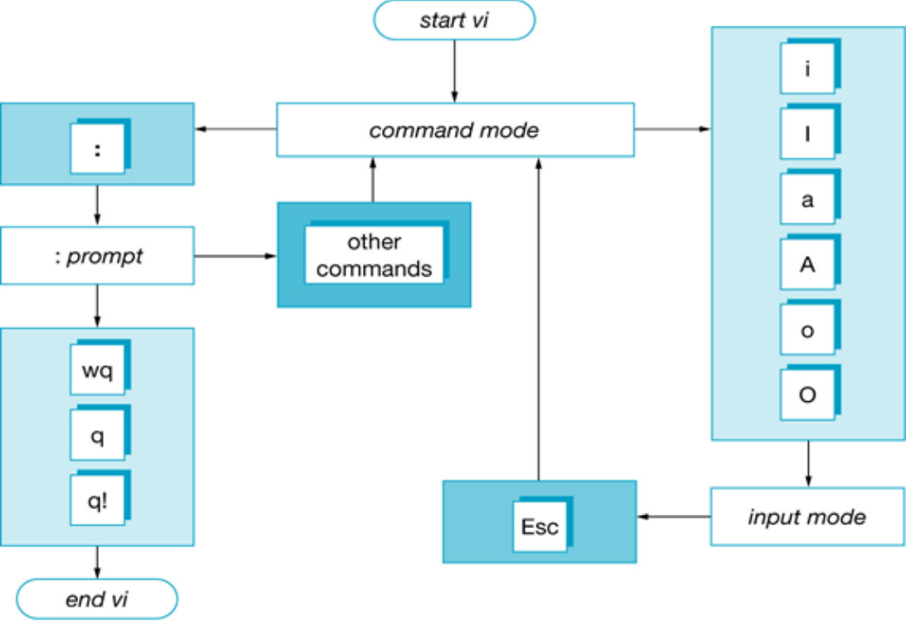
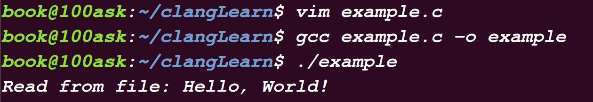
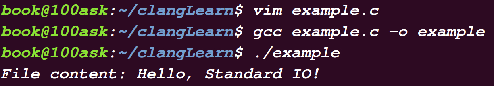

<div align="center">

<h1>Linux编程基础</h1>

</div>

# 目录

- [目录](#目录)
- [vi 或 vim](#vi-或-vim)
  - [工作模式：](#工作模式)
  - [常用命令：](#常用命令)
- [GCC](#gcc)
  - [编译流程](#编译流程)
  - [编译常用选项](#编译常用选项)
  - [GCC指令](#gcc指令)
  - [告警和出错选项](#告警和出错选项)
  - [库依赖](#库依赖)
- [GDB](#gdb)
  - [概述](#概述)
  - [GDB使用流程](#gdb使用流程)
  - [GDB基本命令](#gdb基本命令)
- [Makefile工程管理器](#makefile工程管理器)
  - [概述](#概述-1)
  - [Makefile基本结构](#makefile基本结构)
  - [Makefile变量](#makefile变量)
    - [简单使用](#简单使用)
    - [变量类型](#变量类型)
  - [Makefile规则](#makefile规则)
    - [隐式规则](#隐式规则)
    - [模式规则](#模式规则)
    - [习题1](#习题1)
    - [习题2](#习题2)
- [文件IO编程](#文件io编程)
  - [文件描述符](#文件描述符)
  - [基本IO操作函数](#基本io操作函数)
    - [open() 打开](#open-打开)
    - [read() 读取](#read-读取)
    - [write() 写入](#write-写入)
    - [close() 关闭文件描述符](#close-关闭文件描述符)
    - [lseek() 定位文件偏移量](#lseek-定位文件偏移量)
    - [综合案例](#综合案例)
  - [标准IO操作函数](#标准io操作函数)
    - [fopen()](#fopen)
    - [fclose()](#fclose)
    - [fread()](#fread)
    - [fwrite()](#fwrite)
    - [综合案例2](#综合案例2)
  - [文件描述符和文件指针的区别](#文件描述符和文件指针的区别)
  - [复制文件描述符](#复制文件描述符)
    - [1. `dup` 函数](#1-dup-函数)
    - [2. `dup2` 函数](#2-dup2-函数)
  - [习题3](#习题3)
  - [习题4](#习题4)
- [Linux串口通信](#linux串口通信)
  - [1. 概述](#1-概述)
  - [2. 串口配置流程](#2-串口配置流程)
- [进程控制编程](#进程控制编程)
  - [1. 进程概述](#1-进程概述)
    - [(1) 进程和程序](#1-进程和程序)
    - [(2) 进程的状态和转换](#2-进程的状态和转换)
    - [(3) 进程的标识](#3-进程的标识)
  - [2. Linux进程编程](#2-linux进程编程)
    - [(1) 进程创建](#1-进程创建)
    - [(2) exec 函数族](#2-exec-函数族)
    - [(3) 进程的退出](#3-进程的退出)
      - [异常终止](#异常终止)
      - [正常终止](#正常终止)
      - [exit() 和 \_exit() 函数的区别](#exit-和-_exit-函数的区别)
    - [(4) wait 和 waitpid](#4-wait-和-waitpid)
      - [wait 函数](#wait-函数)
      - [waitpid 函数](#waitpid-函数)
    - [()](#)
    - [()](#-1)


# vi 或 vim

`vi` 或 `vim` 是一款强大的文本编辑器，常用于Unix和Linux系统。它有三种主要工作模式：命令模式、编辑模式和底行模式。

## 工作模式：

1. **命令模式：**
   - 在此模式下，键盘输入会被解释为命令。你可以执行移动光标、复制、粘贴等操作。

2. **编辑模式：**
   - 在此模式下，你可以输入或编辑文本。按下 `i` 键进入编辑模式。

3. **底行模式：**
   - 在此模式下，你可以保存文件、退出编辑器等。按下 `:` 键进入底行模式。



## 常用命令：

- **yy：**
  - 复制当前行（在命令模式下输入 `yy`）。

- **dd：**
  - 删除当前行（在命令模式下输入 `dd`）。

- **:q!：**
  - 放弃所有更改并强制退出（在底行模式下输入 `:q!`）。

- **:q：**
  - 退出编辑器（在底行模式下输入 `:q`）。

- **:wq：**
  - 保存更改并退出编辑器（在底行模式下输入 `:wq`）。

---


# GCC

## 编译流程

编译过程通常包括以下四个阶段：

1. **预处理（Preprocessing）：**
   - 展开宏定义，处理条件编译，生成经过预处理的源代码文件（通常以`.i`为扩展名）。

2. **编译（Compilation）：**
   - 将预处理后的代码翻译成汇编代码（通常以`.s`为扩展名）。

3. **汇编（Assembly）：**
   - 将汇编代码翻译成目标机器语言，生成目标文件（通常以`.o`为扩展名）。

4. **链接（Linking）：**
   - 将目标文件与其他目标文件或库文件链接在一起，生成最终的可执行文件。

---


## 编译常用选项

1. **`-o file`：**
   - 指定输出文件的名称，例如 `-o my_program`。

2. **`-g`：**
   - 生成包含调试信息的可执行文件，以便在调试时使用。

3. **`-E`：**
   - 只进行预处理，生成预处理后的代码。

4. **`-S`：**
   - 只进行编译，生成汇编代码。

5. **`-c`：**
   - 只进行编译和汇编，生成目标文件。

6. **`-I dir`：**
   - 指定头文件的搜索路径，例如 `-I /usr/include`。

7. **`-L path`：**
   - 指定库文件的搜索路径，例如 `-L /usr/lib`。

8. **`-lname`：**
   - 指定要链接的库文件，例如 `-lm` 链接数学库。

9. **`-Wall`：**
   - 启用所有常用的警告信息。


## GCC指令

`GCC`指令的一般格式如下：

```bash
gcc [选项] 要编译的文件 [选项] [目标文件]
```

其中：

- `gcc` 是编译命令。
- `[选项]` 包含各种编译选项，例如优化级别、调试信息等。
- `要编译的文件` 是源代码文件的名称。
- `[目标文件]` 是生成的目标文件的名称。

在底层执行过程中，一条 `gcc` 指令包含了多个阶段，每个阶段有不同的责任：

1. **预处理阶段（cpp）**：
   - `cpp` 是预处理器，负责对源代码进行预处理。
   - 在这个阶段，宏会被展开，条件编译会进行，生成一个经过预处理的中间文件（通常以`.i`为扩展名）。
   - 我们可使用 `-E` 选项来查看：
   ```bash
   $ gcc -E hello.c -o hello.i
   ```

2. **编译阶段（ccl）**：
   - `ccl` 表示 C Compiler，这个阶段将预处理后的文件编译成汇编代码。
   - 生成一个汇编代码文件（通常以`.s`为扩展名）。
   - 我们可使用 `-S` 选项来查看：
   ```bash
   $ gcc -S hello.i -o hello.s
   ```

3. **汇编阶段（as）**：
   - `as` 是汇编器，将汇编代码转换成目标文件。
   - 生成一个目标文件（通常以`.o`为扩展名）。
   - 我们可使用 `-c` 选项来查看：
   ```bash
   $ gcc -c hello.s -o hello.o
   ```

4. **链接阶段（ld）**：
   - `ld` 是链接器，负责将多个目标文件和库文件链接在一起，生成最终的可执行文件。
   - 可执行文件的名称可以通过 `-o` 选项指定，如果没有指定，默认为 `a.out`。
   ```bash
   $ gcc hello.o -o hello
   ```

## 告警和出错选项

`gcc` 提供的编译选项中，有一些是用于控制警告和错误的处理。

举例如下：

1. **`-pedantic`**：
   - `-pedantic` 选项启用更多的警告，**包括一些标准之外的语法和语义问题**。
   - 这个选项用于强制编译器严格遵循语言标准，尽量避免使用非标准的语法或行为。
   - 帮助程序员发现一些不符合 ANSI/ISO C标准的代码（但不是全部）。
   - 例如，如果代码中使用了一些标准之外的语法或特性，`-pedantic` 选项将发出相应的警告。
   - 用法：
   ```bash
   $ gcc -pedantic -o output_file source_file.c
   ```

2. **`-Wall`**：
   - `-Wall` 选项**启用大多数常见的警告**。
   - 它用于开启编译器的一般警告，帮助开发者发现潜在的问题或不良实践。
   - 警告可以帮助改善代码的质量和可维护性。
   - 用法：
   ```bash
   $ gcc -Wall -o output_file source_file.c
   ```

3. **`-Werror`**：
   - `-Werror` 选项**将所有警告视为错误**，导致编译过程中任何警告都会被当作错误处理，终止编译过程。
   - 这有助于确保代码在编译时不会产生任何警告，提高代码质量。
   - 如果使用了 `-Werror`，开发者需要确保代码中没有警告，否则编译将失败。
   - 用法：
   ```bash
   $ gcc -Werror -o output_file source_file.c
   ```

## 库依赖

在编写和编译程序时，可能会使用到各种函数库（或称为动态链接库、静态链接库）。这些库通常包括头文件（`.h`）和相应的库文件（`.a` 或者 `.so`）。为了在编译过程中正确地链接这些库，需要告诉编译器它们的位置。这就是库依赖管理的问题。

以下是一些与库依赖相关的概念和使用方法：

1. **头文件的位置**：
   - 头文件通常包含函数和数据结构的声明，但不包含实际的实现。
   - 通常存储在 `/usr/include/` 目录下，但有些库可能存储在其他位置。

2. **库文件的位置**：
   - 库文件包含实际的函数和数据结构的实现。
   - 通常存储在 `/usr/lib/` 或 `/usr/lib64/` 目录下，但也可能存储在其他位置。

3. **查找头文件和库文件**：
   - 使用 `-I` 选项告诉编译器在哪里查找头文件。
   - 使用 `-L` 选项告诉编译器在哪里查找库文件。
   - 使用 `-l` 选项指定要链接的库的名称。

   ```bash
   $ gcc -I/path/to/header/files -L/path/to/library/files -lmylibrary -o output_file source_file.c
   ```

   - 上述命令中，`-I` 用于指定头文件的路径，`-L` 用于指定库文件的路径，`-l` 用于指定要链接的库。注意，库名不需要加上前缀 "lib" 和文件扩展名，例如，使用 `-lmylibrary` 会查找 `libmylibrary.so` 或 `libmylibrary.a`。

---

# GDB

## 概述

GDB（GNU调试器）是一个用于调试程序的强大工具。它能够在程序执行时监视并控制其行为，帮助你找到和修复错误。在使用 `gcc` 编译时，添加 `-g` 选项可以将调试信息嵌入可执行文件中，这样 GDB 就能更好地理解源代码和程序的关系。

## GDB使用流程

以下是使用GDB的基本流程：

1. **在编译时加入调试信息**：

- 在使用GDB进行调试之前，首先确保在编译程序时加入调试信息。
- 通过在编译时添加 `-g` 选项来实现。
- 举例：
```bash
$ gcc -g source_file.c -o executable_file
```

2. **启动GDB**：

- 使用 `gdb` 命令启动GDB，并指定要调试的可执行文件，通常在当前目录下
- 举例：
```bash
$ gdb executable_file
```
- 如果要同时调试运行程序和`core`文件，可以这样：
```bash
# core文件是程序非法执行后core dump产生的
$ gdb executable_file core
```
- 如果要附加到运行中的进程可以这样：
```bash
$ gdb executable_file PID
```
- 此时`executable_file`是服务程序，并且在PATH环境变量中搜索得到，此时指定进程ID，gdb会自动attach上去并调试


3. **GDB命令**：
   - 一旦GDB启动，可以使用各种命令来控制调试过程。一些常用的命令包括：
     - `run`：启动程序并开始调试。
     - `break`：设置断点。
     - `step`：逐行执行程序，进入函数内部。
     - `next`：逐行执行程序，不进入函数内部。
     - `print`：打印变量的值。
     - `backtrace` 或 `bt`：显示函数调用堆栈。
     - `quit`：退出`GDB`。

4. **调试过程**：
   - 在调试过程中，可以使用断点、单步执行、查看变量值等功能，帮助定位和解决程序中的错误。
   - `GDB`还提供了丰富的命令和选项，以满足不同场景下的调试需求。

5. **退出GDB**：
   - 在调试完成后，可以使用 `quit` 命令退出`GDB`。

   ```bash
   (gdb) quit
   ```

## GDB基本命令

1. **`list`：**
   - 显示源代码，通常与行号一起使用，如 `list 10` 显示第10行附近的源代码。

2. **`break`：**
   - 在指定的行设置断点，如 `break 15` 在第15行设置断点。

3. **`information`：**
   - 提供各种信息，如 `info breakpoints` 显示当前设置的所有断点。

4. **`run`：**
   - 启动程序并开始调试，如 `run arg1 arg2` 启动程序并传递参数 `arg1` 和 `arg2`。

5. **`print`：**
   - 打印变量的值，如 `print variable` 打印变量的值。

6. **`watch`：**
   - 监视变量的值，当变量的值发生变化时停下来，如 `watch variable`。

7. **`next` 或 `step`：**
   - 单步执行，`next` 用于逐过程执行，`step` 用于逐语句执行。

8. **`continue`：**
   - 继续执行程序直到遇到下一个断点或程序结束。

9. **`quit`：**
   - 退出 GDB。

# Makefile工程管理器

## 概述

所有Makefile工程管理器，指的是管理较多的文件，在大型项目开发中，如果有几十到上百的源文件，如果每次都手工键入gcc命令进行编译，非常不方便，因此人们通常使用Make工具来自动完成编译工作。

`Make` 是一个用于构建（build）和管理项目的工具，它最早是为Unix系统设计的，但现在已经在多个平台上得到广泛应用。`Make` 的工作原理是基于一个称为 `Makefile` 的文本文件，`Makefile` 包含了构建规则和依赖关系，告诉 `make` 如何构建项目。

> 注意，`Make` 能够通过根据文件时间戳自动发现更新过的文件，减少不必要的编译工作，从而提高项目的工作效率。

Makefile文件按照某种语法进行编写。说明了如何编译各个源文件并链接生成可执行文件，指定了哪些文件先编译，哪些需要重新编译，甚至更复杂的操作。Makefile带来的好处就是“自动化编译”，一旦写好Makefile，只需一个Make命令就可以自动编译整个工程。


## Makefile基本结构

`Makefile` 的基本结构如下：

```bash
target: dependency_files
    command
```

其中：

- `target` 是目标体。
- `dependency_files` 是要创建目标体所需的依赖文件。
- `command` 是创建每个目标体时需要运行的命令，必须以`Tab`键开始。

示例：

```bash
main: main.c utils.c
    gcc -o main main.c utils.c
```

上述示例中，`main` 是目标体，它依赖于 `main.c` 和 `utils.c`，命令是使用 `gcc` 编译这两个文件生成可执行文件 `main`。

如果你需要清理生成的文件，可以添加一个清理规则，例如：

```bash
clean:
    rm -f target
```

在这个例子中，`clean` 是一个伪目标，它不产生实际的文件，但可以通过执行 `make clean` 命令来删除生成的目标体和依赖文件。


## Makefile变量

### 简单使用

有这样的情况，如果要以相同的编译选项同时编译十几个C源文件，而为每一个目标的编译指定冗长的编译选项是非常乏味的，为了提高维护性，可以使用变量来解决。

Makefile文件的变量就是字符串，可以理解为C语言中的宏。变量名是不包含“:”“#”“=”和结尾空格的任何字符串，并且大小写敏感。

```makefile
# Makefile
objects= main.o add.o dec.o mul.o div.o   # 定义变量

program: $(objects)  # 使用变量
   gcc $(objects) -o program
main.o:main.c main.h
   gcc -c main.c -o main.o
add.o:add.c
   gcc -c add.c -o add.o
dec.o:dec.c
   gcc -c dec.c -o dec.o
mul.o:mul.c
   gcc -c mul.c -o mul.o
div.o:div.c
   gcc -c div.c -o div.o
clean:
   rm *.o program
```

### 变量类型

`Makefile` 中的变量主要分为用户自定义变量、预定义变量、自动变量和环境变量。

下面对每种类型进行简要说明：

1. **用户自定义变量**：
   - **递归展开方式**：使用 `VAR=var`，这种方式在使用时会递归地展开，即每次使用时都重新计算。
   - **简单扩展方式**：使用 `VAR:=var`，这种方式在定义时就会扩展，后续使用时不再重新计算。

2. **预定义变量**：
   - 预定义变量是由 Make 提供的一些预先定义好的变量，用户可以直接使用或者修改。
   - 例如，可以使用 `CC` 变量更换编译器，实现交叉编译。

3. **自动变量**：
   自动变量代表编译语句中的目标文件和依赖文件，具有特殊的含义，包括：
   - `$*`：不包含扩展名的目标文件名称。
   - `$+`：表示所有的依赖文件，以空格分隔，以出现的先后为序，可能包含重复的依赖文件。
   - `$<`：表示第一个依赖文件。
   - `$?`：所有时间戳比目标文件晚的依赖文件，以空格分隔。
   - `$@`：目标文件的完整名称。
   - `$^`：所有不重复的依赖文件，以空格分开。
   - `$%`：如果目标是归档成员，则该变量表示目标的归档成员名称。

4. **环境变量**：
   Make 在启动时自动读取系统当前已经定义了的环境变量，并且创建同名同值的变量。如果用户自定义变量和环境变量相同，则用户自定义变量会覆盖同名的环境变量。

我们来将前面那个Makefile文件修改一下：

```makefile
# Makefile
objects= main.o add.o dec.o mul.o div.o
CC=gcc
CFLAGS=-Wall -O -g
# $^: 所有不重复的依赖文件
# $@: 目标文件的完整名称
program: $(objects)
   $(CC) $^ -o $@
main.o:main.c main.h
   $(CC) $(CFLAGS) -c main.c -o main.o
add.o:add.c
   $(CC) $(CFLAGS) -c add.c -o add.o
dec.o:dec.c
   $(CC) $(CFLAGS) -c dec.c -o dec.o
mul.o:mul.c
   $(CC) $(CFLAGS) -c mul.c -o mul.o
div.o:div.c
   $(CC) $(CFLAGS) -c div.c -o div.o
clean:
   rm *.o program
```

## Makefile规则

Makefile规则是Make进行处理的一句，包括了目标体、依赖文件及其之间的命令语句。

比如 `$(CC) $(CFLAGS) -c main.c -o main.o` 就是一条规则。

### 隐式规则

Make 会自动搜索隐式规则目录来确定如何生成目标文件，用于自动推导生成目标文件（`.o`）的规则，而不需要显式地写出每个源文件的编译规则。

常见的隐式规则：

| 对应语言后缀名                     | 隐式规则                            |
| ---------------------------------- | ----------------------------------- |
| **C编译**：`.c` 变为 `.o`          | `$(CC)-c $(CPPCFLAGS) $(CFLAGS)`    |
| **C++编译**：`.cc` 或`.C`变为 `.o` | `$(CXX)-c $(CPPCFLAGS) $(CXXFLAGS)` |

好，根据这个隐式规则，我们再把上述Makefile文件简化：

```makefile
# Makefile
objects= main.o add.o dec.o mul.o div.o
CC=gcc
CFLAGS=-Wall -O -g
program: $(objects)
   $(CC) $^ -o $@
clean:
   rm *.o program
```

之所以可以这么简洁，是因为隐式规则指出，所有“.o”文件都可以自动由“.c”文件使用命令 `$(CC) $(CPPCFLAGS) $(CFLAGS) -c file.c -o file.o` 来生成。

### 模式规则

模式规则使用 `%` 符号表示通配符，可以用来匹配一类文件名或目标。在上述隐式规则中，`%.o: %.c` 表示任何 `.o` 文件都可以由对应的 `.c` 文件生成，无需为每一对文件编写具体的规则。

举个例子，假设你有两个源文件 `file1.c` 和 `file2.c`，你可以使用模式规则 `%.o: %.c` 来为它们生成对应的目标文件。这个规则告诉Make工具如何将`.c`文件编译成`.o`文件，而不需要为每一对文件都编写具体的规则。

假设目录结构如下：

```bash
project/
|-- Makefile
|-- file1.c
|-- file2.c
```

下面是一个简单的Makefile示例：

```Makefile
# Makefile

# 模式规则：任何 .o 文件都可以由对应的 .c 文件生成
%.o: %.c
    gcc -c $< -o $@

# 目标规则：生成可执行文件 my_program
my_program: file1.o file2.o
    gcc $^ -o $@

# 伪目标规则：清理生成的文件
clean:
    rm -f *.o my_program
```

在这个Makefile中，`%.o: %.c` 表示任何`.o`文件都可以由对应的`.c`文件生成。`$<` 是一个自动变量，表示规则中的第一个依赖项，即`.c`文件。`$@` 是一个自动变量，表示规则中的目标，即`.o`文件。通过这个规则，Make工具会自动根据需要编译`file1.c`和`file2.c`，生成对应的`.o`文件，然后使用目标规则生成最终的可执行文件`my_program`。

### 习题1

编写了三个C语言源文件`main.C`、`port.c`和`port.h`，其中`main.c`为主函数，并对`port.c`进行了引用。请写一个`Makefile`文件，执行`make`命令时生成可执行文件`myapp`，执行`make clean`命令是删除目标文件和可执行文件。

方式一：

```makefile
# makefile

myapp:main.o port.o
   gcc main.o port.o -o myapp
main.o:main.c port.h
   gcc -c main.c -o main.o
port.o:port.c prot.h
   gcc -c port.c -o port.o

clean:
   rm -f main.o port.o myapp
```

方式二：

```makefile
# makefile

myapp:main.o port.o
   gcc $^ -o $@
main.o:main.c port.h
   gcc -c $< -o $@
port.o:port.c prot.h
   gcc -c $< -o $@

clean:
   rm *.o myapp
```

### 习题2

阅读以下`Makeflie`文件

```makefile
# makefile
all:libmys.so
SRC=f1.c f2.c f3.c
TGT=$(SRC:.c=.o)
%.o:%.c
   gcc -c $?
libmys.so:$(TGT)
   gcc -shared -0 $@ $(TGT)
clean:
rm -f $(TGT)
```

请回答下列问题:

1. 此 `Makefile` 文件的主要功能是什么?

答：生成共享库文件 `libmys.so`

1. 此 `Makefile` 文件包含多少个规则? 它们分别是什么?

答：4个，分别是 `all`、`%.o`、`libmys.so`、`clean`

3. 使用此 `Makefile` 文件可以生成目标文件 `f2.o` 吗? 为什么?

答：可以。因为模式规则 `%.o:%.c` 定义了 `*.o` 与 `*.c` 的关系和生成方式。

# 文件IO编程

## 文件描述符

在Linux系统中，文件描述符（File Descriptor）是用于标识和访问已打开文件或I/O通道的一种机制。对于Linux来说，所有对设备和文件的操作都使用文件描述符来实现。文件描述符是一个非负整数，是一个索引值，并指向内核中每个进程打开文件的记录表。每个进程都会有一个文件描述符表，它是一个数组，其中每个元素都是一个文件描述符。

标准文件描述符是指在程序启动时由操作系统自动打开的文件描述符。有三个，分别是：

- 0：`STDIN_FILENO`，标准输入文件描述符，通常关联于键盘输入。
- 1：`STDOUT_FILENO`，标准输出文件描述符，通常关联于屏幕输出。
- 2：`STDERR_FILENO`，标准错误文件描述符，通常关联于屏幕输出。

这些标准文件描述符是在程序执行时自动打开的，并且它们在整个程序的生命周期内都可用。当程序启动时，它们已经被关联到相应的输入、输出和错误流。程序可以通过这些文件描述符来进行读取、写入和错误报告等操作。

## 基本IO操作函数

基本IO操作函数的特点是**不带缓存**，通过文件描述符来完成各种IO操作，**直接对文件或设备进行读写操作**。

### open() 打开

`open()` 函数是一个用于打开或创建文件的系统调用函数。

`open()` 函数的原型如下：

```c
#include <sys/types.h>  
#include <sys/stat.h>   // 声明 mode_t
#include <fcntl.h>      // 声明 flag 常量

int open(const char *pathname, int flags);
int open(const char *pathname, int flags, mode_t mode);
```

参数含义：

- `pathname` ：字符串，表示打开的文件名称，可以包含路径。
- `flags` ：是打开文件的标志（可包含多个），用于指定打开文件的方式，如只读、只写、读写等。
- `mode` ：只有在创建文件时才会用到，它指定了文件的权限，可以使用八进制数来表示权限。

`open()` 函数返回一个文件描述符，该文件描述符是一个非负整数，用于后续对文件的读写操作。如果打开或创建文件失败，`open()` 返回 -1，并设置全局变量 `errno` 来指示错误的原因。

以下是一些常见的 `flags` 可选值：

- `O_RDONLY`：只读打开。
- `O_WRONLY`：只写打开。
- `O_RDWR`：读写打开。
- `O_CREAT`：如果文件不存在，则创建文件。
- `O_TRUNC`：如果文件存在，将其截断为零长度（删除原有数据）。
- `O_APPEND`：追加写入文件。

至于文件的权限，可以用一组宏定义来表示，这些宏定义通常与 `mode_t` 类型一起使用。

以下是一些常用的宏定义：

- `S_IRUSR`：文件所有者具有读权限（即，用户读权限）。
- `S_IWUSR`：文件所有者具有写权限（即，用户写权限）。
- `S_IXUSR`：文件所有者具有执行权限（即，用户执行权限）。
- `S_IRGRP`：文件所属组具有读权限（即，组读权限）。
- `S_IWGRP`：文件所属组具有写权限（即，组写权限）。
- `S_IXGRP`：文件所属组具有执行权限（即，组执行权限）。
- `S_IROTH`：其他用户具有读权限（即，其他用户读权限）。
- `S_IWOTH`：其他用户具有写权限（即，其他用户写权限）。
- `S_IXOTH`：其他用户具有执行权限（即，其他用户执行权限）。

这些宏定义可以与按位或（`|`）操作符结合使用，以创建一个表示完整文件权限的数字。例如，`S_IRUSR | S_IWUSR | S_IRGRP | S_IROTH` 表示文件所有者具有读写权限，文件所属组和其他用户具有只读权限。

### read() 读取

函数原型：

```c
#include <unistd.h>  // 声明size_t

ssize_t read(int fd, void *buf, size_t count);
```

参数含义：

- `fd`：文件描述符。
- `buf`：指向存放读取数据的缓冲区的指针。
- `count`：要读取的字节数。

函数返回值：

- 成功：返回读取的字节数（非负整数）。
- 失败：返回 -1，并设置全局变量 `errno` 来指示错误的原因。

### write() 写入

函数原型：

```c
#include <unistd.h>  // 声明size_t

ssize_t write(int fd, const void *buf, size_t count);
```

参数含义：

- `fd`：文件描述符。
- `buf`：指向包含要写入的数据的缓冲区的指针。
- `count`：要写入的字节数。

函数返回值：

- 成功：返回写入的字节数（非负整数）。
- 失败：返回 -1，并设置全局变量 `errno` 来指示错误的原因。

### close() 关闭文件描述符

函数原型：

```c
#include <unistd.h>

int close(int fd);
```

参数含义：

- `fd`：要关闭的文件描述符。

函数返回值：

- 成功：返回 0。
- 失败：返回 -1，并设置全局变量 `errno` 来指示错误的原因。

### lseek() 定位文件偏移量

函数原型：

```c
#include <unistd.h>

off_t lseek(int fd, off_t offset, int whence);
```

参数含义：

- `fd`：文件描述符。
- `offset`：要移动的偏移量，可以是正数、负数或零。
- `whence`：指定偏移量的起始位置，可以取以下值：
  - `SEEK_SET`：从文件开头开始计算偏移。
  - `SEEK_CUR`：从当前文件偏移量开始计算偏移。
  - `SEEK_END`：从文件末尾开始计算偏移。

`lseek()` 用于在文件中定位偏移量，通常与 `read()` 和 `write()` 一起使用。`lseek()` 可以将文件偏移量设置到文件的开头、当前位置或末尾，取决于 `whence` 参数的值。如果成功，`lseek()` 返回新的文件偏移量；如果失败，返回 -1，并设置全局变量 `errno` 来指示错误的原因。

### 综合案例

下面是一个简单的例子，演示了如何使用基本的IO操作函数进行文件的创建、写入、读取和关闭：

```c
#include <fcntl.h>
#include <stdio.h>
#include <stdlib.h>
#include <unistd.h>
#include <string.h>

int main() {
    int fd;

    // 创建文件 example.txt，如果不存在则创建，以读写方式打开，权限为：用户读写，组只读
    fd = open("example.txt", O_CREAT | O_RDWR, S_IRUSR | S_IWUSR | S_IRGRP);

    if (fd == -1) {
        perror("open");
        exit(EXIT_FAILURE);
    }

    // 写入数据到文件
    const char *data = "Hello, World!\n";
    ssize_t write_result = write(fd, data, strlen(data));

    if (write_result == -1) {
        perror("write");
        close(fd);
        exit(EXIT_FAILURE);
    }

    // 定位文件偏移量到文件开头
    off_t seek_result = lseek(fd, 0, SEEK_SET);

    if (seek_result == -1) {
        perror("lseek");
        close(fd);
        exit(EXIT_FAILURE);
    }

    // 读取文件数据
    char buffer[100];
    ssize_t read_result = read(fd, buffer, sizeof(buffer));

    if (read_result == -1) {
        perror("read");
        close(fd);
        exit(EXIT_FAILURE);
    }

    // 打印读取的数据
    printf("Read from file: %s", buffer);

    // 关闭文件描述符
    close(fd);

    return 0;
}
```

效果如下：



## 标准IO操作函数

标准IO操作函数的特点在于有**全缓冲**、**行缓冲**和**不带缓冲**三种形式，尽可能减少使用`read()`和`write()`等系统调用的数量以提高程序的性能和效率。

### fopen()

`fopen()`函数用于打开文件，并返回一个文件指针。它的原型如下：

```c
FILE *fopen(const char *filename, const char *mode);
```

- `filename`：文件名。
- `mode`：打开文件的模式，如读取、写入、追加等。

`mode` 字符串通常包含一个或多个字符，每个字符代表一种操作：

- `"r"`: 以只读方式打开文件。文件必须存在，否则打开失败。
- `"w"`: 以写入方式打开文件。如果文件存在，则截断文件大小为0；如果文件不存在，则创建新文件。
- `"a"`: 以追加方式打开文件。如果文件存在，文件指针定位到文件末尾；如果文件不存在，则创建新文件。
- `"rb"`, `"wb"`, `"ab"`: 以二进制方式打开文件，即进行二进制读取或写入。同样的，如果文件不存在，写入方式会创建新文件。

另外，可以通过在模式字符串中添加 `"+"` 来表示同时支持读和写：

- `"r+"`: 读写模式，文件必须存在。
- `"w+"`: 读写模式，如果文件存在则截断，不存在则创建。
- `"a+"`: 读写模式，文件指针定位到文件末尾，如果文件不存在则创建。

注意：在进行文件操作时，务必小心使用正确的模式，以免不小心覆盖或删除重要数据。


### fclose()

`fclose()`函数用于关闭一个打开的文件。它的原型如下：

```c
int fclose(FILE *fp);
```

- `fp`：要关闭的文件指针。

### fread()

`fread()`函数用于从文件中读取数据。它的原型如下：

```c
size_t fread(void *ptr, size_t size, size_t nmemb, FILE *stream);
```

- `ptr`：指向存储数据的内存地址。
- `size`：每个数据项的字节数。
- `nmemb`：要读取的数据项数目。
- `stream`：文件指针。

### fwrite()

`fwrite()`函数用于向文件中写入数据。它的原型如下：

```c
size_t fwrite(const void *ptr, size_t size, size_t nmemb, FILE *stream);
```

- `ptr`：指向要写入的数据的内存地址。
- `size`：每个数据项的字节数。
- `nmemb`：要写入的数据项数目。
- `stream`：文件指针。

### 综合案例2

下面是一个使用标准IO操作函数的简单案例，用于创建一个文本文件，写入数据，然后再读取并输出文件内容：

```c
#include <stdio.h>
#include <stdlib.h>

int main() {
    FILE *file;
    char data[] = "Hello, Standard IO!";

    // 打开文件以写入数据，如果文件不存在则创建
    file = fopen("example.txt", "w");
    if (file == NULL) {
        perror("Error opening file");
        exit(EXIT_FAILURE);
    }

    // 写入数据到文件
    fwrite(data, sizeof(char), sizeof(data), file);

    // 关闭文件
    fclose(file);

    // 重新打开文件以读取数据
    file = fopen("example.txt", "r");
    if (file == NULL) {
        perror("Error opening file");
        exit(EXIT_FAILURE);
    }

    // 读取并输出文件内容
    char buffer[100];
    fread(buffer, sizeof(char), sizeof(buffer), file);
    printf("File content: %s\n", buffer);

    // 关闭文件
    fclose(file);

    return 0;
}
```

运行效果：




## 文件描述符和文件指针的区别

`Linux`系统的文件描述符和文件指针的区别如下：

- 文件描述符: 在Linux内核中，任何打开的文件都会被分配一个唯一非负整数，用于表示该打开的文件，Linux内核式通过文件描述符对文件进行操作。
- 文件指针: 在用户应用程序中，使用函数fopen打开一个文件后，将返回一个文件指针与该文件关联，所有对该文件的读写操作都可以通过该指针流完成。
- 文件指针指向进程用户区中的一个被称为FILE结构的数据结构，FILD结构封装了一个缓冲区和一个文件描述符，使用户通过文件指针对文件操作成为可能。


## 复制文件描述符

`dup` 和 `dup2` 是用于复制文件描述符的系统调用。它们的目的是创建一个现有文件描述符的副本，以便在程序中使用这个副本进行文件操作。这对于重定向标准输入、标准输出和标准错误流以及在管道中使用文件描述符等场景非常有用。

### 1. `dup` 函数

`dup` 函数用于复制一个文件描述符，并返回一个新的文件描述符，该描述符与原始描述符指向相同的文件表项。其原型如下：

```c
#include <unistd.h>

int dup(int oldfd);
```

- `oldfd`：要复制的文件描述符。

`dup` 返回的新文件描述符是当前进程中尚未使用的最小文件描述符。如果复制成功，返回的新文件描述符将与 `oldfd` 共享相同的文件表项。

示例代码：

```c
#include <fcntl.h>
#include <stdio.h>
#include <unistd.h>

int main() {
    int fd = open("example.txt", O_RDWR);

    if (fd == -1) {
        perror("open");
        return 1;
    }

    int new_fd = dup(fd);

    if (new_fd == -1) {
        perror("dup");
        close(fd);
        return 1;
    }

    printf("Original file descriptor: %d\n", fd);
    printf("Duplicated file descriptor: %d\n", new_fd);

    // 使用 fd 和 new_fd 进行文件操作

    close(fd);
    close(new_fd);

    return 0;
}
```

运行效果：

```bash
book@100ask:~/clangLearn$ vim dup_test.c
book@100ask:~/clangLearn$ gcc dup_test.c -o dup_test
book@100ask:~/clangLearn$ ./dup_test 
Original file descriptor: 3
Duplicated file descriptor: 4
```


### 2. `dup2` 函数

`dup2` 函数与 `dup` 类似，但它允许指定新的文件描述符号。如果新的文件描述符已经被使用，`dup2` 会先关闭该描述符，然后将旧的文件描述符复制到指定的新描述符上。其原型如下：

```c
#include <unistd.h>

int dup2(int oldfd, int newfd);
```

- `oldfd`：要复制的文件描述符。
- `newfd`：指定的新文件描述符。

`dup2` 返回的文件描述符与 `oldfd` 共享相同的文件表项，但其描述符号是 `newfd`。

示例代码：

```c
#include <fcntl.h>
#include <stdio.h>
#include <unistd.h>

int main() {
    int fd = open("example.txt", O_RDWR);

    if (fd == -1) {
        perror("open");
        return 1;
    }

    int new_fd = dup2(fd, 100);  // 将文件描述符复制到指定的新描述符上

    if (new_fd == -1) {
        perror("dup2");
        close(fd);
        return 1;
    }

    printf("Original file descriptor: %d\n", fd);
    printf("Duplicated file descriptor: %d\n", new_fd);

    // 使用 fd 和 new_fd 进行文件操作

    close(fd);
    // 注意：这里不需要关闭 new_fd，因为 dup2 已经关闭了可能冲突的新文件描述符

    return 0;
}
```

在这个例子中，`dup2` 函数将文件描述符复制到指定的新描述符上（这里是 100）。如果新描述符已经被使用，`dup2` 会先关闭新描述符，然后再进行复制。

## 习题3

阅读以下程序，请写出执行结果并解释得到该结果的原因：

```c
void main()
{
   int fd1,fd2;
   fd1=open("/etc/passwd",O_RDONLY);
   fd2=open("/etc/passwd ",O_RDWR);
   printf("fd1=%d,fd2=%d\n",fd1,fd2);
   close(fd1);
   close(fd2);
}
```

答：

结果是`fd1=3 fd2=4`，这是因为函数`open()`函数返回的文件描述符为最小可用的非负整数，而`012`是三个标准的文件描述符，默认已经被占用，所以第一个`open()`的返回值为`3`，第二个`open()`返回的是`4`。

## 习题4

```c
#include <fcntl.h>
#include <stdio.h>
#include <stdlib.h>
#include <unistd.h>
#include <string.h>

int main(void) {
   int fd, save_fd;
   char msg[] = "This is a test\n";

   // 打开文件 somefile，如果不存在则创建，以读写方式打开，权限为用户读写
   fd = open("somefile", O_RDWR | O_CREAT, S_IRUSR | S_IWUSR);

   if (fd == -1) {
      perror("open");
      exit(EXIT_FAILURE);
   }

   // 复制标准输出文件描述符（1），并保存原始标准输出文件描述符
   save_fd = dup(1);

   // 将文件描述符 fd 复制到标准输出文件描述符（1）
   dup2(fd, 1);

   // 关闭文件描述符 fd（因为 dup2 已经复制了 fd，可以关闭原始的了）
   close(fd);

   // 使用标准输出进行写入
   write(1, msg, strlen(msg));

   // 恢复原始标准输出文件描述符
   dup2(save_fd, 1);

   // 使用恢复后的标准输出进行写入
   write(1, msg, strlen(msg));

   // 关闭原始标准输出文件描述符
   close(save_fd);

   return 0;
}
```

# Linux串口通信

## 1. 概述

在Linux中，串口通信编程是通过串口（也称为COM口或RS-232）来实现数据交换的一种方式。串口通信通常用于连接计算机和外部设备，如传感器、打印机、调制解调器等。

以下是Linux串口通信编程的一般步骤：

1. **打开串口设备：** 你需要打开串口设备文件，通常是`/dev/ttyS0`（对应COM1）或`/dev/ttyUSB0`（对应USB串口适配器）。
2. **配置串口参数：** 你需要设置串口的通信参数，如波特率、数据位、停止位和奇偶校验位。
3. **读写数据：** 使用`read`和`write`函数进行数据的读取和发送。
4. **关闭串口：** 在程序结束时，记得关闭串口。

在`Linux`中，串口通信的配置主要通过 `termios` 结构体来完成，其中 `c_cflag` 字段也是非常重要的。`c_cflag` 包含了控制模式标志，这些标志通过“与”和“或”操作来进行设置和清除。

## 2. 串口配置流程

**1. 保存原先串口配置**

在开始配置之前，使用 `tcgetattr` 函数保存当前串口配置，以便后续需要时能够还原。

```c
struct termios newtio, oldtio;
tcgetattr(fd, &oldtio);
```

**2. 激活选项**

激活选项包括 `CLOCAL` 和 `CREAD`，用于启用本地连接和允许数据接收。

```c
newtio.c_cflag |= CLOCAL | CREAD;
```

**3. 设置波特率**

使用 `cfsetispeed` 和 `cfsetospeed` 函数设置波特率，确保输入和输出都采用相同的波特率。

```c
cfsetispeed(&newtio, B115200);
cfsetospeed(&newtio, B115200);
```

**4. 设置数据位**

通过位操作设置数据位，使用掩码操作确保不影响其他标志位。

```c
newtio.c_cflag &= ~CSIZE;  // 清除数据位掩码
newtio.c_cflag |= CS8;     // 设置8位数据位标志
```

**5. 设置奇偶校验位**

设置奇偶校验位需要同时操作 `c_cflag` 和 `c_iflag`。

- 设置奇校验：

  ```c
  newtio.c_cflag |= PARENB;
  newtio.c_cflag |= PARODD;
  newtio.c_iflag |= (INPCK | ISTRIP);
  ```

- 设置偶校验：

  ```c
  newtio.c_iflag |= (INPCK | ISTRIP);
  newtio.c_cflag |= PARENB;
  newtio.c_cflag &= ~PARODD;
  ```

**6. 设置停止位**

通过操纵 `CSTOPB` 标志设置停止位的数量。

```c
newtio.c_cflag &= ~CSTOPB; // 使用1位停止位
```

**7. 设置最少字符和等待时间**

设置最少字符和等待时间，通常可设为0。

```c
newtio.c_cc[VTIME] = 0;
newtio.c_cc[VMIN] = 0;
```

**8. 处理要写入的引用对象**

在此步骤中，处理要通过串口写入的数据对象。

**9. 刷清输入/输出缓存**

使用 `tcflush` 函数刷新输入和输出缓冲区，确保旧数据不会影响新的配置。

```c
tcflush(fd, TCIOFLUSH);
```

`tcflush` 函数用于刷新输入和输出缓冲区，其原型如下：

```c
int tcflush(int filedes, int queue);
```

- `filedes`: 文件描述符，指定要刷新缓冲区的串口设备。
- `queue`: 刷新的队列类型，可以是以下三个值之一：
  - `TCIFLUSH`：刷清输入队列。即抛弃（丢弃）已经被终端驱动程序接收到，但用户程序尚未读取的输入数据。
  - `TCOFLUSH`：刷清输出队列。即抛弃用户程序已经写入，但尚未被发送的输出数据。
  - `TCIOFLUSH`：刷清输入、输出队列。即在刷清输入队列和输出队列时，还要抛弃所有在更改发生时未读取的输入数据。


**10. 激活配置**

在完成以上配置后，使用 `tcsetattr` 函数激活配置，确保新的设置立即生效。

`tcsetattr` 函数用于设置终端设备的属性，并在何时激活新的属性取决于 `opt` 参数。其原型如下：

```c
int tcsetattr(int filedes, int opt, const struct termios *termptr);
```

- `filedes`: 文件描述符，指定要设置属性的串口设备。
- `opt`: 指定何时激活新属性的选项，可以是以下三个值之一：
  - `TCSANOW`：更改立即发生。即新的终端属性立即生效。
  - `TCSADRAIN`：等到发送了所有输出后更改才发生。如果更改了输出参数，应该使用这个选项，以确保不会影响正在发送的数据。
  - `TCSAFLUSH`：等到发送了所有输出后更改才发生。在更改发生时未读的所有输入数据都被删除。更进一步，它会抛弃未发送的输出数据。

- `termptr`: 指向 `struct termios` 结构体的指针，包含新的终端属性。

例如，要在配置串口后立即激活新的属性，可以使用如下代码：

```c
tcsetattr(fd, TCSANOW, &newtio);
```

这将立即激活新的串口属性，确保新的配置参数生效。

# 进程控制编程

## 1. 进程概述

### (1) 进程和程序

进程是指一个具有独立功能的程序在某个数据集合上的一次动态执行过程，它是系统进行资源分配和调度的基本单元。

进程和程序有本质区别：

- **程序**是静态的一段代码，是一些保存在非易失性存储器的指令的有序集合，没有任何执行的概念。
  
- **进程**是一个动态的概念，它是程序执行的过程，包括了动态创建、调度和消亡的整个过程，是程序执行和资源管理的最小单位。

### (2) 进程的状态和转换

根据CPU对资源拥有情况，定义三种基本状态：

- **就绪状态**（ready state）：进程已分配到除CPU以外的所有必要资源，只要获得CPU，便可立即执行，该状态为就绪状态。

- **运行状态**（也称执行状态，running state）：进程已包括CPU在内的所有运行所需资源，正在执行中。

- **阻塞状态**（blocked state）：正在执行的进程因请求资源、等待事件发生、等待I/O等原因，而暂时无法继续执行时，进入阻塞状态。

在实际操作系统设计中，通常还需要增加两个状态：

- **创建状态**：正在创建且尚未完成创建过程的进程（处于胎儿期）所处的状态称为创建状态。

- **终止状态**：进程终止后，并不立即将其清理，而是让其进入终止状态。

### (3) 进程的标识

进程标识通过PID（进程标识号）和PPID（父进程标识号）来实现。

- **PID**：每个进程都有一个唯一的PID，用于区分系统中的不同进程。
- **PPID**：表示父进程的PID，即创建该进程的进程的PID。 PPID 使得进程之间形成了一种树状的父子关系。

在编程中，可以使用以下函数获取进程的标识符：

- **getpid()**：获取当前进程的PID。
- **getppid()**：获取当前进程的父进程的PID。


## 2. Linux进程编程

### (1) 进程创建

`fork`函数是用于创建新进程的系统调用。调用`fork`函数时，操作系统会复制当前进程的副本，创建一个新的进程，即子进程。新进程（子进程）和原进程（父进程）在程序代码、数据和堆栈等方面都是一样的，但是它们有不同的进程ID。

在父进程中，`fork`的返回值是新创建子进程的进程号（PID），而在子进程中，`fork`的返回值是0。如果`fork`调用失败，返回-1，表示未能创建新的进程。

需要注意的是，`fork`函数会复制当前进程的所有资源（包括代码、数据、堆栈等），也就是说子进程是父进程的复制品，因此使用fork的代价较大，执行速度并不快。同时需要注意，子进程中的变量修改不会影响父进程中的变量，它们是相互独立的。

举例：

```c
#include <stdio.h>
#include <unistd.h>
#include <sys/types.h>

int main() {
   int n = 4;  /*此时只有一个进程*/

   // 创建新进程
   pid_t pid = fork();  /*此时已经有两个进程在同时运行了*/

   // 根据fork的返回值区分父子进程
   if (pid == -1) {
      // 错误处理
      perror("Fork failed");
      return 1;
   } else if (pid == 0) {
      // 子进程的代码
      n--;
      printf("Child process - PID: %d, n: %d\n", getpid(), n);
   } else {
      // 父进程的代码
      n++;
      printf("Parent process - PID: %d, n: %d\n", getpid(), n);
   }

   return 0;
}
```

```bash
$ ./fork_test 
Parent process - PID: 6696, n: 5
Child process - PID: 6697, n: 3
```

在上述例子中，变量`n`初始化为`4`，然后通过`fork`函数创建一个新的进程。在子进程中，`n--`，然后输出子进程的`PID`和`n`；在父进程中，`n++`，然后输出父进程的`PID`和`n`。通过观察输出结果，可以看到父子进程分别修改了变量`n`，并且它们的`PID`不同。

### (2) exec 函数族

`exec` 函数族提供了一个在进程中启动另一个程序执行的函数。当调用 `exec` 函数时，当前进程的用户空间代码和数据会被新程序完全替换，新程序的启动例程从头开始执行。

总体上，exec 函数族包括六种不同的函数，它们是：

以下是 exec 函数族的函数原型定义，以表格形式返回：

| 函数   | 函数原型                                                                  |
| ------ | ------------------------------------------------------------------------- |
| execl  | `int execl(const char *path, const char *arg, ...);`                      |
| execv  | `int execv(const char *path, char *const argv[]);`                        |
| execle | `int execle(const char *path, const char *arg, ..., char *const envp[]);` |
| execve | `int execve(const char *path, char *const argv[], char *const envp[]);`   |
| execlp | `int execlp(const char *file, const char *arg, ...);`                     |
| execvp | `int execvp(const char *file, char *const argv[]);`                       |

这些函数的参数意义如下：
- `path`：要执行的程序的绝对路径和相对路径（execl，execv，execle，execve）。
- `file`：要执行的程序的文件名，会在环境变量 `$PATH` 指定的路径中查找（execlp，execvp）。
- `arg`：参数列表，以逐个列举或数组形式传递给新程序。
- `argv`：参数数组，用于整体构造指针数组传递给新程序。
- `envp`：环境变量数组，用于指定新程序执行时使用的环境变量。


这些函数在使用时需要谨慎，因为一旦调用成功，当前进程的代码和数据将被完全替换，不再返回。如果调用出错，这些函数将返回 -1。

事实上，只有`execve`是真正的系统调用，其他五个最终都调用`execve`函数。


> ### 记忆：exec 函数族的查找方式
> 
> #### 1. execl, execv, execle, execve
> - 这四个函数（不以p结尾）的查找方式都需要**提供完整的文件目录路径**。
> - 可以是相对路径或者绝对路径。
> - 要执行的程序在调用进程的文件系统中的确切位置必须被指定。
>
> #### 2. execlp, execvp
> - 这两个以 "p" 结尾的函数允许只提供文件名，而不是完整的文件目录路径。
> - 系统会自动从环境变量 "PATH" 指定的路径中查找可执行文件。
>
> ### 记忆：exec 函数族的参数传递方式
>
> 参数传递方式只看函数名的第五个字母
>
> #### 1. execl, execle, execlp
> - 第五个字母使用 "l" 的函数表示参数以列表（list）的形式逐个列举。
> - 举例：`int execl(const char *path, const char *arg, ...);`
> - 参数 `arg` 是可变参数列表，用于列举传递给新程序的参数。
> - “...”中的最后一个可变参数应该是NULL，起标记作用。
>
> #### 2. execv, execve, execvp
> - 第五个字母使用 "v" 的函数表示参数以矢量（vector）的方式整体构造指针数组传递。
> - 举例：`int execv(const char *path, char *const argv[]);`
> - 参数 `argv` 是一个指针数组，包含新程序执行时的参数。
>
> ### 记忆：环境变量
>
> #### execle, execve
> - 以 "e" 结尾的函数允许传入指定的环境变量。
> - 即通过参数 `envp` 指定新程序执行时使用的环境变量数组。

### (3) 进程的退出

进程的退出主要有**异常终止**和**正常终止**两种情况。

#### 异常终止

1. **接收到信号：**
   - 当进程接收到某些信号时，可能会导致异常终止。不同的信号代表不同的异常情况，例如 `SIGSEGV` 表示段错误，`SIGABRT` 表示调用了 `abort` 函数等。

2. **调用 abort 函数：**
   - 明确调用 `abort` 函数会导致进程异常终止，并产生 `SIGABRT` 信号。

#### 正常终止

1. **由 main 函数返回：**
   - 进程在执行 `main` 函数时，当 `main` 函数返回时，操作系统认为程序正常执行结束，会进行正常的清理工作，然后终止进程。

2. **调用 exit() 函数：**
   - 调用标准库函数 `exit()` 也会使进程正常终止。这个函数会执行一系列清理工作，包括关闭文件、释放内存等，然后通知操作系统进程已经结束。

3. **调用 _exit() 或 _Exit() 函数：**
   - 这两个函数直接终止进程，不进行清理工作。

#### exit() 和 _exit() 函数的区别

这两个函数都是用来终止进程的，只不过 `exit()` 函数在终止进程前会检查该进程打开过哪些文件，把文件缓冲区中的内容写回文件。而 `_exit()` 则是直接将进程关闭，此时缓冲区的数据就会丢失。

### (4) wait 和 waitpid

如果父进程终止，子进程还存在，则子进程的父进程改为`init`进程。

> `init`进程是`Linux`系统中的第一个用户级进程，其**进程ID**（`PID`）为`1`，负责系统初始化和进程的孤儿管理，是所有其他进程的祖先。通常程序文件为 `“/sbin/init”`

`wait` 函数和 `waitpid` 函数是用于等待子进程结束并获取其终止状态的两个系统调用。


#### wait 函数

函数原型：

```c
#include <sys/types.h>
#include <sys/wait.h>

// 阻塞调用进程，等待任意子进程终止，并获取其终止状态
pid_t wait(int *status); 
```

参数 `status` 用于存储子进程的终止状态信息的指针。如果不关心终止状态，可以传入 `NULL`。

函数返回值：
- 成功时返回终止的子进程的进程ID（PID）。
- 失败时返回 `-1`，并设置 `errno` 表示错误类型。

注意：
- 如果调用进程没有子进程，`wait` 函数会一直阻塞等待。
- 如果有多个子进程，`wait` 函数会等待任意一个子进程终止，并返回其进程ID。

#### waitpid 函数

函数原型：

```c
#include <sys/types.h>
#include <sys/wait.h>

// 等待指定的子进程终止，并获取其终止状态
pid_t waitpid(pid_t pid, int *status, int options);
```

函数参数：

- `pid`：指定要等待的子进程的进程ID。
  - `-1`：等待任意子进程（此时和wait作用一样）。
  - `0`：等待与调用进程属于同一进程组的任意子进程。
  - 其他正值：等待指定PID的子进程。
- `status`：用于存储子进程的终止状态信息的指针。如果不关心终止状态，可以传入 `NULL`。
- `options`：附加选项，控制 `waitpid` 的行为。
  - `WCONTINUED`：
    - 等待被暂停的子进程被继续。
    - 使用场景：当一个子进程由于接收到 `SIGSTOP` 信号而被暂停，然后再次收到 `SIGCONT` 信号以继续执行时，使用 `WCONTINUED` 可以等待子进程的继续运行。
  - `WNOHANG`：
    - 非阻塞调用，即使没有子进程终止也立即返回。
    - 使用场景：在某些情况下，需要定期检查子进程是否已经终止，但又不希望阻塞等待子进程的终止。

函数返回值：

- 成功时返回终止的子进程的进程ID（PID）。
- 失败时返回 `-1`，并设置 `errno` 表示错误类型。

简单来说，`waitpid` 函数具有比 `wait` 更灵活的参数，可以选择等待特定的子进程，以及是否阻塞等待。如果调用进程没有符合条件的子进程，根据 `options` 的不同，`waitpid` 可能阻塞等待或立即返回。

### ()
### ()