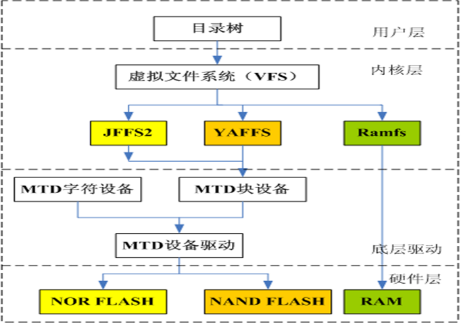
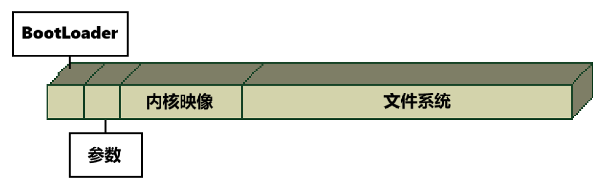

<div align="center">

<h1>基于LInux的嵌入式软件开发</h1>

</div>

# 目录

- [目录](#目录)
- [1. 嵌入式软件结构](#1-嵌入式软件结构)
  - [1.1 软件体系结构](#11-软件体系结构)
  - [1.2 基于Linux的嵌入式软件](#12-基于linux的嵌入式软件)
    - [(1) BootLoader](#1-bootloader)
    - [(2) Linux内核](#2-linux内核)
    - [(3) 应用程序](#3-应用程序)
- [2. 嵌入式软件开发流程](#2-嵌入式软件开发流程)
  - [2.1 嵌入式Linux设计概述](#21-嵌入式linux设计概述)
  - [2.2 基于开发板的二次开发](#22-基于开发板的二次开发)
  - [2.3 基于Linux的嵌入式软件开发流程](#23-基于linux的嵌入式软件开发流程)
- [3. 嵌入式内核结构及移植](#3-嵌入式内核结构及移植)
  - [3.1 Linux内核结构](#31-linux内核结构)
    - [(1) Linux内核简介](#1-linux内核简介)
    - [(2) Linux内核的主要子系统](#2-linux内核的主要子系统)
    - [(3) Linux内核的技术特点](#3-linux内核的技术特点)
  - [3.2 Linux的移植](#32-linux的移植)
    - [(1) Linux的源代码结构](#1-linux的源代码结构)
    - [(2) Linux的移植](#2-linux的移植)
- [4. 嵌入式文件系统及移植](#4-嵌入式文件系统及移植)
  - [4.1 嵌入式文件系统的基础](#41-嵌入式文件系统的基础)
    - [(1) 基于Flash的文件系统](#1-基于flash的文件系统)
    - [(2) 基于RAM的文件系统](#2-基于ram的文件系统)
    - [(3) 网络文件系统（NFS）](#3-网络文件系统nfs)
  - [4.2 嵌入式文件系统的设计](#42-嵌入式文件系统的设计)
- [5. 嵌入式系统引导代码](#5-嵌入式系统引导代码)
  - [5.1 BootLoader简介](#51-bootloader简介)
    - [(1) BootLoader的作用](#1-bootloader的作用)
    - [(1) BootLoader的操作模式](#1-bootloader的操作模式)
  - [5.2 常用的BootLoader](#52-常用的bootloader)
  - [5.3 BootLoader基本原理](#53-bootloader基本原理)
  - [5.4 BootLoader实例：U-Boot](#54-bootloader实例u-boot)
    - [(1) U-Boot到Linux内核的参数传递](#1-u-boot到linux内核的参数传递)
    - [(2) U-Boot 常用命令](#2-u-boot-常用命令)
    - [(3) U-Boot 环境变量](#3-u-boot-环境变量)


# 1. 嵌入式软件结构

## 1.1 软件体系结构

自顶向下，分别是：

1. **应用软件层**：用户应用程序主要调用系统的API函数来对系统进行操作，完成用户应用功能开发。
2. **中间件层**：基础软件的一大类，属于可复用软件，为应用软件层提供运行和开发的环境。
3. **操作系统层**：如果有，则一般以内核映像的形式下载到目标系统中。
4. **设备驱动层**：为上层软件提供了设备的操作接口，包括硬件抽象层、板级支持包和设备驱动程序
5. **硬件层**：包括嵌入式微处理器、存储器和键盘等输入输出设备


---


## 1.2 基于Linux的嵌入式软件

**硬件之上 → 引导程序 BootLoader → Linux内核 → 应用程序**

### (1) BootLoader

引导装载程序 `BootLoader` ，通常是在任何硬件上执行的第一段代码，负责整个系统的加载启动任务，初始化硬件，建立内存空间的映射图，准备好正确的环境。

常见的 `BootLoader` 有 `uboot` 和 `Vivi` 等。

### (2) Linux内核

**Linux内核**的开发工作主要包括**Linux内核**的定制和裁剪等工作。

内核通过硬件的设备驱动程序来控制它们。

### (3) 应用程序

基于 GUI 的应用程序开发越来越重要。

目前比较流行的 GUI 平台有 `QT/Embedded`、紧缩的 `X Windows` 系统、`MicroWindows`以及`MiniGUI`系统。

---


# 2. 嵌入式软件开发流程

## 2.1 嵌入式Linux设计概述

采用交叉编译调试的方式进行软件开发。

调试环境建立在宿主机（host，一台PC机）上，对应的开发平台称为目标机（target），开发完成后将可执行的二进制代码下载到目标机上运行即可。

---


## 2.2 基于开发板的二次开发

二次开发指的是利用现有的开发板进行开发。

在当前嵌入式领域中，ARM（Advanced RISC Machines） 处理器被广泛应用于各种嵌入式设备中。

---

## 2.3 基于Linux的嵌入式软件开发流程

流程如下：

1. 建立开发环境，下载并安装交叉编译器
2. 配置开发主机，设置MINICOM、配置网络（如NFS网络文件系统）
3. 建立引导装载程序BootLoader，下载并进行移植修改
4. 移植Linux操作系统，如μClinux、ARM-Linux等
5. 建立根文件系统，一般设为只读
6. 建立应用程序的文件系统，规划Flash的分区方案

---


# 3. 嵌入式内核结构及移植

## 3.1 Linux内核结构

### (1) Linux内核简介

Linux内核是操作系统的核心组成部分，负责管理硬件资源、提供系统调用接口以及执行内核级别的任务。内核分为用户空间和内核空间两部分：

**用户空间：**
- 包括应用程序运行的区域，用户程序在这个空间执行。
  

**内核空间：**
- 系统调用接口：提供用户程序与内核之间的通信接口，允许用户程序请求操作系统提供的服务。
- 内核代码：包含操作系统的核心功能和算法的实现。
- BSP（Board Support Package）：依赖于体系结构的代码，用于支持特定硬件平台的代码。

---


### (2) Linux内核的主要子系统

Linux内核由多个主要子系统组成，每个子系统负责不同的功能模块。在特定的目录结构中可以找到相关的实现代码：

- **进程调度：** 位于“./linux/kernel”目录，负责管理进程的调度和执行。
  
- **进程间通信：** 提供不同进程之间的通信机制，促使协同工作。

- **内存管理：** 位于“./linux/mm”目录，负责管理系统内存，包括内存分配、释放和虚拟内存管理等。

- **虚拟文件系统（VFS）：** 提供文件系统的通用接口抽象，源代码位于“./linux/fs”目录，为用户和文件系统之间提供一个交换层。

- **网络堆栈：** 位于“./linux/net”目录，实现了Linux的网络协议栈，负责处理网络通信。

- **设备驱动程序：** 位于“./linux/drivers”目录，管理系统中各种设备的驱动程序。

- **依赖体系结构的代码：** 位于“./linux/arch”目录，包含与特定体系结构相关的代码。

---


### (3) Linux内核的技术特点

- **实用、效率：** Linux内核注重实用性和效率，追求在各种硬件平台上的高性能表现。

- **内核可定制：** 用户可以根据需要配置和编译内核，选择加载不同的模块，以满足特定的系统要求。

- **LKM机制（动态）：** Linux支持Loadable Kernel Modules，允许在运行时动态加载和卸载内核模块，提高系统的灵活性。

- **网络支持：** 内核具有强大的网络支持，能够处理各种网络通信需求。

- **采用虚拟内存：** Linux内核使用虚拟内存管理技术，提供更高效的内存管理和地址空间隔离。

Linux内核的结构和特点使其成为一个强大而灵活的操作系统核心，适用于各种应用场景和硬件平台。

---


## 3.2 Linux的移植

### (1) Linux的源代码结构

Linux的源代码结构如下：

1. **Linux：** 主目录，包含所有的子目录，还含有唯一的一个Makefile文件，用于整体编译和构建内核。

2. **arch：** 包含与硬件体系结构相关的代码，各个子目录对应不同的硬件平台，如x86、ARM等。

3. **block：** 存放部分块设备驱动程序，涉及块设备的I/O操作和管理。

4. **crypto：** 包含加密、散列算法、压缩和CRC校验算法，提供安全相关的功能。

5. **Documentation：** 存放内核各部分的通用解释和注释，作为开发者文档的重要来源。

6. **drivers：** 存放设备驱动程序，占据了内核源码中的大部分，包括各种硬件设备的驱动。

7. **fs：** 包含文件系统代码，支持各种文件系统的实现，如ext4、FAT等。

8. **include：** 存放头文件，提供给内核和用户空间程序使用的头文件。

9. **init：** 包含内核初始化代码，负责启动内核的基本设置。

10. **ipc：** 处理进程间通信的相关代码，包括消息队列、信号量等。

11. **kernel：** 内核最核心的部分，包含核心函数和调度器等关键模块。

12. **lib：** 存放内核使用的库文件，提供一些通用的函数和数据结构。

13. **mm：** 实现虚拟内存管理，包括内存分配、页面管理等。

14. **modules：** 存放已经编译好的可动态加载的模块，支持LKM机制。

15. **net：** 存放所有提供网络支持的代码，包括协议栈和网络设备驱动。

16. **scripts：** 包含配置内核的脚本文件以及用户开发和维护手册。

17. **security：** 主要包含安全相关的代码，例如SELinux的模块。

18. **sound：** 包含常用音频设备的驱动程序，支持音频设备的管理。

19. **usr：** 存放应用程序和文件，是一个较庞大的目录，包含用户空间程序的一部分。

### (2) Linux的移植

移植是将`Linux`操作系统适应到特定目标平台的过程。这涉及对源代码的修改和配置，以确保Linux能够正确运行在目标硬件上。

> 移植，就是把Linux操作系统针对具体的目标平台做必要的改写后，安装到该目标平台使其正确地运行起来。

---


# 4. 嵌入式文件系统及移植

## 4.1 嵌入式文件系统的基础

Linux支持多种文件系统，引入虚拟文件系统（VFS），为各种文件系统提供一个统一的操作界面和应用编程接口。



Linux启动时，第一个必须挂载的是根文件系统。以下讲到的基于存储设备的文件系统，都可以用作Linux的根文件系统。

> 闪存主要有 `Nor` 和 `Nand` 两种技术。

### (1) 基于Flash的文件系统

1. `JFFS`: **日志闪存文件系统**
   1. 是可读写的、支持数据压缩的、基于哈希表的日志型文件系统。
   2. 将文件系统的数据和原数据以**节点形式**存储在`Flash`上
   3. 主要用于`NOR Flash`
2. `yaffs`: 专门为 `Nand FIash` 设计的**嵌入式日志型文件系统**
   1. 跨平台的文件系统
   2. 适用于大容量的存储设备。
   3. 运行和挂载速度都比JFES2要快。
3. `Cramfs`: **只读的压缩文件系统**
   1. 压缩比一般可以达到1: 2。
   2. 但仍可以做到高效的随机读取。
4. `Rommfs` : **简单的、紧凑的、只读的文件系统**
   1. 不支持动态擦写保存。
   2. 按顺序存放数据。
   3. 因而支持应用程序以`XIP`(eXecuteIm Place，片内运行)方式运行。
   4. 在系统运行时，节省RAM空间。

### (2) 基于RAM的文件系统

1. `Ramdisk`: 
   1. `Ramdisk`是将一部分固定大小的内存当作分区来使用。
   2. 它并非一个实际的文件系统，而是一种将实际的文件系统装入内存的机制。
   3. 可以作为**根文件系统**。
2. `Ramfs/Tmpfs`: 
   1. 把所有的文件都放在`RAM`中
   2. 因此**读/写操作发生在RAM中**。
   3. 可以用`Ramfs/Tmpfs`来存储一些临时性或经常要修改的数据。
   4. 如 `/tmp` 和 `/var` 目录。

### (3) 网络文件系统（NFS）

NFS 指的是在不同机器，不同操作系统之间通过网络共享文件的技术。

---

## 4.2 嵌入式文件系统的设计

**文件系统格式选择的基本策略**如下：

把任何在**运行时不需要进行更新**的文件放在`Cramfs`文件系统中。

> 因为`Cramfs`的压缩比高达`2:1`，节约存储空间的效果是明显的。如果应用程序要求采用`XIP`方式运行，则可以选择`RomFs`文件系统。

那些**需要经常读/写**的目录，例如`/var`、`/tmp`，应该放在`tmpfs`文件系统中。

> 减少对`flash`的擦写次数，延长`flash`的使用寿命。`tmptfs`文件系统中的变化在下次启动后是不会保存的。

对于那些**需要进行读、写，并且在下次启动之后也能将更新信息保存的文件**，则应该放入日志型文件系统里。

> - 如果采用的是`NOR`型闪存，则应选择`JFFS2`文件系统; 
> - 如果是 `NAND` 闪存，则应选择`YAFFS`文件系统。

# 5. 嵌入式系统引导代码

## 5.1 BootLoader简介

### (1) BootLoader的作用

引导加载程序`BootLoader`是系统加电后运行的第一段软件代码，是操作系统内核运行之前运行的一段小程序。

> `BootLoader`可以完成系统硬件的初始化，包括`CPU`、`SDRRAM`、`FLASH`、串口等硬件初始化，并设置系统时钟，检测内存空间映射设置堆栈指针，将内核映像和根文件系统映像从`FLASH`上读到 `RAM` 空间中，准备内核启动参数，从而将系统的软硬件环境带到一个合适状态，以便为最终调用操作系统内核准备好正确的环境。

### (1) BootLoader的操作模式

`BootLoader`有两种操作模式: **启动加载模式**、**下载模式**。

**启动加载模式**：`BootLoader`的正常工作模式，也成为“自主”模式。

**下载模式**：产品开发时通常使用这个模式，利用某种通信手段从主机下载文件并保存到目标机的RAM中，然后再被`BootLoader`写到目标机的固态存储设备中。


## 5.2 常用的BootLoader

- `ARMBoot`：基于ARM的嵌入式系统所设计的。
- `PPCBoot`：用于多种嵌入式CPU的`BootLoader`引导程序。
- `U-Boot`：`sourceforge` 网站上一个开放源代码的项目，主要用来开发嵌入式系统初始化代码BootLoader。
- `RedBoot`：专门为嵌入式系统定制的开发工具，集BootLoader、调试和Flash烧写于一体。
- `Blob`：一款功能强大的BootLoader。
- `Vivi`：韩国 mizi 公司开发的BootLoader。

## 5.3 BootLoader基本原理


BootLoader依赖于具体的嵌入式板级设备的配置。系统加电后，CPU首先执行BootLoader程序。

下面是同时装有 Boot Loader、内核的启动参数、内核映像和根文件系统映像的固态存储设备的典型空间分配结构图。



从操作系统的角度来看，BootLoader的总目标就是正确地调用内核来执行。

由于BootLoader依赖于CPU的体系结构，因此大多数BootLoader都是分为stage1和stage2两部分。

依赖于CPU的体系结构的部分通常放在stage1，通常以汇编语言来实现。而stage2通常用C语言来实现。

`Boot Loader` 的 `stage1` 通常包括以下步骤:

1. 硬件设备初始化
2. 为加载 `Boot Loader` 的 `stage2` 准备 `RAM` 空间
3. 拷贝 `Boot Loader` 的 `stage2` 到 `RAM` 空间中
4. 设置好堆栈
5. 跳转到 `stage2` 的 `C` 入口点

`Boot Loader` 的 `stage2` 通常包括以下步骤:

1. 初始化本阶段要使用到的硬件设备
2. 检测系统内存映射
3. 将 `kermel` 映像和根文件系统映像从 `flash` 上读到 `RAM` 空间中
4. 为内核设置启动参数
5. 调用内核

---

## 5.4 BootLoader实例：U-Boot

### (1) U-Boot到Linux内核的参数传递

`U-Boot`和内核交互是单向的，两个程序不能同时运行，要实现参数传递只能通过把参数存放到一个固定内存位置，然后通过`RO`、`R1`、`R2`寄存器将参数传递：

- `r0`一般设置为`0`
- `r1` 一般设置为 `machine id` (在使用设备树时该参数没有被使用)
- `r2` 一般设置为`ATAGS`或`DTB`的开始地址， `DTB`的开始地址可以从`images`的`ftd_addr` 成员变量获取

```bash
void (*kernel entry)(int zero, int arch, uint params)
kernel_entry = (void(*)(int, int, uint))images->ep
```

### (2) U-Boot 常用命令

Nand Flash 操作命令为 `nand`。它根据不同参数进行不同操作。

> 切记Nand Flash写入数据之前一定要先擦除。

举例：

- `nand erase [clean] [off size]`
  - 擦除Nand Flash
  - clean表示在每个块的第一个扇区的OOB区写入清除标记
  - off、size表示要擦除的开始偏移地址和长度
- `nand read addr off size`
  - 从Nand Flash偏移地址off处读出size个字节的数据
  - 存放到开始地址为addr的内存中
- `nand write addr off size`
  - 把开始地址为addr的内存中的size个字节的数据
  - 写到Nand Flash偏移地址off处
- `nand write.yaffs addr off size`
  - 烧写文件系统
  - 把开始地址为addr的内存中的size个字节数据写到Nand Flash偏移地址off处

`bootz`命令启动`zImage`镜像，`bootm`命令启动`uImage`镜像：

- `bootz [addr [initrd[:size]] [fdt]]`
- `bootm [addr [initrd[:size]] [fdt]]`

`addr` 是 `Linux` 镜像文件在 `DRAM` 中的位置。

initrd 是 initrd 文件在 `DRAM` 中的地址，如果不使用 `initrd` 的话使用 `-` 代替即可。

`fdt` 就是设备数文件在 `DRAM` 中的地址。

### (3) U-Boot 环境变量

- bootargs：传递给Linux内核的命令行参数
- bootcmd：自动启动时执行的几条命令
- bootdelay：执行自动启动的等待秒数
- baudrate：串口控制台的波特率
- ethaddr：定义以太网接口的MAC地址
- ipaddr：本地的IP地址
- serverip：tftp服务器端的IP地址

