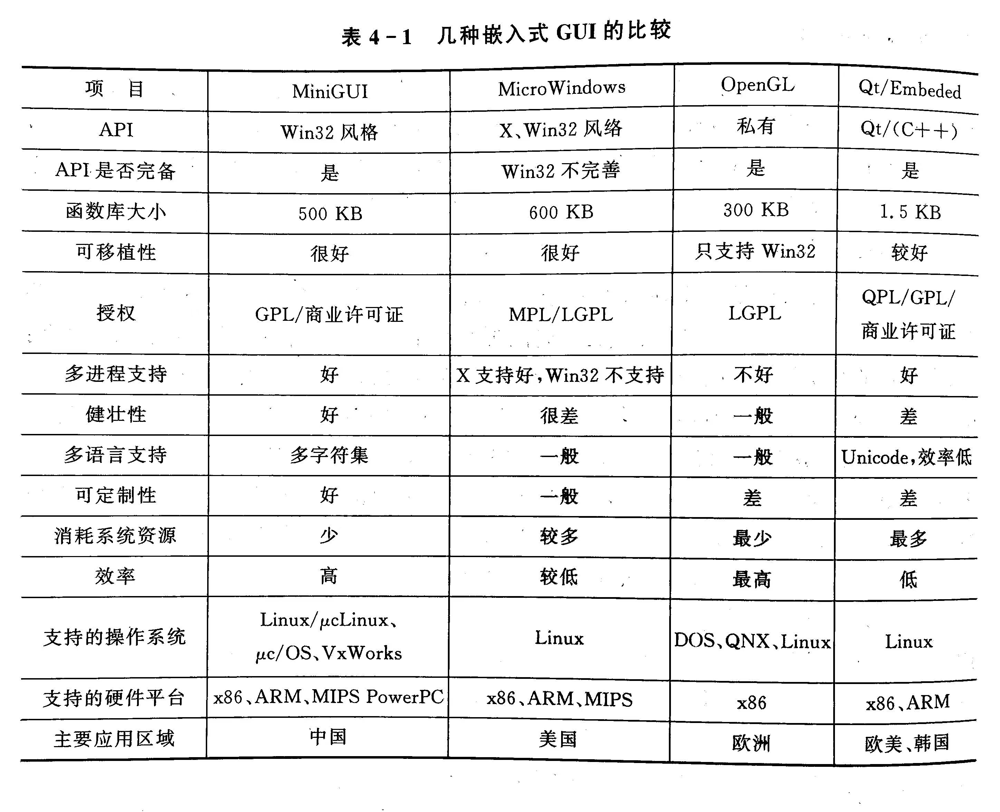
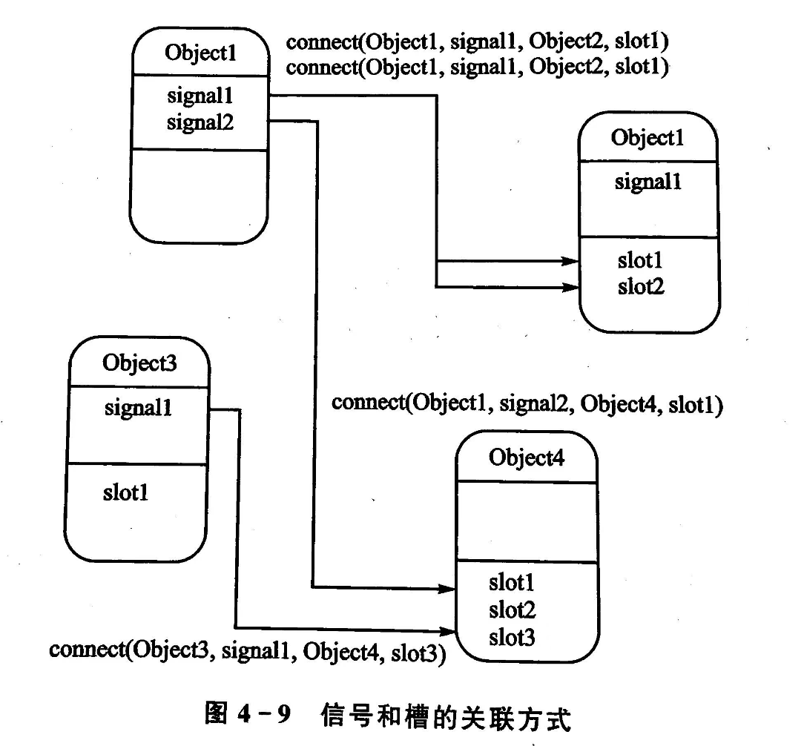

<div align="center">

<h1>嵌入式应用程序设计</h1>

</div>

# 目录

- [目录](#目录)
- [1. 概述](#1-概述)
  - [1.1 嵌入式软件分类](#11-嵌入式软件分类)
    - [(1) 嵌入式操作系统](#1-嵌入式操作系统)
    - [(2) 嵌入式支撑软件](#2-嵌入式支撑软件)
    - [(3) 嵌入式应用软件](#3-嵌入式应用软件)
  - [1.2 嵌入式GUI](#12-嵌入式gui)
- [1.3 常用的嵌入式GUI](#13-常用的嵌入式gui)
- [2. Qt编程基础](#2-qt编程基础)
  - [2.1 Qt简介](#21-qt简介)
    - [(1) Qt软件](#1-qt软件)
    - [(2) Qt版本](#2-qt版本)
    - [(3) Qt 优势](#3-qt-优势)
  - [2.2 Qt/Embedded](#22-qtembedded)
- [3. Qt程序设计基本流程](#3-qt程序设计基本流程)
  - [3.1  Qt程序设计基本流程](#31--qt程序设计基本流程)
    - [(1) 编辑源文件](#1-编辑源文件)
    - [(2) 生成工程文件](#2-生成工程文件)
    - [(3) 生成Makefile文件](#3-生成makefile文件)
    - [(4) 编译运行](#4-编译运行)
  - [3.2 Qt程序的基本结构](#32-qt程序的基本结构)
    - [(1) 头文件](#1-头文件)
    - [(2) main函数](#2-main函数)
    - [(3) 对象](#3-对象)
    - [(4) 显示窗口](#4-显示窗口)
    - [(5) 将控制权交给Qt](#5-将控制权交给qt)
- [4. 信号和槽机制](#4-信号和槽机制)
  - [4.1 基本概念](#41-基本概念)
    - [(1) 信号](#1-信号)
    - [(2) 槽](#2-槽)
    - [(3) 元对象](#3-元对象)
  - [4.2 信号和槽机制的原理](#42-信号和槽机制的原理)
    - [(1) 信号和槽机制](#1-信号和槽机制)
    - [(2) 信号和槽的关联](#2-信号和槽的关联)
    - [(3) 信号和槽的断开](#3-信号和槽的断开)
    - [(4) 信号和槽机制的优点](#4-信号和槽机制的优点)
    - [(5) 信号和槽机制的实例](#5-信号和槽机制的实例)

# 1. 概述

## 1.1 嵌入式软件分类

嵌入式软件：基于嵌入式系统设计的软件，也是计算机软件的一种，可细分为系统软件、支撑软件和应用软件。

### (1) 嵌入式操作系统

嵌入式操作系统是一种用途广泛的系统软件，过去应用于工业控制和国防系统领域。

我国嵌入式操作系统主要基于自主版权的Linux操作系统，以中软Linux、红旗Linux和东方Linux为代表。

### (2) 嵌入式支撑软件

支撑软件是用于帮助和支持软件开发的软件，通常包括数据库和开发工具（其中数据库最为重要）。

### (3) 嵌入式应用软件

嵌入式应用软件：指的是针对特定应用领域、基于某一固定的硬件平台，用来达到用户预期目标的计算机软件。

> 举例：浏览器、E-mail软件、文字处理软件、通信软件、多媒体软件、个人信息处理软件、智能人机交互软件和各种行业应用软件等。

## 1.2 嵌入式GUI

嵌入式GUI为嵌入式系统提供了一种应用于特殊场合的交互接口。

嵌入式GUI的特点：

- 体积小
- 运行时消耗系统资源少
- 上层接口与硬件无关，高度可移植
- 高可靠性
- 在某些场合应具备实时性

目前流行的嵌入式GUI有：`Qt/Embedded`、`Microwindows` 和 `MiniGUI` 等。

嵌入式GUI采用分层结构设计，如下所示：

```
+---------------------+
|        API层        |
+---------------------+
|        核心层       |
+---------------------+
|       连接层        |
+---------------------+
```

其中主要功能集中在核心层，分为两部分：

- 基本功能层：GUI平台的基本功能所在，如鼠标管理、定时器管理、光标管理、窗口管理等。
- 扩展层：基于某种业务功能的实现，如工控领域内的波形显示，这部分需要用户自己开发。

用户使用核心层提供的功能必须通过API接口层，该层就是为用户提供的接口调用层。

# 1.3 常用的嵌入式GUI

- X Window
- OpenGL
- MicroWindows
- MiniGUI
- Qt/Embedded

比较如下：



# 2. Qt编程基础

## 2.1 Qt简介

### (1) Qt软件

Qt是一款跨平台的C++图形用户界面（GUI）工具包，最初由挪威的Trolltech公司（奇趣科技）于1994年创建。这个工具包提供了丰富的功能，包括图形用户界面、网络、数据库、XML处理等，使开发者能够轻松地创建各种类型的应用程序。

Qt的主要特点之一是其跨平台性，可以在不同操作系统上运行，包括Windows、Linux、macOS等。这使得开发者能够编写一份代码，然后在多个平台上进行部署，大大提高了开发效率。

Qt还具有良好的模块化和可扩展性，使得开发者可以根据项目需求选择性地使用各种模块和组件。它支持国际化和本地化，使得应用程序能够轻松地适应不同的语言和地区。

另外，Qt采用了信号与槽机制（Signal and Slot），这是一种强大的事件处理机制，使得开发者能够更灵活地处理用户交互和应用程序逻辑。

在Qt中，还有一种被称为Qt Quick的技术，它基于QML（Qt Meta-Object Language）语言，用于开发移动应用、嵌入式应用和其他具有现代用户界面需求的应用程序。Qt Quick使得界面设计更加灵活和动态。

### (2) Qt版本

1. **Qt 1.x系列：**
   - Qt 1.0: 1995年发布，是Qt的首个正式版本。
   - Qt 1.4: 1997年发布，加入了一些新功能和改进。

2. **Qt 2.x系列：**
   - Qt 2.0: 1999年发布，引入了许多新特性，如国际化支持和多文档界面。
   - Qt 2.3: 2000年发布，增加了对Unix平台的支持。

3. **Qt 3.x系列：**
   - Qt 3.0: 2001年发布，引入了Qt Designer和Qt Linguist等工具。
   - Qt 3.3: 2004年发布，支持了更多的平台，并引入了许多新的特性。

4. **Qt 4.x系列：**
   - Qt 4.0: 2005年发布，引入了Qt的图形体系结构（Graphics View framework）等新特性。
   - Qt 4.5: 2009年发布，增加了Qt WebKit模块，并引入了LGPL授权选择，使Qt在开源社区更加广泛使用。

5. **Qt 5.x系列：**
   - Qt 5.0: 2012年发布，引入了Qt Quick和Qt Quick Controls等现代UI开发技术。
   - Qt 5.6: 2016年发布，支持Qt Lite项目，用于嵌入式和移动设备。
   - Qt 5.15: 2020年发布，是Qt 5系列的最终长期支持（LTS）版本。

6. **Qt 6.x系列：**
   - Qt 6.0: 2020年发布，带来了许多重大的改变，包括模块的重新组织和C++17的采用。
   - ...

### (3) Qt 优势

- **优良的跨平台特性：** Qt的设计注重跨平台性，使得开发者可以轻松地在不同操作系统上部署其应用程序。

- **面向对象：** Qt采用面向对象的编程范式，这有助于提高代码的可维护性和可扩展性。

- **丰富的API：** Qt提供了丰富的应用程序编程接口，使开发者能够轻松地访问和操作各种功能。

- **支持2D/3D图形渲染，支持OpenGL：** Qt支持强大的图形渲染能力，包括对2D和3D图形的全面支持，并集成了OpenGL，为开发图形密集型应用提供了强大的支持。

- **大量的开发文档：** Qt拥有详尽的开发文档，为开发者提供了学习和参考的宝贵资源。

- **XML支持：** Qt内置对XML的支持，使得处理和解析XML数据变得更加便捷。

- **Webkit引擎的集成：** Qt集成了Webkit引擎，使得开发者能够实现本地界面与Web内容的无缝集成，拓展了应用程序的交互和展示方式。

## 2.2 Qt/Embedded

Qt是KDE等项目使用的GUI支持库，许多基于Qt的X Windows程序可以非常方便地移植到Qt/Embedded上。

> KDE是所有主要的Linux发行版的一个标准组件。

简单来说，Qt/Embedded就是有帧缓冲（framebuffer）支持的Linux平台，Windows CE。

# 3. Qt程序设计基本流程

## 3.1  Qt程序设计基本流程

先介绍在终端窗口如何编写Qt程序。

### (1) 编辑源文件

打开一个终端，建立文件夹，然后进入该文件夹，创建C++文件：

```bash
mkdir hello
cd hello
vi hello.cpp
```

编辑代码：

```C++
#include <qapplication.h>
#include <qlabel.h>

int main(int argc, char *argv[])
{
    QApplication app(argc, argv);
    QLabel * label = new QLabel("Hello, Qt!", 0);
    label -> show();
    return app.exac();
}
```

### (2) 生成工程文件

编辑完代码后，用`Qt`的工具`qmake`来生成工程文件：

```bash
qmake -project
ls  # 输出 hello.cpp hello.pro
```

可以看到生成一个名为 `hello.pro` 的工程文件。

### (3) 生成Makefile文件

```bash
qmake hello.pro
ls # 输出 hello.cpp hello.pro Makefile
```

### (4) 编译运行

最后一步直接使用`make`命令来生成可执行文件`hello`，然后运行即可。

```bash
make
./hello
```

## 3.2 Qt程序的基本结构

基于上面的例子，我们来看看Qt程序的基本结构。

### (1) 头文件

```C++
#include <QApplication>
#include <qlabel.h>
```

第一个头文件包含了`QApplication`类的定义。

`QApplication`类是`Qt`应用程序的核心类，每一个使用`Qt`的应用程序中都必须使用一个对象。

第二个头文件包含了`Qlabel`类的定义。实际应用中使用哪个类就必须包含哪个类。

---

### (2) main函数

```C++
int main(int argc, char *argv[])
{

}
```

这是C++程序的入口函数`main`，是程序运行时的起点。

- `argc` 是参数计数，表示命令行参数的个数。
- `argv` 是参数向量，是一个指向字符串数组的指针，其中存储了命令行参数的实际值。

几乎在使用`Qt`的所有情况下，`main()`只需把控制权交给`Qt`库之前执行一些初始化即可，然后`Qt`库通过事件来向程序告知用户的行为。

---

### (3) 对象

```C++
QApplication app(argc, argv);
QLabel * label = new QLabel("Hello, Qt!", 0);
```

这里创建了`QApplication`类的一个对象 `app`，并传入命令行参数。然后创建了一个`QLabel`类的指针 `label`，并通过 `new` 关键字在堆上分配了一个新的`QLabel`对象，显示文本为 `"Hello, Qt!"`。

`app`就是这个程序的`QApplication`，接着创建一个标签控件，并且自己构成一个窗口（因为在构造函数中指定0为它的父窗口，在这个父窗口中标签被定位）。

---

### (4) 显示窗口

```C++
label->show();
```

这一行代码调用了`QLabel`对象的`show`方法，将标签窗口显示在屏幕上。

---

### (5) 将控制权交给Qt

```C++
return app.exec();
```

这里就是将控制权交给`Qt`，`app.exec()` 开始了Qt应用程序的事件循环，它会一直运行，直到应用程序退出。

> `return app.exec();` 语句将程序的控制权交给Qt，直到应用程序退出为止。

在 `exac()` 中，Qt接收并处理用户和系统的事件并且把它们传递给适当的窗口部件。

---

# 4. 信号和槽机制

## 4.1 基本概念

信号和槽机制是一种高级接口，应用于对象之间的通信，是Qt的核心机制。

> 要正确处理信号和槽，必须借助moc的Qt工具，该工具是一个C++预处理程序，为高层次的事件处理自动生成所需要的附加代码。

---

### (1) 信号

Qt中的信号-槽机制是一种事件处理机制，用于在对象间进行通信。

当一个对象的内部状态发生改变时，该对象可以发射一个信号。信号可以被与之相关联的槽函数接收，并在信号发射时被立即执行，类似于普通函数调用。只有定义过信号的类及其派生类能够发射该信号。信

> 当信号与多个槽相关联时，这些槽将按照不确定的顺序依次执行，不能人为指定执行顺序。

只有当所有的槽返回后，发射函数 `emit` 才返回。

信号的声明是在头文件中进行的，使用Qt的关键字 `signals` 来声明：

```c++
signals:
    void mySignal()；
    void mySignal(int x);
    void mySignal(int x, int y);
```

特点：

- 没有函数体定义。
- 返回值都是`void`。
- 信号由 `moc` 自动产生，不应该在 `.cpp` 中实现。

### (2) 槽

槽，普通的成员函数，可以被正常调用，特殊之处在于很多信号可以与其相关联。

当与其关联的信号被发射时，这个槽就会被调用。

> 槽可以有参数，但是参数不能有默认值。槽的声明也是在头文件中。

比如下面就声明了三个槽：

```C++
public slots:
    void mySlot();
    void mySlot(int x);
    void mySlot(int x, int y);
```

槽的存取权限规定了谁能够与其相关联：

- `public slots`：
  - 任何对象都可以将信号与其相关联。
- `protected slots`：
  - 当前类及其子类可以将信号与之相关联。
- `private slots`：
  - 只有类自己可以将信号与之相连接。


### (3) 元对象

`moc`是元对象编译器（meta object compiler）的缩写。用于分析C++文件中的类声明，并生成用于初始化元对象的C++代码。元对象包含了**全部信号和槽的名称以及指向这些函数的指针**。

**Q_OBJECT宏的作用：**
- 在`C++`类声明中，使用`Q_OBJECT`宏声明的类表示具有信号和槽的特性。
- 当`moc`读取`C++`源文件时，发现有`Q_OBJECT`宏声明的类，会生成一个新的`C++`源文件，其中包含该类的元对象代码。

**moc的处理过程：**
- 对于包含信号或槽声明的头文件，例如`"mysignal.h"`，`moc`在编译之前生成名为`"mysignal.moc.h"`的新的`C++`源文件。
- 生成的`C++`源文件包含了该类的元对象代码。
- 对应于类的源文件，`moc`生成名为`"mysignal.moc.cpp"`的文件，并提交给编译器。

元对象代码是实现Qt信号/槽机制所必需的。`moc`生成的`C++`源文件必须与类的实现一起进行编译和链接，或者通过`#include`语句包含到类的源文件中。

> 需要注意！`moc`不会扩展`#include`或`#define`宏定义，只是简单地跳过所遇到的任何预处理指令。

## 4.2 信号和槽机制的原理

### (1) 信号和槽机制

在Qt中，信号和槽机制取代了传统的函数指针，使得编写通信程序更为简洁和清晰。避免了使用函数指针时可能出现的混乱和复杂性。

并且，信号和槽能够携带任意数量和任意类型的参数。保证了类型的完全安全性，避免了像回调函数一样可能导致 `core dumps` 的问题。

所有从`QObject`或其子类（如`QWidget`）派生的类都能够包含信号和槽。

当对象改变其状态时，信号就由该对象发射出去，对象无需知道信号的接收端是谁，这就是真正的信息封装，确保对象被当作一个真正的软件组件来使用。

槽用于接收信号，关联关系如下：
- 一个信号和一个槽关联；
- 一个信号和多个槽关联；
- 多个信号和一个槽关联。

一个槽并不知道是否有任何信号与自己连接。对象并不了解具体的通信机制，实现了松散的耦合。

用户可以将很多信号与单个的槽进行连接，也可以将单个的信号与很多的槽进行连接。甚至可以将一个信号与另外一个信号相连接，实现了信号的级联。

信号和槽构造了一个强大的部件编程机制，提供了灵活且可扩展的方式来处理对象之间的通信。




### (2) 信号和槽的关联


### (3) 信号和槽的断开


### (4) 信号和槽机制的优点


### (5) 信号和槽机制的实例

