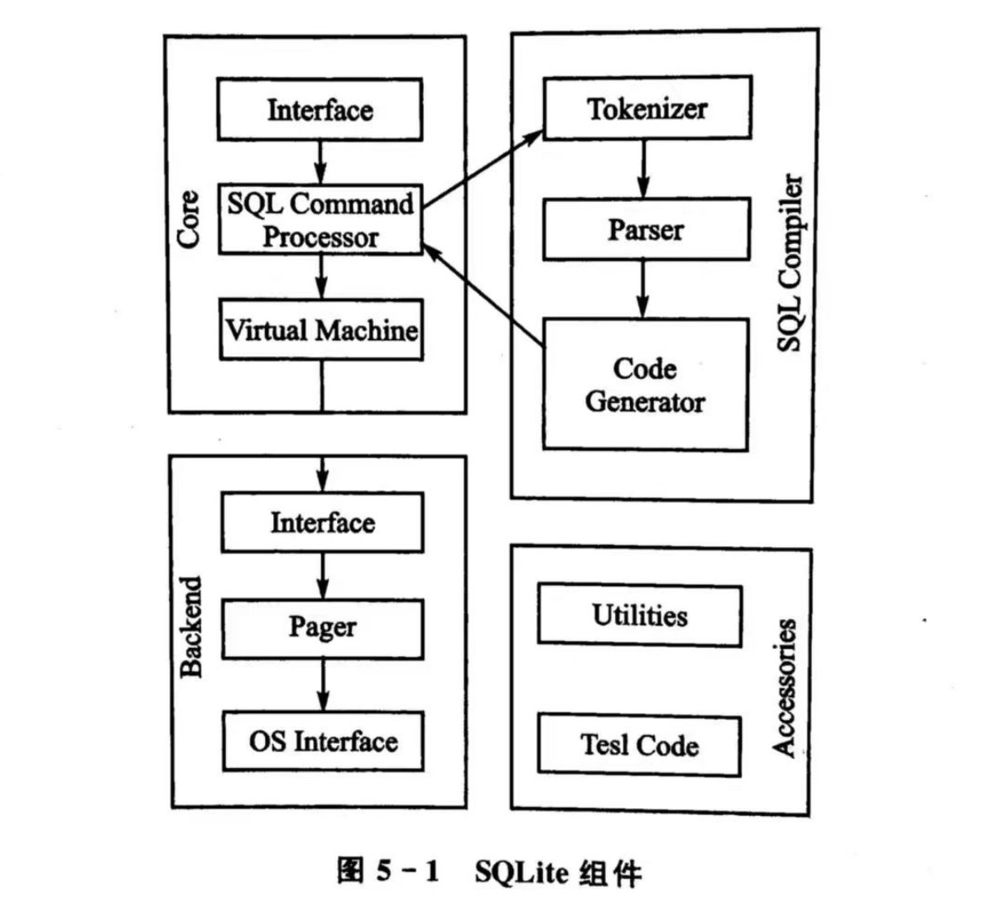

<h1>嵌入式数据库</h1>

# 目录

- [目录](#目录)
- [1. 嵌入式数据库概述](#1-嵌入式数据库概述)
  - [1.1 嵌入式数据库简介](#11-嵌入式数据库简介)
  - [1.2 嵌入式数据库特点及分类](#12-嵌入式数据库特点及分类)
    - [(1) 特点](#1-特点)
    - [(2) 分类](#2-分类)
  - [1.3 嵌入式数据库的应用](#13-嵌入式数据库的应用)
- [2. SQLite数据库](#2-sqlite数据库)
  - [2.1 SQLite数据库概述](#21-sqlite数据库概述)
    - [(1) 概述](#1-概述)
    - [(2) SQLite组件](#2-sqlite组件)
    - [(3) 数据类型](#3-数据类型)

# 1. 嵌入式数据库概述

## 1.1 嵌入式数据库简介

嵌入式数据库是一种设计用于嵌入式系统的轻量级数据库系统，它通常具有小型的存储需求、低功耗、高效的读写速度以及对资源有限的嵌入式设备的适应性。这种数据库系统能够在嵌入式设备上提供本地数据存储和管理功能。

## 1.2 嵌入式数据库特点及分类

### (1) 特点

1. **轻量级：** 嵌入式数据库通常具有小巧的体积和内存占用，以适应嵌入式系统的资源有限性。
2. **低功耗：** 考虑到嵌入式设备通常有功耗限制，嵌入式数据库的设计注重在低功耗条件下高效地执行数据操作。
3. **实时性：** 部分嵌入式数据库要求对实时数据的快速读写响应，以满足实时控制和监测需求。
4. **易集成：** 嵌入式数据库通常易于集成到嵌入式系统中，能够与应用程序协同工作。

### (2) 分类

1. **关系型嵌入式数据库：** 使用SQL语言进行数据查询和操作，典型代表包括`SQLite`等。
2. **面向对象嵌入式数据库：** 数据以对象的形式存储，常用于对象导向的应用，代表如`db4o`。
3. **时间序列数据库：** 专注于存储和处理时间序列数据，适用于实时监测和控制系统，例如`InfluxDB`。
4. **键值对存储：** 以简单的键值对形式存储数据，例如`Redis`等，适用于快速的数据检索和存储。

## 1.3 嵌入式数据库的应用

嵌入式数据库在各种嵌入式系统和应用中发挥着关键作用，包括但不限于：
1. **物联网设备：** 在物联网设备中，嵌入式数据库用于本地存储和管理传感器数据，以支持设备的实时决策和反馈。
2. **嵌入式控制系统：** 在工业控制和自动化系统中，嵌入式数据库用于存储和处理实时生产数据，支持生产过程的监测和优化。
3. **嵌入式医疗设备：** 在医疗设备中，如可穿戴设备和医疗传感器，嵌入式数据库用于存储患者的生理数据和健康信息。
4. **智能家居设备：** 在智能家居领域，嵌入式数据库用于本地存储和管理家庭设备的状态信息，以提供个性化的智能服务。

嵌入式数据库通过为嵌入式系统提供高效的本地数据管理能力，为各种领域的嵌入式应用带来了便利和性能优势。

# 2. SQLite数据库

## 2.1 SQLite数据库概述

### (1) 概述

SQLite是一种轻量级的嵌入式关系型数据库管理系统（RDBMS），采用C语言编写，以小巧、快速、可嵌入等特点而闻名。相比于传统的客户端-服务器模式的数据库系统，SQLite是一个零配置、无服务器的数据库引擎，适用于嵌入式设备、移动应用以及桌面应用等场景。SQLite的数据库以单一的磁盘文件形式存在，极大地简化了数据库的管理和维护。

### (2) SQLite组件

SQLite主要由以下几个组件构成：

- **SQL编译器：** 负责解析和编译SQL语句。
- **内核（核心）：** 提供数据库引擎的核心功能，包括SQL解析、查询执行、事务处理等。
- **后端：** 负责与底层的文件系统交互，管理数据库文件的读写。
- **附件：** 包括一些可选的附加模块，如全文搜索模块（FTS3/4/5）、JSON1扩展等，提供额外的功能。

### (3) 数据类型

SQLite支持以下基本的数据类型：

1. **NULL：** 用于表示缺少值或未定义的值。
2. **INTEGER：** 整数类型，可以存储带符号的整数。
3. **REAL：** 浮点数类型，用于存储浮点数。
4. **TEXT：** 文本字符串类型，用于存储字符序列。
5. **BLOB：** 二进制大对象类型，用于存储二进制数据。

SQLite的数据类型相对简单，但足以满足大多数应用场景的需求。在创建表时，可以使用这些数据类型定义列的属性。

当某个值插入数据库时，`SQLite` 将检查它的类型。如果该类型与关联的列不匹配，则 `SQLite` 会尝试将该值转换成列类型。如果不能转换，则该值将作为其本身具有的类型存储。