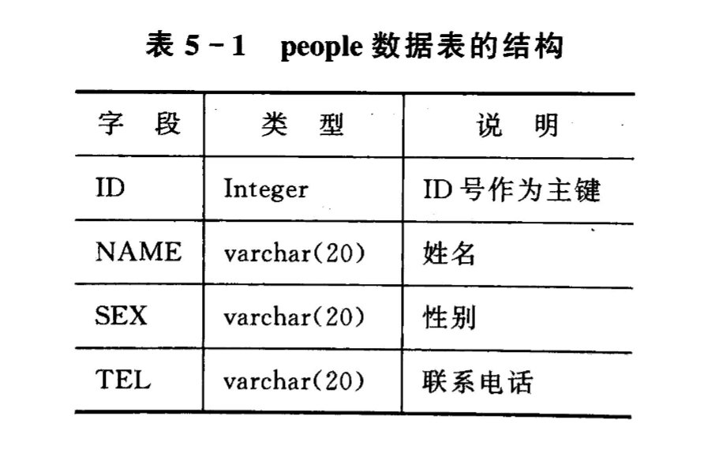

<div align="center">

<h1>嵌入式数据库</h1>

</div>

# 目录

- [目录](#目录)
- [1. 嵌入式数据库概述](#1-嵌入式数据库概述)
  - [1.1 嵌入式数据库简介](#11-嵌入式数据库简介)
  - [1.2 嵌入式数据库特点及分类](#12-嵌入式数据库特点及分类)
    - [(1) 特点](#1-特点)
    - [(2) 分类](#2-分类)
  - [1.3 嵌入式数据库的应用](#13-嵌入式数据库的应用)
- [2. SQLite数据库](#2-sqlite数据库)
  - [2.1 SQLite数据库概述](#21-sqlite数据库概述)
    - [(1) 概述](#1-概述)
    - [(2) SQLite组件](#2-sqlite组件)
    - [(3) 数据类型](#3-数据类型)
  - [2.2 SQLite数据库的基本命令](#22-sqlite数据库的基本命令)
    - [(1) 建立数据库](#1-建立数据库)
    - [(2) 建立表](#2-建立表)
    - [(3) 建立索引](#3-建立索引)
    - [(4) 插入记录](#4-插入记录)
    - [(5) 查询记录](#5-查询记录)
    - [(6) 修改或删除记录](#6-修改或删除记录)

# 1. 嵌入式数据库概述

## 1.1 嵌入式数据库简介

嵌入式数据库是一种设计用于嵌入式系统的轻量级数据库系统，它通常具有小型的存储需求、低功耗、高效的读写速度以及对资源有限的嵌入式设备的适应性。这种数据库系统能够在嵌入式设备上提供本地数据存储和管理功能。

## 1.2 嵌入式数据库特点及分类

### (1) 特点

1. **轻量级：** 嵌入式数据库通常具有小巧的体积和内存占用，以适应嵌入式系统的资源有限性。
2. **低功耗：** 考虑到嵌入式设备通常有功耗限制，嵌入式数据库的设计注重在低功耗条件下高效地执行数据操作。
3. **实时性：** 部分嵌入式数据库要求对实时数据的快速读写响应，以满足实时控制和监测需求。
4. **易集成：** 嵌入式数据库通常易于集成到嵌入式系统中，能够与应用程序协同工作。

### (2) 分类

1. **关系型嵌入式数据库：** 使用SQL语言进行数据查询和操作，典型代表包括`SQLite`等。
2. **面向对象嵌入式数据库：** 数据以对象的形式存储，常用于对象导向的应用，代表如`db4o`。
3. **时间序列数据库：** 专注于存储和处理时间序列数据，适用于实时监测和控制系统，例如`InfluxDB`。
4. **键值对存储：** 以简单的键值对形式存储数据，例如`Redis`等，适用于快速的数据检索和存储。

## 1.3 嵌入式数据库的应用

嵌入式数据库在各种嵌入式系统和应用中发挥着关键作用，包括但不限于：
1. **物联网设备：** 在物联网设备中，嵌入式数据库用于本地存储和管理传感器数据，以支持设备的实时决策和反馈。
2. **嵌入式控制系统：** 在工业控制和自动化系统中，嵌入式数据库用于存储和处理实时生产数据，支持生产过程的监测和优化。
3. **嵌入式医疗设备：** 在医疗设备中，如可穿戴设备和医疗传感器，嵌入式数据库用于存储患者的生理数据和健康信息。
4. **智能家居设备：** 在智能家居领域，嵌入式数据库用于本地存储和管理家庭设备的状态信息，以提供个性化的智能服务。

嵌入式数据库通过为嵌入式系统提供高效的本地数据管理能力，为各种领域的嵌入式应用带来了便利和性能优势。

# 2. SQLite数据库

## 2.1 SQLite数据库概述

### (1) 概述

SQLite是一种轻量级的嵌入式关系型数据库管理系统（RDBMS），采用C语言编写，以小巧、快速、可嵌入等特点而闻名。相比于传统的客户端-服务器模式的数据库系统，SQLite是一个零配置、无服务器的数据库引擎，适用于嵌入式设备、移动应用以及桌面应用等场景。SQLite的数据库以单一的磁盘文件形式存在，极大地简化了数据库的管理和维护。

### (2) SQLite组件

SQLite主要由以下几个组件构成：

- **SQL编译器：** 负责解析和编译SQL语句。
- **内核（核心）：** 提供数据库引擎的核心功能，包括SQL解析、查询执行、事务处理等。
- **后端：** 负责与底层的文件系统交互，管理数据库文件的读写。
- **附件：** 包括一些可选的附加模块，如全文搜索模块（FTS3/4/5）、JSON1扩展等，提供额外的功能。


### (3) 数据类型

SQLite支持以下基本的数据类型：

1. **NULL：** 用于表示缺少值或未定义的值。
2. **INTEGER：** 整数类型，可以存储带符号的整数。
3. **REAL：** 浮点数类型，用于存储浮点数。
4. **TEXT：** 文本字符串类型，用于存储字符序列。
5. **BLOB：** 二进制大对象类型，用于存储二进制数据。

SQLite的数据类型相对简单，但足以满足大多数应用场景的需求。在创建表时，可以使用这些数据类型定义列的属性。

当某个值插入数据库时，`SQLite` 将检查它的类型。如果该类型与关联的列不匹配，则 `SQLite` 会尝试将该值转换成列类型。如果不能转换，则该值将作为其本身具有的类型存储。

## 2.2 SQLite数据库的基本命令

结合实例，说明命令的使用。

假设要设计个人信息管理系统。首先根据需求设计一个数据库，命名为 `test.db`。个人信息管理系统主要实现对某个人的信息进行增加、删除、修改和查询等作，而个人信息主要包括姓名、性别和电话，则可以创建一个 `people` 的数据表，这样就可以起到通讯录的作用，用户也可以根据需求增加其他字段。另外，数据库的表中应该有一个主键由于可能发生重名，所以不能作为主键，这里增加`ID`字段来作为主键。

`people` 数据表的结构如下：



### (1) 建立数据库

启动终端，输入如下命令:

```bash
sqlite3 test.db
```

如果目录下没有 `test.db`，`SQLite3`则建立这个数据库。

> `SQLite3` 并没有强制数据库名称，用户可以根据需要命名数据库。

### (2) 建立表

建立表的语法如下：

```sql
CREATE TABLE table name(field1, field2, field3, ...);
```

- 使用`CREATE TABLE`语句创建数据库表。
- `table_name` 数据表的名称
- `fieldx` 则是字段的名字。


> `SQLite3`的字段可以储存任何类型，如文字、数字和大量文字(blub)，它会适时自动转换。

下面我们创建一个名为 `people` 的数据表：

```sql
CREATE TABLE people(
    ID integer primary key,
    name varchar(10),
    age integer,
    num varchar(18)
);
```

上述SQL语句创建了一个名为 `people` 的数据表:

- **ID：** 该列是整数类型，作为主键（primary key），用于唯一标识每个记录。主键通常用于确保每条记录的唯一性。
- **name：** 该列是字符串类型（varchar(10)），用于存储人物的姓名，限定最大长度为10个字符。
- **age：** 该列是整数类型，用于存储人物的年龄。
- **num：** 该列是字符串类型（varchar(18)），用于存储身份证号码，限定最大长度为18个字符。


### (3) 建立索引

建立索引可加快检索速度。语法如下：

```sql
create index index_name on table_name(field_to_be_indexed);
```

其中：
- **create index：** 创建索引的关键字。
- **people_title_index：** 索引的名称，可以根据实际需求自行命名。
- **on people：** 指定索引所属的表为 `people`。
- **(name)：** 指定要建立索引的字段为 `name` 列。

针对`people`表，我们建立一个索引：

```sql
create index people_title_index on people(name);
```

上述SQL语句创建了一个名为 `people_title_index` 的索引，该索引针对 `people` 表的 `name` 列。索引的建立可以加速对 `name` 列的检索操作，提高查询效率。

> 需要注意，虽然索引可以加速检索，但在插入、更新和删除数据时可能会稍微降低性能，因此在选择建立索引时需要综合考虑实际的数据库操作需求。

### (4) 插入记录

插入记录使用 `INSERT INTO` 语句，语法如下：

```sql
INSERT INTO table_name (column1, column2, column3, ...)
VALUES (value1, value2, value3, ...);
```

比如往 `people` 表中插入一条记录的例子：

```sql
INSERT INTO people (name, age, num)
VALUES ('John Doe', 25, '123456789012345678');
```

上述SQL语句在 `people` 表中插入了一条记录，该记录的姓名为 'John Doe'，年龄为 25，身份证号为 '123456789012345678'。

### (5) 查询记录

查询记录使用 `SELECT` 语句，语法如下：

```sql
SELECT column1, column2, ...
FROM table_name
WHERE condition;
```

例如，从 `people` 表中查询所有记录的例子：

```sql
SELECT * FROM people;
```

上述SQL语句返回 `people` 表中所有记录的所有列。

### (6) 修改或删除记录

修改记录使用 `UPDATE` 语句，语法如下：

```sql
UPDATE table_name
SET column1 = value1, column2 = value2, ...
WHERE condition;
```

删除记录使用 `DELETE FROM` 语句，语法如下：

```sql
DELETE FROM table_name
WHERE condition;
```

例如，更新 `people` 表中年龄为 25 的记录的姓名为 'Jane Doe' 的例子：

```sql
UPDATE people
SET name = 'Jane Doe'
WHERE age = 25;
```

上述SQL语句将 `people` 表中年龄为 25 的记录的姓名更新为 'Jane Doe'。

再例如，删除 `people` 表中年龄小于 18 的记录的例子：

```sql
DELETE FROM people
WHERE age < 18;
```

上述SQL语句将删除 `people` 表中所有年龄小于 18 的记录。