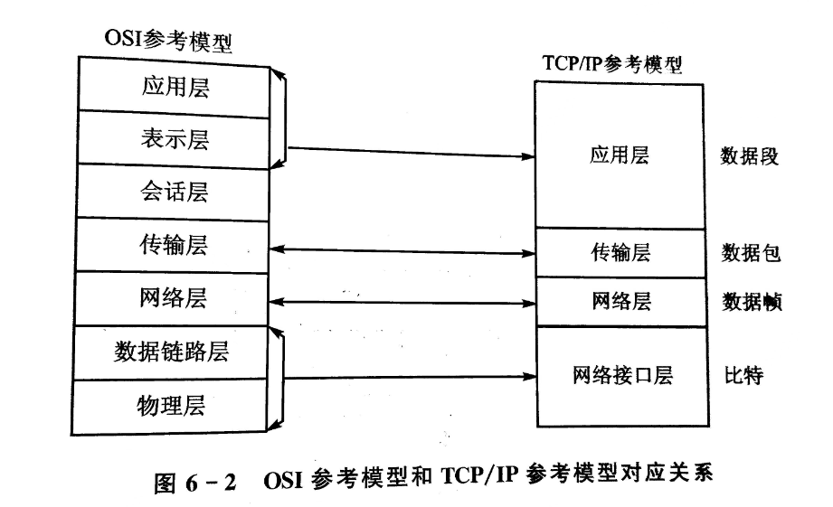

<h1>嵌入式LInux网络编程</h1>

# 目录

- [目录](#目录)
- [1. 网络协议概述](#1-网络协议概述)
  - [1.1 网络协议参考模型](#11-网络协议参考模型)
    - [OSI模型](#osi模型)
      - [TCP/IP模型](#tcpip模型)
    - [1.2 TCP/IP协议族](#12-tcpip协议族)
      - [网络层](#网络层)
      - [传输层](#传输层)
      - [应用程序层](#应用程序层)
  - [1.3 TCP 和 UDP](#13-tcp-和-udp)
- [2. 网络编程基础](#2-网络编程基础)
  - [2.1 Socket概述](#21-socket概述)
  - [2.2 基本数据结构和函数](#22-基本数据结构和函数)
  - [2.3 Socket基础编程](#23-socket基础编程)
- [3. TCP 通信编程](#3-tcp-通信编程)
  - [3.1 TCP 通信过程](#31-tcp-通信过程)
  - [3.2 TCP Server 程序设计](#32-tcp-server-程序设计)
  - [3.3 TCP Client 程序设计](#33-tcp-client-程序设计)
  - [3.3 TCP 程序测试过程](#33-tcp-程序测试过程)
- [4. UDP 通信编程](#4-udp-通信编程)
  - [4.1 UDP 通信过程](#41-udp-通信过程)
  - [4.2 UDP Server 程序设计](#42-udp-server-程序设计)
  - [4.3 UDP Client 程序设计](#43-udp-client-程序设计)
  - [4.3 UDP 程序测试过程](#43-udp-程序测试过程)

# 1. 网络协议概述

网络协议是计算机网络中用于实现通信的规则和约定。常见的网络协议有许多，其中两个重要的参考模型是OSI模型和TCP/IP模型。

## 1.1 网络协议参考模型

### OSI模型

OSI（Open Systems Interconnection）模型是国际标准化组织（ISO）定义的一个通信协议的参考模型，共分为七层。每一层负责不同的功能，依次是：

1. 物理层
2. 数据链路层
3. 网络层
4. 传输层
5. 会话层
6. 表示层
7. 应用层

#### TCP/IP模型

TCP/IP模型是实际互联网所使用的协议体系结构，分为四层，与OSI模型对应如下：
1. 网络接口层（对应OSI的物理层和数据链路层）
2. 网络层
3. 传输层
4. 应用层（对应OSI的会话层、表示层和应用层）

### 1.2 TCP/IP协议族

TCP/IP协议族是TCP/IP模型的实现，主要分为三个层次：

#### 网络层
网络层负责在网络上寻址和路由数据包，其中常见的协议包括：
- IP（Internet Protocol）：负责在网络中唯一标识设备和路由数据包。
- ICMP（Internet Control Message Protocol）：用于在IP网络上发送错误消息和控制消息。
- ARP（Address Resolution Protocol）：将IP地址映射到MAC地址。

#### 传输层
传输层主要有两个协议：
- TCP（Transmission Control Protocol）：提供可靠的、面向连接的数据流传输。
- UDP（User Datagram Protocol）：提供不可靠的、无连接的数据包传输。

#### 应用程序层
应用程序层包含了各种网络应用，常见的协议有：
- Telnet：用于远程登录。
- FTP和TFTP：用于文件传输。
- SMTP和DNS：分别用于电子邮件和域名系统。

这些协议共同构成了TCP/IP协议族，为互联网上的数据通信提供了基础。

---

## 1.3 TCP 和 UDP

---

# 2. 网络编程基础

## 2.1 Socket概述

---

## 2.2 基本数据结构和函数

---

## 2.3 Socket基础编程

---

# 3. TCP 通信编程

---

## 3.1 TCP 通信过程

---

## 3.2 TCP Server 程序设计

---

## 3.3 TCP Client 程序设计

---

## 3.3 TCP 程序测试过程

---

# 4. UDP 通信编程

## 4.1 UDP 通信过程

---

## 4.2 UDP Server 程序设计

---

## 4.3 UDP Client 程序设计

---

## 4.3 UDP 程序测试过程

