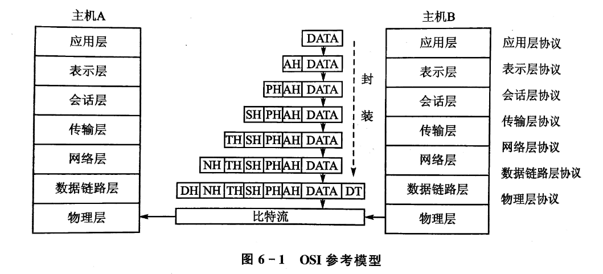
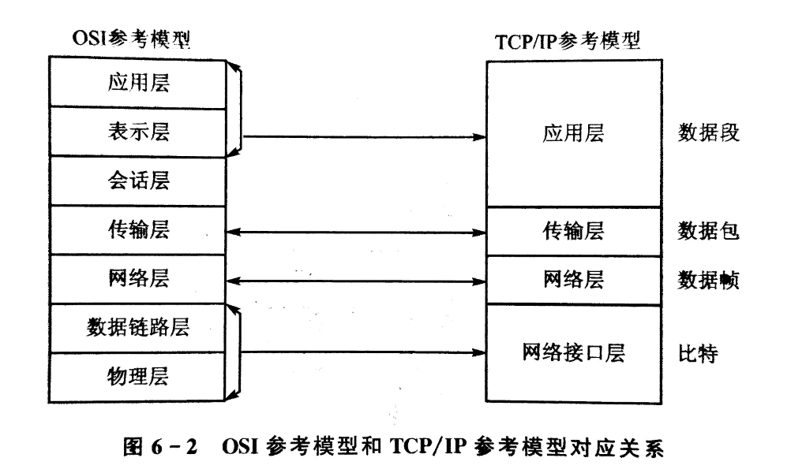

<h1>嵌入式LInux网络编程</h1>

# 目录

- [目录](#目录)
- [1. 网络协议概述](#1-网络协议概述)
  - [1.1 网络协议参考模型](#11-网络协议参考模型)
    - [(1) OSI模型](#1-osi模型)
    - [(2) TCP/IP模型](#2-tcpip模型)
  - [1.2 TCP/IP协议族](#12-tcpip协议族)
    - [(1) 网络层](#1-网络层)
    - [(2) 传输层](#2-传输层)
    - [(3) 应用程序层](#3-应用程序层)
  - [1.3 TCP 和 UDP](#13-tcp-和-udp)
    - [(1) TCP 协议](#1-tcp-协议)
      - [TCP数据包格式](#tcp数据包格式)
      - [TCP连接建立的过程](#tcp连接建立的过程)
      - [TCP连接的标识](#tcp连接的标识)
      - [关闭TCP连接](#关闭tcp连接)
    - [(2) UDP 协议](#2-udp-协议)
- [2. 网络编程基础](#2-网络编程基础)
  - [2.1 Socket概述](#21-socket概述)
  - [2.2 基本数据结构和函数](#22-基本数据结构和函数)
  - [2.3 Socket基础编程](#23-socket基础编程)
- [3. TCP 通信编程](#3-tcp-通信编程)
  - [3.1 TCP 通信过程](#31-tcp-通信过程)
  - [3.2 TCP Server 程序设计](#32-tcp-server-程序设计)
  - [3.3 TCP Client 程序设计](#33-tcp-client-程序设计)
  - [3.3 TCP 程序测试过程](#33-tcp-程序测试过程)
- [4. UDP 通信编程](#4-udp-通信编程)
  - [4.1 UDP 通信过程](#41-udp-通信过程)
  - [4.2 UDP Server 程序设计](#42-udp-server-程序设计)
  - [4.3 UDP Client 程序设计](#43-udp-client-程序设计)
  - [4.3 UDP 程序测试过程](#43-udp-程序测试过程)

# 1. 网络协议概述

网络协议是计算机网络中用于实现通信的规则和约定。常见的网络协议有许多，其中两个重要的参考模型是OSI模型和TCP/IP模型。

## 1.1 网络协议参考模型

### (1) OSI模型

OSI（Open Systems Interconnection）模型是国际标准化组织（ISO）定义的一个通信协议的参考模型，共分为七层。每一层负责不同的功能，依次是：

1. 物理层
2. 数据链路层
3. 网络层
4. 传输层
5. 会话层
6. 表示层
7. 应用层

### (2) TCP/IP模型

TCP/IP模型是实际互联网所使用的协议体系结构，分为四层，与OSI模型对应如下：
1. 网络接口层（对应OSI的物理层和数据链路层）
2. 网络层
3. 传输层
4. 应用层（对应OSI的会话层、表示层和应用层）

## 1.2 TCP/IP协议族

TCP/IP协议族是TCP/IP模型的实现，主要分为三个层次：

### (1) 网络层

网络层负责在网络上寻址和路由数据包，其中常见的协议包括：
- IP（Internet Protocol）：负责在网络中唯一标识设备和路由数据包。
- ICMP（Internet Control Message Protocol）：用于在IP网络上发送错误消息和控制消息。
- ARP（Address Resolution Protocol）：将IP地址映射到MAC地址。

### (2) 传输层

传输层主要有两个协议：
- TCP（Transmission Control Protocol）：提供可靠的、面向连接的数据流传输。
- UDP（User Datagram Protocol）：提供不可靠的、无连接的数据包传输。

### (3) 应用程序层

应用程序层包含了各种网络应用，常见的协议有：
- Telnet：用于远程登录。
- FTP和TFTP：用于文件传输。
- SMTP和DNS：分别用于电子邮件和域名系统。

这些协议共同构成了TCP/IP协议族，为互联网上的数据通信提供了基础。

---

## 1.3 TCP 和 UDP

### (1) TCP 协议

TCP（Transmission Control Protocol）是一种面向连接、可靠的传输协议，它将数据划分为数据段，并在通信双方之间进行**可靠的传输**。

#### TCP数据包格式

TCP数据包的格式包括以下字段：

1. **源端口号（16位）**：标识发送端的端口。
2. **目标端口号（16位）**：标识接收端的端口。
3. **序列号（32位）**：用于对数据进行排序和重组。
4. **确认号（32位）**：对收到的数据进行确认，表示期望收到的下一个序列号。
5. **数据偏移（4位）**：指示TCP头部的长度，以32位字为单位。
6. **保留（6位）**：保留字段，未来使用，目前置为0。
7. **标志位（6位）**：包括URG、ACK、PSH、RST、SYN和FIN等标志。
8. **窗口大小（16位）**：指定发送端的接收窗口大小，用于流量控制。
9. **校验和（16位）**：检测TCP头和数据的错误。
10. **紧急指针（16位）**：与URG标志一起使用，指明紧急数据的末尾。
11. **选项和填充**：可选字段和用于填充的字段，长度可变。

#### TCP连接建立的过程

TCP连接的建立采用三次握手的过程，包括以下步骤：

1. **客户端发送SYN（同步）报文**：客户端向服务器发送一个TCP报文，其中设置SYN标志位，并选择一个初始序列号。
2. **服务器发送SYN-ACK（同步-确认）报文**：服务器收到客户端的SYN报文后，返回一个带有SYN和ACK标志位的报文，同时选择自己的初始序列号。
3. **客户端发送ACK（确认）报文**：客户端收到服务器的SYN-ACK报文后，向服务器发送一个带有ACK标志位的报文。至此，连接建立完成。

#### TCP连接的标识

TCP连接的唯一标识由以下四元组组成：
1. 源IP地址和端口号
2. 目标IP地址和端口号

这四元组唯一地标识了一个TCP连接。

#### 关闭TCP连接

TCP连接的关闭采用四次挥手的过程，包括以下步骤：
1. **客户端发送FIN（结束）报文**：客户端通知服务器它已经发送完数据，并请求关闭连接。
2. **服务器发送ACK（确认）报文**：服务器收到客户端的FIN后，发送一个带有ACK标志位的报文，但仍允许数据的双向传输。
3. **服务器发送FIN报文**：服务器在准备好关闭连接时，发送一个带有FIN标志位的报文。
4. **客户端发送ACK报文**：客户端收到服务器的FIN后，发送一个带有ACK标志位的报文，完成连接的关闭。

---

### (2) UDP 协议

---

# 2. 网络编程基础

## 2.1 Socket概述

---

## 2.2 基本数据结构和函数

---

## 2.3 Socket基础编程

---

# 3. TCP 通信编程

---

## 3.1 TCP 通信过程

---

## 3.2 TCP Server 程序设计

---

## 3.3 TCP Client 程序设计

---

## 3.3 TCP 程序测试过程

---

# 4. UDP 通信编程

## 4.1 UDP 通信过程

---

## 4.2 UDP Server 程序设计

---

## 4.3 UDP Client 程序设计

---

## 4.3 UDP 程序测试过程

