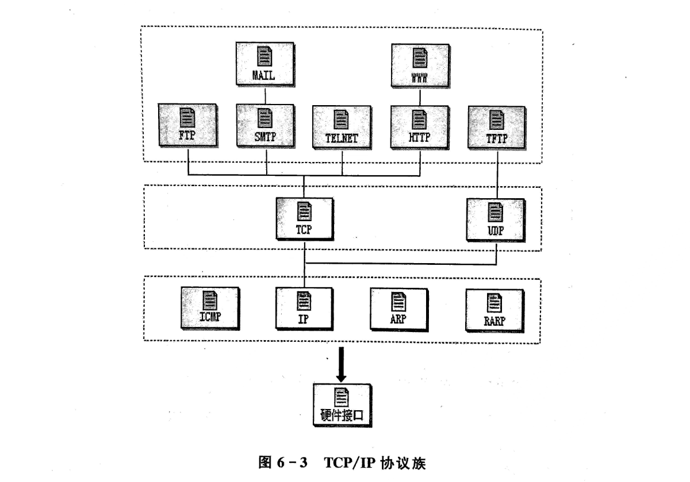
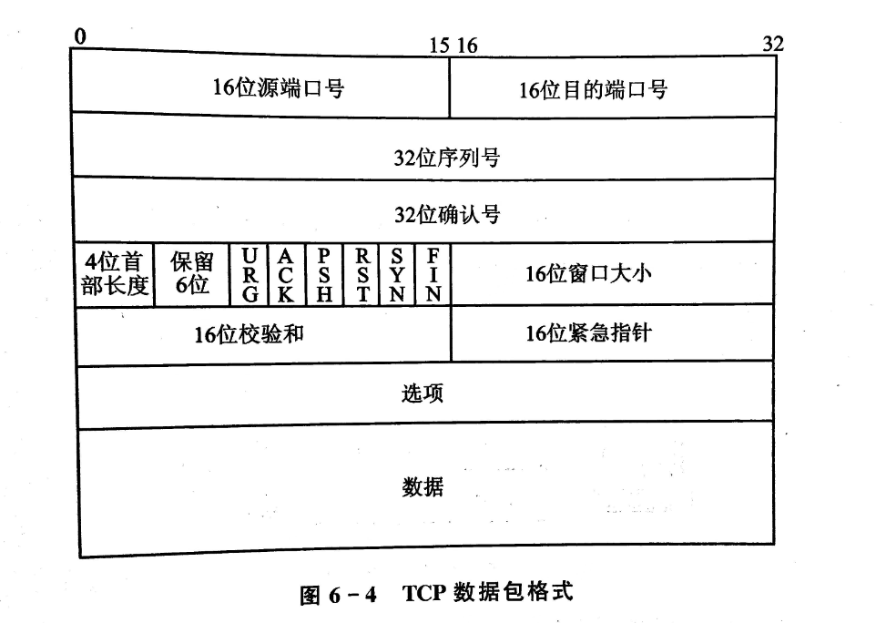
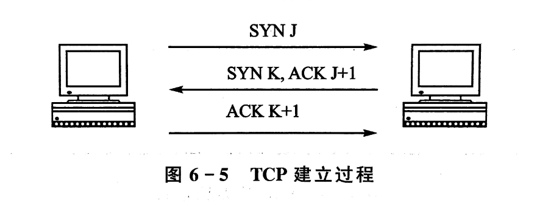
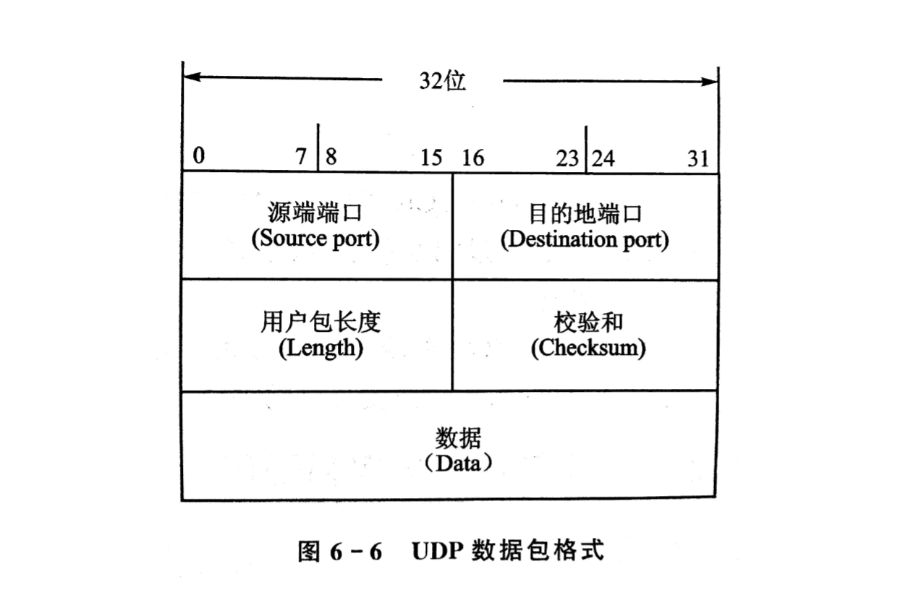
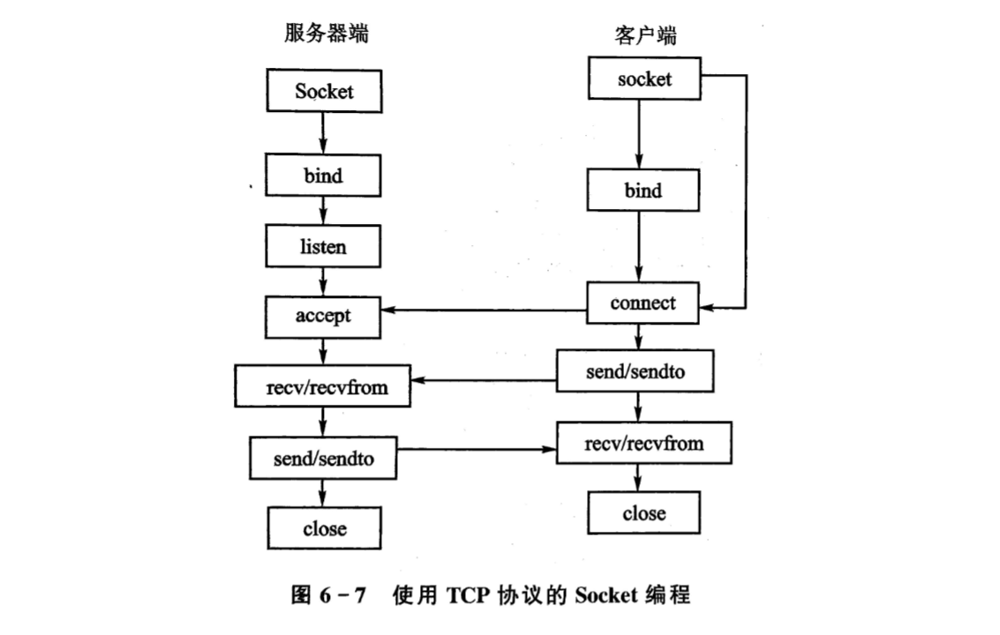
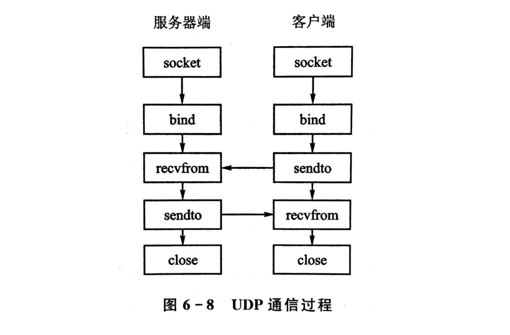

<div align="center">

<h1>嵌入式LInux网络编程</h1>

</div>

# 目录

- [目录](#目录)
- [1. 网络协议概述](#1-网络协议概述)
  - [1.1 网络协议参考模型](#11-网络协议参考模型)
    - [(1) OSI模型](#1-osi模型)
    - [(2) TCP/IP模型](#2-tcpip模型)
  - [1.2 TCP/IP协议族](#12-tcpip协议族)
    - [(1) 网络层](#1-网络层)
    - [(2) 传输层](#2-传输层)
    - [(3) 应用程序层](#3-应用程序层)
  - [1.3 TCP 和 UDP](#13-tcp-和-udp)
    - [(1) TCP 协议](#1-tcp-协议)
      - [TCP数据包格式](#tcp数据包格式)
      - [TCP连接建立的过程](#tcp连接建立的过程)
      - [TCP连接的标识](#tcp连接的标识)
      - [关闭TCP连接](#关闭tcp连接)
    - [(2) UDP 协议](#2-udp-协议)
      - [UDP特点：](#udp特点)
      - [UDP报文格式：](#udp报文格式)
      - [应用场景：](#应用场景)
- [2. 网络编程基础](#2-网络编程基础)
  - [2.1 Socket概述](#21-socket概述)
  - [2.2 基本数据结构和函数](#22-基本数据结构和函数)
    - [(1) 网络地址](#1-网络地址)
      - [结构体 sockaddr](#结构体-sockaddr)
      - [结构体 sockaddr\_in](#结构体-sockaddr_in)
    - [(2) IP 地址转换](#2-ip-地址转换)
      - [inet\_aton()](#inet_aton)
      - [inet\_ntoa()](#inet_ntoa)
    - [(3) IP和域名的转换](#3-ip和域名的转换)
      - [gethostbyname()](#gethostbyname)
      - [gethostbyaddr()](#gethostbyaddr)
      - [struct hostent](#struct-hostent)
    - [(4) 字节顺序转换](#4-字节顺序转换)
      - [htonl()](#htonl)
      - [htons()](#htons)
      - [ntohl()](#ntohl)
      - [ntohs()](#ntohs)
    - [(5) 服务信息函数](#5-服务信息函数)
      - [getsockname()](#getsockname)
      - [getpeername()](#getpeername)
      - [getservbyname()](#getservbyname)
      - [getservbyport()](#getservbyport)
      - [struct servent](#struct-servent)
  - [2.3 Socket基础编程](#23-socket基础编程)
- [3. TCP 通信编程](#3-tcp-通信编程)
  - [3.1 TCP 通信过程](#31-tcp-通信过程)
    - [(1) 使用Socket()创建套接字](#1-使用socket创建套接字)
    - [(2) 绑定本地地址](#2-绑定本地地址)
  - [3.2 TCP Server 程序设计](#32-tcp-server-程序设计)
  - [3.3 TCP Client 程序设计](#33-tcp-client-程序设计)
  - [3.3 TCP 程序测试过程](#33-tcp-程序测试过程)
- [4. UDP 通信编程](#4-udp-通信编程)
  - [4.1 UDP 通信过程](#41-udp-通信过程)
  - [4.2 UDP Server 程序设计](#42-udp-server-程序设计)
  - [4.3 UDP Client 程序设计](#43-udp-client-程序设计)
  - [4.3 UDP 程序测试过程](#43-udp-程序测试过程)

# 1. 网络协议概述

网络协议是计算机网络中用于实现通信的规则和约定。常见的网络协议有许多，其中两个重要的参考模型是OSI模型和TCP/IP模型。

## 1.1 网络协议参考模型

### (1) OSI模型

OSI（Open Systems Interconnection）模型是国际标准化组织（ISO）定义的一个通信协议的参考模型，共分为七层。每一层负责不同的功能，依次是：

1. 物理层
2. 数据链路层
3. 网络层
4. 传输层
5. 会话层
6. 表示层
7. 应用层


### (2) TCP/IP模型

TCP/IP模型是实际互联网所使用的协议体系结构，分为四层，与OSI模型对应如下：
1. 网络接口层（对应OSI的物理层和数据链路层）
2. 网络层
3. 传输层
4. 应用层（对应OSI的会话层、表示层和应用层）


## 1.2 TCP/IP协议族

TCP/IP协议族是TCP/IP模型的实现，主要分为三个层次：

### (1) 网络层

网络层负责在网络上寻址和路由数据包，其中常见的协议包括：
- IP（Internet Protocol）：负责在网络中唯一标识设备和路由数据包。
- ICMP（Internet Control Message Protocol）：用于在IP网络上发送错误消息和控制消息。
- ARP（Address Resolution Protocol）：将IP地址映射到MAC地址。

### (2) 传输层

传输层主要有两个协议：
- TCP（Transmission Control Protocol）：提供可靠的、面向连接的数据流传输。
- UDP（User Datagram Protocol）：提供不可靠的、无连接的数据包传输。

### (3) 应用程序层

应用程序层包含了各种网络应用，常见的协议有：
- Telnet：用于远程登录。
- FTP和TFTP：用于文件传输。
- SMTP和DNS：分别用于电子邮件和域名系统。



这些协议共同构成了TCP/IP协议族，为互联网上的数据通信提供了基础。


---


## 1.3 TCP 和 UDP

### (1) TCP 协议

TCP（Transmission Control Protocol）是一种面向连接、可靠的传输协议，它将数据划分为数据段，并在通信双方之间进行**可靠的传输**。

#### TCP数据包格式

TCP数据包的格式包括以下字段：

TCP协议头部的各字段具有不同的用途，以下是对每个字段的详细解释：

1. **源端口号（Source Port）**：指明发送方的端口号，以确保接收方能够回复到正确的端口（2字节）。

2. **目标端口号（Destination Port）**：指明接收方的端口号，以确保数据能够被正确交付给目标应用程序（2字节）。

3. **序列号（Sequence Number）**：用于对数据进行排序和重组。每个TCP报文都有一个唯一的序列号，以确保数据的有序传输（4字节）。

4. **确认号（Acknowledgment Number）**：表示期望接收到的下一个序列号，用于确认收到的数据。只有在ACK标志被设置时才有效（4字节）。

5. **数据偏移（Data Offset）**：指示TCP头部的长度，以32位字为单位。它告诉接收方在TCP头部之后有多少字节的数据（4位首部长度）。

6. **保留（Reserved）**：保留字段，目前置为0，供将来使用（保留6位）。

7. **标志位（Flags）**：TCP头部包含多个标志位：
   - **URG（Urgent）**：指示紧急指针字段是否有效。
   - **ACK（Acknowledgment）**：表示确认号字段有效，即确认已收到的数据。
   - **PSH（Push）**：提示接收方应尽快将数据交给应用层。
   - **RST（Reset）**：用于复位连接，表示连接出现错误。
   - **SYN（Synchronize）**：用于建立连接，发起连接的一方设置此标志。
   - **FIN（Finish）**：表示发送方已经完成发送数据，即将关闭连接。

8. **窗口大小（Window Size）**：指定发送方的接收窗口大小，用于流量控制。它告诉发送方接收方目前的缓冲区容量（2字节）。

9. **校验和（Checksum）**：用于检测TCP头和数据的错误（2字节）。校验和的计算包括TCP头、数据和伪首部（包含源IP地址、目标IP地址、协议类型和TCP长度）。

10. **紧急指针（Urgent Pointer）**：与URG标志一起使用，指明紧急数据的末尾位置（2字节）。

11. **选项和数据填充（Options and Padding）**：可选字段，用于包含一些额外的信息，如最大报文段长度（MSS）、窗口扩大因子等。填充字段用于确保TCP头部长度为32位的整数倍。



这些字段共同构成了TCP报文头部，确保了TCP协议的可靠性、有序性和流量控制。通过这些字段，TCP协议能够在不可靠的网络中提供可靠的端到端通信。

---

#### TCP连接建立的过程

TCP连接的建立采用三次握手的过程，包括以下步骤：

1. **客户端发送SYN（同步）报文**：客户端向服务器发送一个TCP报文，其中设置SYN标志位为1，并选择一个初始序列号。
2. **服务器发送SYN-ACK（同步-确认）报文**：服务器收到客户端的SYN报文后，返回一个带有SYN和ACK标志位的报文，同时选择自己的初始序列号。
3. **客户端发送ACK（确认）报文**：客户端收到服务器的SYN-ACK报文后，向服务器发送一个带有ACK标志位的报文。至此，连接建立完成。



#### TCP连接的标识

对于一条TCP连接，可以用两个一元组来表示：

- `<本地IP地址, 本地端口>`
- `<远端IP地址, 远端端口>`

这四元组唯一地标识了一个TCP连接。

或者使用一个四元组来表示：

- `<本地IP地址, 本地端口, 远端IP地址, 远端端口>`

#### 关闭TCP连接

TCP连接的关闭采用四次挥手的过程，包括以下步骤：

1. **客户端发送FIN（结束）报文**：客户端通知服务器它已经发送完数据，并请求关闭连接。
2. **服务器发送ACK（确认）报文**：服务器收到客户端的FIN后，发送一个带有ACK标志位的报文，但仍允许数据的双向传输。
3. **服务器发送FIN报文**：服务器在准备好关闭连接时，发送一个带有FIN标志位的报文。
4. **客户端发送ACK报文**：客户端收到服务器的FIN后，发送一个带有ACK标志位的报文，完成连接的关闭。

---

### (2) UDP 协议

UDP（User Datagram Protocol）是一种简单的、无连接的传输协议，它与TCP相比，不提供可靠性和流控制机制，但具有较低的开销。以下是UDP协议的一些特点和相关信息：

#### UDP特点

1. **无连接性**：UDP是无连接的，不需要在数据传输前建立连接，也不需要在传输后关闭连接。
  
2. **不可靠性**：UDP不保证数据的可靠性传输。它不进行序列号、确认号和重传等机制，因此在传输过程中可能会出现丢失、乱序或重复的数据包。

3. **轻量级**：相对于TCP，UDP协议的头部开销较小，没有TCP的握手、确认和关闭阶段，使得UDP适用于对实时性要求较高的应用。

4. **适用于广播和多播**：UDP支持向多个主机同时发送数据，因此适用于广播和多播的场景。

5. **无拥塞控制**：UDP不提供流量控制，因此发送方会一直以恒定的速率发送数据，而不会因网络拥塞而进行调整。

#### UDP报文格式

UDP报文头部相对简单，包含以下字段：

1. **源端口号（Source Port）**：16位，标识发送方的端口号。

2. **目标端口号（Destination Port）**：16位，标识接收方的端口号。

3. **长度（Length）**：16位，指示UDP报文的总长度，包括头部和数据。

4. **校验和（Checksum）**：16位，用于检测UDP报文的错误。和TCP一样，校验和的计算包括UDP头、数据和伪首部。



#### 应用场景

由于UDP的轻量级和低延迟特性，它在一些特定的应用场景中得到广泛应用，例如：

- **实时音视频传输**：VoIP、视频会议等对实时性要求较高的应用。
  
- **DNS（Domain Name System）**：域名解析过程中使用UDP进行快速的查询和响应。

- **简单网络管理协议（SNMP）**：用于网络设备之间的通信。

- **广播和多播应用**：UDP适用于广播和多播通信，如实时直播、在线游戏等。

总体而言，UDP适用于那些对可靠性要求相对较低，但对实时性和低延迟有较高要求的应用场景。

---

# 2. 网络编程基础

## 2.1 Socket概述

**Socket 接口是 TCP/IP 网络的 API**。Socket定义了许多函数或例程，程序员可以使用这些函数来开发TCP/IP网络上的应用程序。Socket接口最初设计用于UNIX操作系统。

**Socket 数据传输是特殊的 I/O**。网络中的Socket数据传输被视为一种特殊的输入/输出操作，而Socket本身也是一种文件描述符。类似于UNIX系统的文件I/O，Socket也通过文件描述符进行通信。

Socket具有类似于打开文件的函数调用，通常是`Socket()`函数，该函数返回一个整型的Socket描述符。随后的连接建立、数据传输等操作都通过这个Socket描述符来实现。

**Socket 类型**：

- **流式 Socket（SOCK_STREAM）**：提供可靠的、面向连接的通信流。使用TCP协议，保证了数据传输的正确性。
- **数据报 Socket（SOCK_DGRAM）**：定义了一种无连接的服务，使用UDP协议，通过相互独立的数据报传输数据。协议本身不保证传输的可靠性和数据的原始顺序。
- **原始 Socket**：允许对底层协议（如IP）进行直接访问，功能强大，用户可以通过该Socket开发自己的协议。

---

## 2.2 基本数据结构和函数

### (1) 网络地址

**使用场景**：

- 在网络编程中，套接字地址通常需要以一种通用的方式表示，`struct sockaddr` 提供了这样的通用性。在具体的套接字函数中，会将 sockaddr 结构体强制类型转换为 `struct sockaddr_in` 或其他具体类型。
- `struct sockaddr_in` 主要用于存储IPv4地址和端口信息，是在网络编程中经常使用的结构体。

#### 结构体 sockaddr
```c
struct sockaddr {
    unsigned short sa_family; // 地址家族（Address Family），如 AF_INET
    char sa_data[14];         // 实际的地址数据（14字节的协议地址）
};
```
- **sa_family**：指定地址家族，例如 AF_INET 表示IPv4地址族。
- **sa_data**：存储实际的地址数据。

#### 结构体 sockaddr_in
```c
struct sockaddr_in {
    short sin_family;         // 地址家族，如 AF_INET
    unsigned short sin_port;  // 端口号
    struct in_addr sin_addr;  // IPv4地址
    char sin_zero[8];         // 填充0，使结构体大小与 sockaddr 一致
};
```
- **sin_family**：指定地址家族，例如 AF_INET 表示IPv4地址族。
- **sin_port**：存储16位的端口号。
- **sin_addr**：存储32位的IPv4地址。
- **sin_zero**：用于填充，使结构体大小与 sockaddr 一致。

### (2) IP 地址转换

**使用场景**：

- `inet_aton()` 用于将字符串形式的IPv4地址转换为二进制形式，常用于将用户输入的IP地址进行解析。
- `inet_ntoa()` 则用于将二进制形式的IPv4地址转换为字符串形式，通常在需要打印或显示IP地址时使用。

#### inet_aton()
```c
int inet_aton(const char *cp, struct in_addr *inp);
```
- **cp**：指向包含IPv4地址的字符串的指针。
- **inp**：指向in_addr结构体的指针，用于存储转换后的IPv4地址。
- 返回值：如果转换成功，返回非零；否则，返回0。

#### inet_ntoa()
```c
char *inet_ntoa(struct in_addr in);
```
- **in**：存储IPv4地址的in_addr结构体。
- 返回值：返回一个指向包含转换后的IPv4地址的静态字符串的指针。

### (3) IP和域名的转换

**使用场景**：

- `gethostbyname()` 可以通过主机名获取主机信息，用于实现根据域名获取IP地址的功能。
- `gethostbyaddr()` 则可以通过IP地址获取主机信息，用于实现根据IP地址获取主机名的功能。

#### gethostbyname()
```c
struct hostent *gethostbyname(const char *name);
```
- **name**：指向包含主机名或IPv4地址的字符串的指针。
- 返回值：返回指向hostent结构体的指针，包含有关主机的信息。

#### gethostbyaddr()
```c
struct hostent *gethostbyaddr(const void *addr, socklen_t len, int type);
```
- **addr**：指向包含IPv4或IPv6地址的指针。
- **len**：地址长度。
- **type**：地址类型，如 AF_INET。
- 返回值：返回指向hostent结构体的指针，包含有关主机的信息。

---

**使用场景**：

- `struct hostent` 结构体保存了获取到的主机信息，包括正式主机名、别名列表、地址类型和地址列表。

#### struct hostent
```c
struct hostent {
    char    *h_name;        // 正式主机名
    char    **h_aliases;    // 主机别名列表
    int     h_addrtype;     // 主机地址类型，如 AF_INET
    int     h_length;       // 主机地址的字节数
    char    **h_addr_list;  // 主机地址列表
};
```

### (4) 字节顺序转换

**使用场景**：

- 进行不同字节顺序之间的转换，常见于在网络中传输数据时，确保数据在发送和接收端字节顺序一致。
- `htonl()` 和 `ntohl()` 用于处理32位整数的字节顺序转换。
- `htons()` 和 `ntohs()` 用于处理16位整数的字节顺序转换。

#### htonl()
```c
uint32_t htonl(uint32_t hostlong);
```
- **hostlong**：主机字节顺序的32位整数。
- 返回值：返回网络字节顺序的32位整数。

#### htons()
```c
uint16_t htons(uint16_t hostshort);
```
- **hostshort**：主机字节顺序的16位整数。
- 返回值：返回网络字节顺序的16位整数。

#### ntohl()
```c
uint32_t ntohl(uint32_t netlong);
```
- **netlong**：网络字节顺序的32位整数。
- 返回值：返回主机字节顺序的32位整数。

#### ntohs()
```c
uint16_t ntohs(uint16_t netshort);
```
- **netshort**：网络字节顺序的16位整数。
- 返回值：返回主机字节顺序的16位整数。

### (5) 服务信息函数

**使用场景**：

- `getsockname()` 用于获取与某个套接字关联的本地地址信息，常用于服务器端获取自己的地址信息。
- `getpeername()` 用于获取与某个套接字关联的对等端地址信息，常用于服务器端获取客户端的地址信息。

#### getsockname()
```c
int getsockname(int sockfd, struct sockaddr *addr, socklen_t *addrlen);
```
- **sockfd**：套接字描述符。
- **addr**：指向存储地址信息的结构体的指针。
- **addrlen**：指向存储地址长度的整数的指针。
- 返回值：成功返回0，失败返回-1。

#### getpeername()
```c
int getpeername(int sockfd, struct sockaddr *addr, socklen_t *addrlen);
```
- **sockfd**：套接字描述符。
- **addr**：指向存储对等方地址信息的结构体的指针。
- **addrlen**：指向存储地址长度的整数的指针。
- 返回值：成功返回0，失败返回-1。

---

**使用场景**：

- `getservbyname()` 通过服务名和协议名获取服务的端口号，常用于客户端需要连接到特定服务的场景。
- `getservbyport()` 通过端口号和协议名获取服务的信息，常用于服务器端需要获取监听端口对应的服务信息。

#### getservbyname()
```c
struct servent *getservbyname(const char *name, const char *proto);
```
- **name**：服务名。
- **proto**：协议名，如 "tcp" 或 "udp"。
- 返回值：返回指向servent结构体的指针，包含有关服务的信息。

#### getservbyport()
```c
struct servent *getservbyport(int port, const char *proto);
```
- **port**：端口号。
- **proto**：协议名，如 "tcp" 或 "udp"。
- 返回值：返回指向servent结构体的指针，包含有关服务的信息。

---

`struct servent` 主要用于服务信息的获取，特别是通过服务名或端口号获取与之相关的信息。

#### struct servent
```c
struct servent {
    char    *s_name;     // 服务名
    char    **s_aliases; // 服务别名列表
    int     s_port;      // 端口号
    char    *s_proto;    // 协议名，如 "tcp" 或 "udp"
};
```


---

# 3. TCP 通信编程



工作过程如下：

首先服务器启动，通过调用 Socket( ) 建立一个套接字。然后调用 bind( ) 将该套接字和本地网络地址联系在一起，再调用listen( ) 使套接字做好侦听的准备并规定它的请求队列的长度；之后就调用 accept( ) 来接收连接。客户在建立套接字后就可调用 connect( ) 和服务器建立连接。连接一旦建立，客户机和服务器之间就可以通过调用 read( ) 和 write( ) 来发送和接收数据。最后，待数据传送结束，双方调用 close( ) 关团套接字。

下面结合以上步骤来说明各个函数的用法。

## 3.1 Socket()

该函数返回一个类似文件描述符的句柄。

```c
int socket(int family, int type, int protocol)
```

`socket()` 函数是用于创建套接字的系统调用，通常在网络编程中使用。这个函数有三个参数，它们分别是 `family`、`type` 和 `protocol`。

1. **family（协议族）：**
   - AF_INET: IPv4 协议
   - AF_INET6: IPv6 协议
   - AF_UNIX 或 AF_LOCAL: 本地通信
2. **type（套接字类型）：**
   - SOCK_STREAM: 面向连接的流套接字，提供可靠的、基于连接的服务（如 TCP）。
   - SOCK_DGRAM: 面向消息的数据报套接字，提供无连接的服务（如 UDP）。
   - SOCK_RAW: 原始套接字，提供对网络协议的直接访问。
3. **protocol（协议）：**
   - 0: 一般用0表示根据套接字类型和协议族自动选择合适的协议。

```c
#include <sys/socket.h>

int main() {
    int sockfd = socket(AF_INET, SOCK_STREAM, 0);
    if (sockfd == -1) {
        // 创建套接字失败
        perror("socket");
        return -1;
    }

    // 在这里可以进行后续的网络编程操作，如绑定地址、监听连接等

    return 0;
}
```

## 3.2 bind()

bind函数将Socket与本机上的一个端口相关联，随后即可在该端口监听服务请求。

```c
int bind(int sockfd, struct sockaddr *sa, int addrlen)
```

`bind()` 函数用于将一个套接字绑定到一个本地地址（IP 地址和端口号）。它有三个参数：

1. **sockfd（套接字描述符）：**
   - 要绑定的套接字描述符，通常是通过 `socket()` 函数创建的。
2. **sa（指向 sockaddr 结构体的指针）：**
   - 包含地址信息的结构体指针。这个结构体的具体类型取决于套接字的地址族（family）。
     - 对于 IPv4 地址族（AF_INET），使用 `struct sockaddr_in`。
     - 对于 IPv6 地址族（AF_INET6），使用 `struct sockaddr_in6`。
     - 对于本地通信地址族（AF_UNIX 或 AF_LOCAL），使用 `struct sockaddr_un`。
3. **addrlen（地址结构体的长度）：**
   - 提供给函数的地址结构体的长度，可以使用 `sizeof(struct sockaddr)`。

比如：

```c
#include <stdio.h>
#include <stdlib.h>
#include <string.h>
#include <arpa/inet.h>

int main() {
    // 创建套接字
    int sockfd = socket(AF_INET, SOCK_STREAM, 0);
    if (sockfd == -1) {
        perror("socket");
        return -1;
    }

    // 准备地址结构体
    struct sockaddr_in addr;
    memset(&addr, 0, sizeof(addr));
    addr.sin_family = AF_INET;
    addr.sin_addr.s_addr = INADDR_ANY; // 绑定到任意可用的本地地址
    addr.sin_port = htons(8080);       // 绑定到端口 8080

    // 绑定套接字到地址
    if (bind(sockfd, (struct sockaddr*)&addr, sizeof(addr)) == -1) {
        perror("bind");
        close(sockfd);
        return -1;
    }

    // 在这里可以进行后续的网络编程操作，如监听连接、接收数据等

    close(sockfd); // 使用完毕后关闭套接字

    return 0;
}
```


## 3.3 listen()

使用listen()函数将套接字设置为诶监听模式，以等待连接请求。

```c
int listen(int sockfd, int backlog)
```

`listen()` 函数用于将套接字设置为监听模式，以便等待连接请求。它有两个参数：

1. **sockfd（套接字描述符）：**
   - 要设置为监听模式的套接字描述符，通常是通过 `socket()` 和 `bind()` 函数创建和配置的。

2. **backlog（连接请求队列的最大长度）：**
   - 定义了操作系统中连接请求的队列长度。如果队列已满，新的连接请求将被拒绝。通常，该值设定为一个适当的大小，表示系统中能够排队等待处理的连接请求的最大数目。

以下是一个简单的例子，演示如何将套接字设置为监听模式：

```c
#include <stdio.h>
#include <stdlib.h>
#include <unistd.h>

int main() {
    // 创建套接字
    int sockfd = socket(AF_INET, SOCK_STREAM, 0);
    if (sockfd == -1) {
        perror("socket");
        return -1;
    }

    // ...（省略绑定地址的部分）

    // 设置套接字为监听模式，允许最多 10 个等待连接的请求
    if (listen(sockfd, 10) == -1) {
        perror("listen");
        close(sockfd);
        return -1;
    }

    printf("Listening for incoming connections...\n");

    // 在这里可以使用 accept() 函数接受连接请求

    close(sockfd); // 不再监听时关闭套接字

    return 0;
}
```

## 3.4 accept()

请求到来后，使用accept() 函数接收连接请求。

```c
int accept(int sockfd, struct sockaddr *addr, int addrlen)
```

`accept()` 函数用于接受连接请求，创建一个新的套接字用于与客户端进行通信。它有三个参数：

1. **sockfd（监听套接字描述符）：**
   - 被设置为监听模式的套接字描述符，通常是通过 `socket()`、`bind()` 和 `listen()` 函数创建和配置的。

2. **addr（指向 sockaddr 结构体的指针）：**
   - 用于存储连接建立时客户端的地址信息。这个参数通常是一个 `struct sockaddr` 类型的指针。可以为 `NULL`，表示不关心客户端的地址信息。

3. **addrlen（地址结构体的长度）：**
   - 提供给函数的地址结构体的长度。如果 `addr` 参数不为 `NULL`，则应该为 `sizeof(struct sockaddr)`。

`accept()` 函数返回一个新的套接字描述符，用于与客户端进行通信。如果有错误发生，返回值为 -1。

以下是一个简单的例子，演示如何使用 `accept()` 函数接受连接请求：

```c
#include <stdio.h>
#include <stdlib.h>
#include <unistd.h>
#include <arpa/inet.h>

int main() {
    // 创建监听套接字
    int listen_sock = socket(AF_INET, SOCK_STREAM, 0);
    if (listen_sock == -1) {
        perror("socket");
        return -1;
    }

    // ...（省略绑定地址和设置监听的部分）

    // 等待连接请求并接受连接
    struct sockaddr_in client_addr;
    socklen_t client_addrlen = sizeof(client_addr);
    int client_sock = accept(listen_sock, (struct sockaddr*)&client_addr, &client_addrlen);
    if (client_sock == -1) {
        perror("accept");
        close(listen_sock);
        return -1;
    }

    // 在这里可以与客户端进行通信

    // 关闭与客户端通信的套接字
    close(client_sock);

    // 关闭监听套接字
    close(listen_sock);

    return 0;
}
```

accept函数默认为阻塞函数，调用该函数以后将一直阻塞，直到有连接请求。如果执行成功，则返回值是由内核自动生成的一个新的Socket。

一般来说会有两个套接字描述符，一个用户侦听客户端的连接请求，一个用于与已连接的客户端进行数据通信。

> 一般一个服务器只须生成一个侦听套接字且一直存在，这样在连接队列头部的连接请求就可以与这个套接字连接。执行了 `accept()`函数后，内核为每一个新连接的客户端都重新生成了一个与客户端连接的套接字，这个套接字在完成服务器和客户端的通信之后即可关闭，而用于侦听的套接字则需要在退出服务器时才关闭。

## 3.5 connect() 

客户端如果需要申请一个连接，则必须调用 connect() 函数，这个函数的任务就是建立与服务器的连接。

```c
int connect(int sockfd, struct sockaddr * serv_addr,int addrlen);
```

`connect()` 函数用于客户端向服务器发起连接请求，以建立网络连接。它有三个参数：

1. **sockfd（套接字描述符）：**
   - 客户端的套接字描述符，通常是通过 `socket()` 函数创建的。

2. **serv_addr（指向 sockaddr 结构体的指针）：**
   - 服务器的地址信息。这个参数通常是一个 `struct sockaddr` 类型的指针，但在实际使用时，通常会使用 `struct sockaddr_in` 或 `struct sockaddr_in6` 结构体，具体取决于服务器的地址族（IPv4 或 IPv6）。

3. **addrlen（地址结构体的长度）：**
   - 提供给函数的地址结构体的长度，可以使用 `sizeof(struct sockaddr)`。

`connect()` 函数负责建立与服务器的连接。如果连接成功，返回值为0；如果连接失败，返回值为-1，并设置全局变量 `errno` 以指示具体的错误原因。

以下是一个简单的例子，演示如何使用 `connect()` 函数连接到服务器：

```c
#include <stdio.h>
#include <stdlib.h>
#include <unistd.h>
#include <arpa/inet.h>

int main() {
    // 创建客户端套接字
    int client_sock = socket(AF_INET, SOCK_STREAM, 0);
    if (client_sock == -1) {
        perror("socket");
        return -1;
    }

    // 准备服务器地址结构体
    struct sockaddr_in server_addr;
    server_addr.sin_family = AF_INET;
    server_addr.sin_addr.s_addr = inet_addr("127.0.0.1"); // 服务器的 IP 地址
    server_addr.sin_port = htons(8080); // 服务器的端口号

    // 发起连接请求
    if (connect(client_sock, (struct sockaddr*)&server_addr, sizeof(server_addr)) == -1) {
        perror("connect");
        close(client_sock);
        return -1;
    }

    // 连接成功后，可以进行数据交换等操作

    // 关闭客户端套接字
    close(client_sock);

    return 0;
}
```

在实际使用中，你需要根据实际情况设置服务器的 IP 地址和端口号，并在连接成功后，通过套接字进行数据的发送和接收操作。

## 3.6 send() / recv()

一旦建立起TCP连接，得到一个Socket，就可以进行数据通信。

由于Socket本质就是文件描述符，因此凡是基于文件描述符的IO函数几乎都可以用于数据通信。

`send()` 和 `recv()`

在 TCP 数据通信中，`send()` 和 `recv()` 是常用的函数，用于在已建立的连接上进行数据的发送和接收。

```c
ssize_t send(int sockfd, const void *buf, size_t len, int flags);
ssize_t recv(int sockfd, void *buf, size_t len, int flags);
```

- **`send()` 函数：**用于将数据从指定的套接字发送到已连接的另一端。
  - `sockfd` 是要发送数据的套接字描述符。
  - `buf` 是包含要发送数据的缓冲区的指针。
  - `len` 是要发送的数据的字节数。
  - `flags` 是发送操作的标志，通常设置为 0。
- **`recv()` 函数：**用于从已连接的套接字接收数据。
  - `sockfd` 是要接收数据的套接字描述符。
  - `buf` 是用于存储接收数据的缓冲区的指针。
  - `len` 是接收缓冲区的大小，即可接收的最大字节数。
  - `flags` 是接收操作的标志，通常设置为 0

`sendto()` 和 `recvfrom()`

对于 UDP 数据通信，`sendto()` 和 `recvfrom()` 则常用于在无连接的情况下进行数据的发送和接收。

```c
ssize_t sendto(int sockfd, const void *buf, size_t len, int flags, const struct sockaddr *dest_addr, socklen_t addrlen);
ssize_t recvfrom(int sockfd, void *buf, size_t len, int flags, struct sockaddr *src_addr, socklen_t *addrlen);
```

- **`sendto()` 函数：**
  - 用于在无连接的情况下将数据从指定的套接字发送到指定目的地。
  - `sockfd` 是要发送数据的套接字描述符。
  - `buf` 是包含要发送数据的缓冲区的指针。
  - `len` 是要发送的数据的字节数。
  - `flags` 是发送操作的标志，通常设置为 0。
  - `dest_addr` 是目标地址的结构体指针，通常是 `struct sockaddr`。
  - `addrlen` 是目标地址结构体的长度。
- **`recvfrom()` 函数：**
  - 用于在无连接的情况下从指定的套接字接收数据，并获取发送方的地址信息。
  - `sockfd` 是要接收数据的套接字描述符。
  - `buf` 是用于存储接收数据的缓冲区的指针。
  - `len` 是接收缓冲区的大小，即可接收的最大字节数。
  - `flags` 是接收操作的标志，通常设置为 0。
  - `src_addr` 是发送方地址的结构体指针，通常是 `struct sockaddr`。
  - `addrlen` 是发送方地址结构体的长度，函数调用后存储发送方地址结构体的实际长度。

## 3.7 close()

程序进行网络传输完毕后，就应该关闭这个套接字描述符所表示的连接。实现步骤很简单，调用 close() 函数即可。

---

# 4. UDP 通信编程

与TCP相反，UDP 不提供可靠性保证，但这也使得它具有较少的传输时延，因而 UDP 协议常常用在一些对速度要求较高的场合。



UDP 通信的基本过程如下:

在服务器端，服务器首先创建一个 UDP 数据报类型的套接字，然后服务器就调用 bind() 函数，给此UDP套接字绑定一个端口。由于不需要建立连接，因此服务器端就可以通过调用 recvfrom()函数在指定的端口上等待客户端发送来的 UDP 数据报。在客户端，同样要先通过 Socket() 函数创建一个数据报套接字，然后有操作系统为这个套接字分配端口号。此后客户端就可以使用 sendto() 函数向一个指定的地址发送一个UDP 数据报。服务器端接收到套接字后，从 recvfrom() 中返回，在对数据报进行处理之后，再用 sendto()函数将处理的结果返回客户端。

UDP 中使用的函数基本和上节相同，这里就不专门介绍了。

事实上，UDPServe 的实现与 TCPServer 的实现十分类似，除了没有 listen 和 accept 等步骤外，最大的不同就是 Socket()数的第二个参数为 SOCK_DGRAM，应该说这才是 UDPServer与TCPServer 本质上的区别，其他的都是为了配合这个参数。

---

# 5. 小结

TCP编程的**服务器**端一般步骤是：

1. 创建一个套接字socket，用函数socket();
2. 绑定IP地址、端口等信息到socket上，用函数bind();
3. 将套接字设置为监听模式等待连接请求，开启监听，用函数listen();
4. 阻塞等待接收客户端的连接请求，返回一个新的连接套接字，用函数accept();
5. 接收发送数据，用函数send()和recv()，或者read0和write();
6. 关闭连接socket;关闭监听socket;用函数close()

TCP编程的**客户端**一般步骤是：

1.  创建一个套接字socket，用函数socket();
2. 绑定本地IP地址、端口等信息到socket上，用函数bind();
3. 设置服务器的IP地址和端口等属性，连接服务器，用函数connect();
4. 收发数据，用函数send()和recv()，或者read()和write();
5. 关闭网络连接，用函数close()

---

UDP编程的**服务器端**一般步骤是：

1. 创建一个socket，用函数socket();
2. 绑定本地IP地址、端口等信息到socket上，用函数bind();
3. 循环接收数据，用函数recvfrom();
4. 关闭网络连接，用函数close();

UDP编程的**客户端**一般步骤是:

1. 创建一个socket，用函数socket()。
2. 设置对方的IP地址和端口等属性，使用connect()。
3. 发送数据，用函数sendto()。
4. 关闭网络连接，用函数close()。

# 6. 习题

